          
            
**2018.02.25**

周日啦，今天去拍结婚10周年的纪念照。

一早起床，吃过饭，到了摄影工作室。

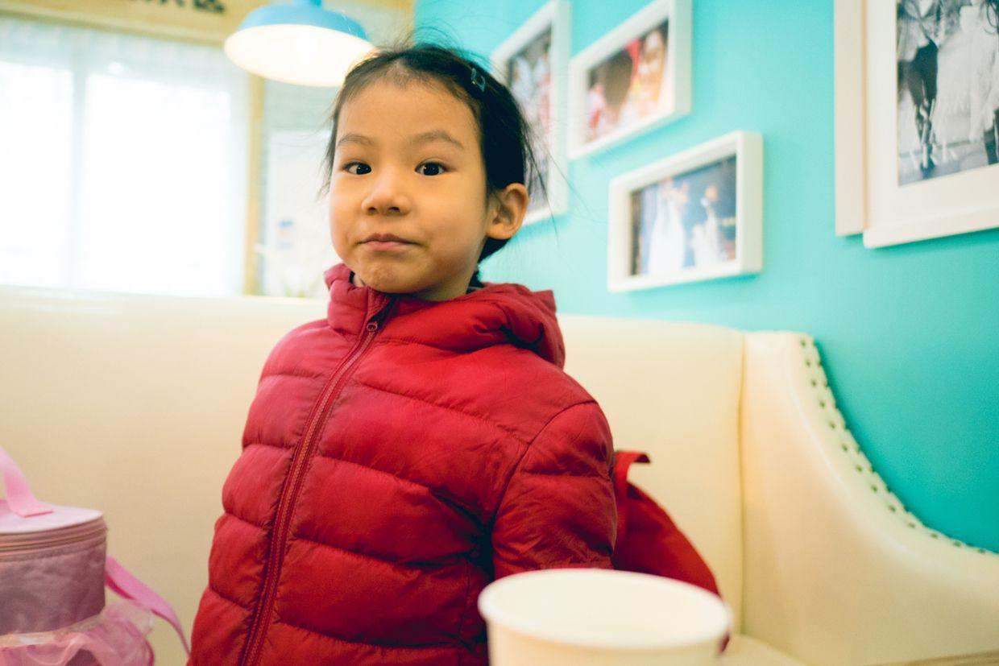

喵妈开始化妆，喵在化妆室，试一试各种的头冠。

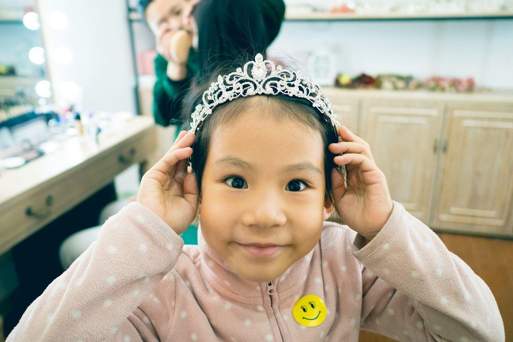

无聊中，自己拿起相机拍照。

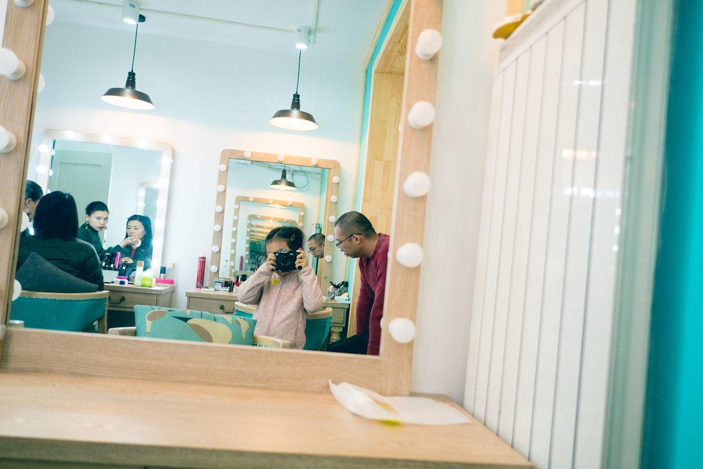

发现了放高跟鞋的屋子。

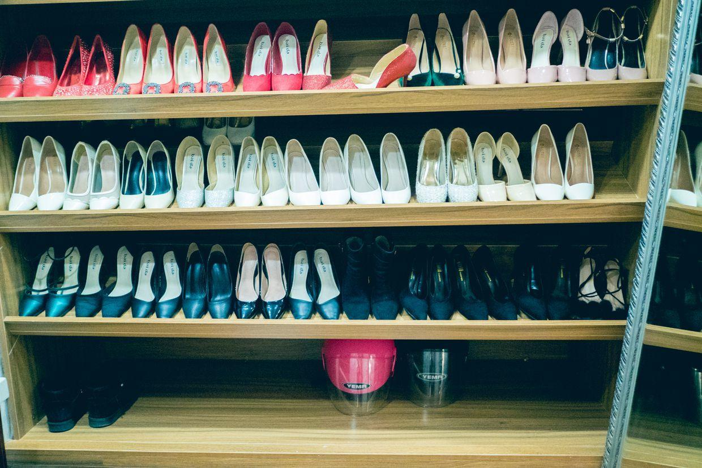

喵自己拍了一张漂亮的高跟鞋。

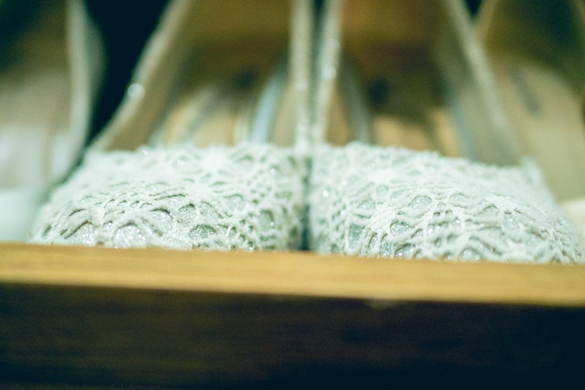

玩儿起了钻胳膊的游戏。

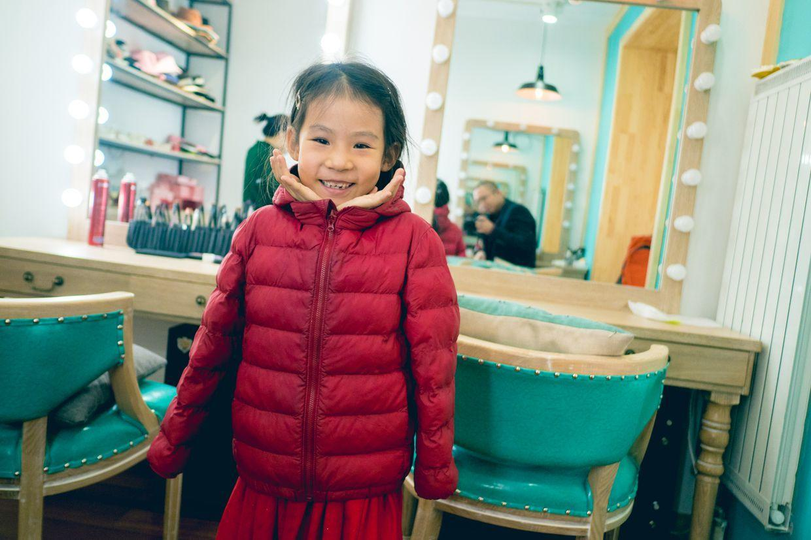

该给喵化妆了。

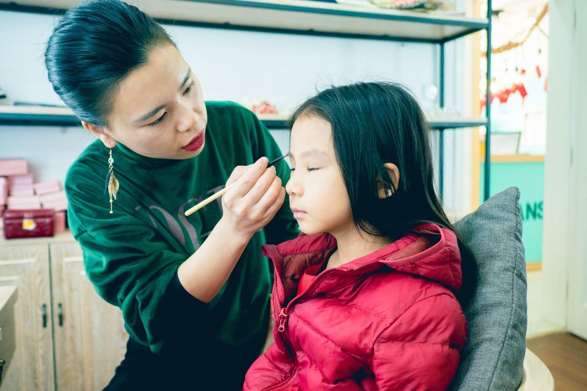

艾莎女王出场啦。

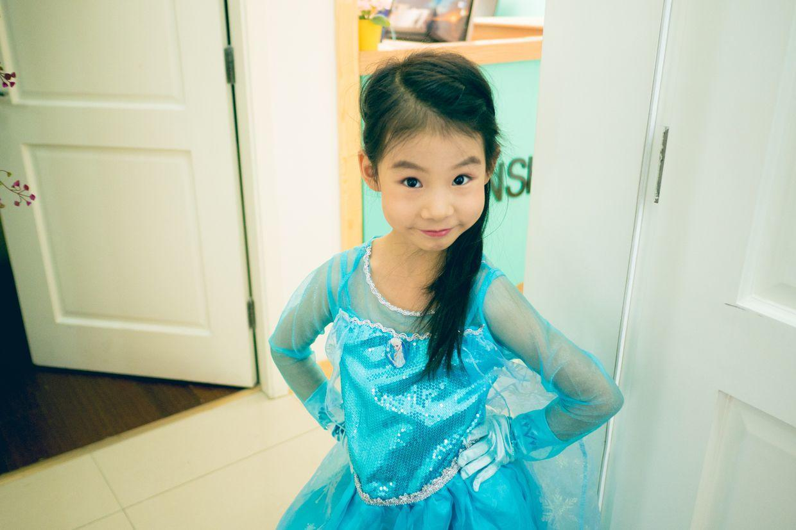

戴上花冠。

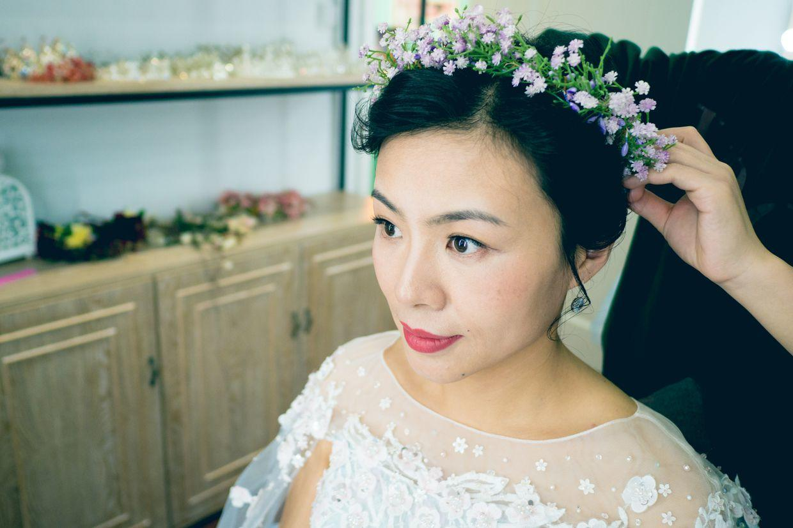

眼睛可真大。

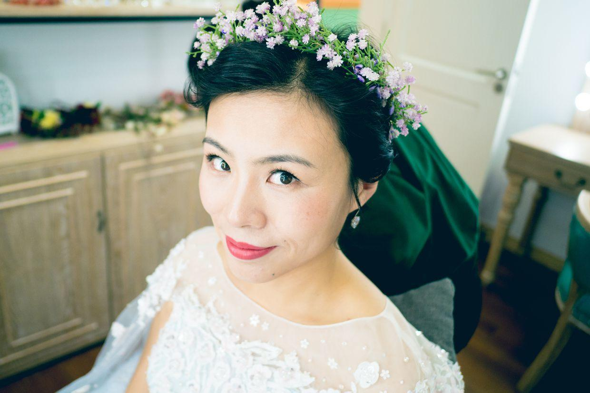

封面

给我也拍一张。

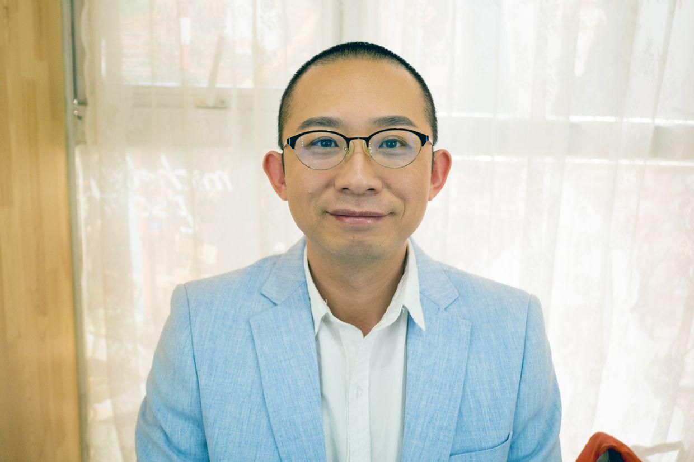

喵的大白裙子。

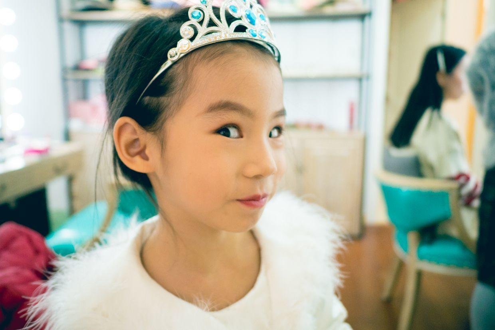

吃点饼干，补充一下体力。

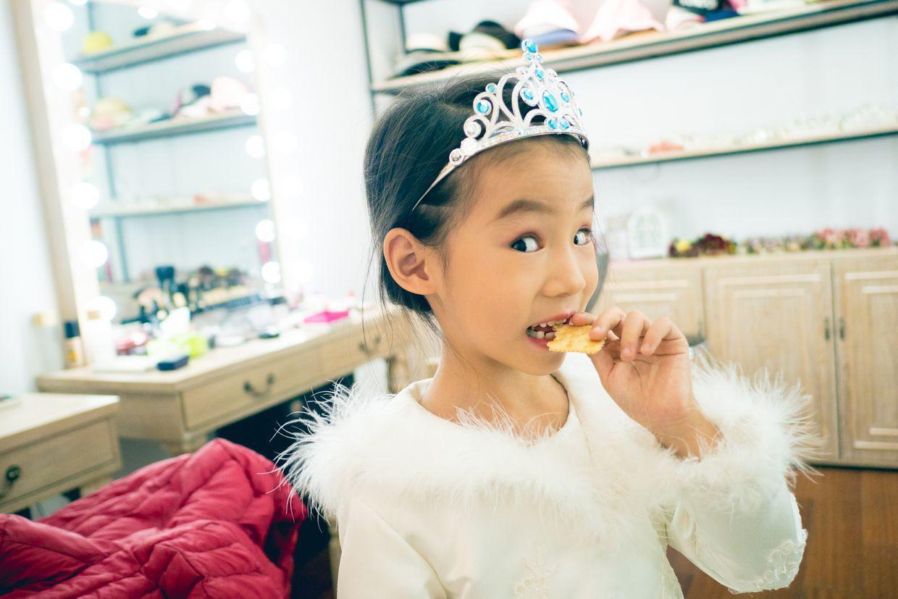

最后一身，带上了头冠。

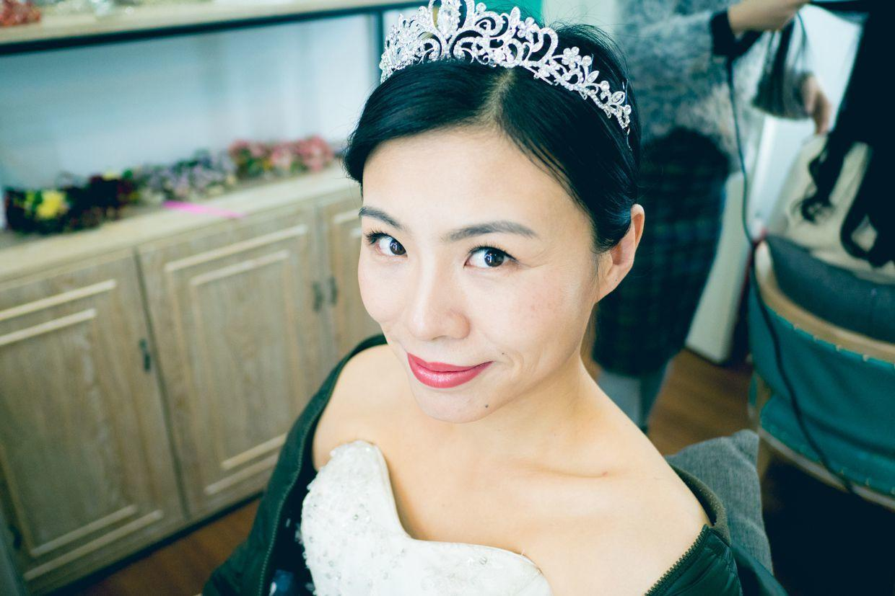

上午半天，很快就拍完了。

回想起当年结婚时拍婚纱照，折腾一整天的经历，真是轻松多了。

工作人员对喵的配合也是非常吃惊，让摆什么姿势，就能摆出来，还不乱跑乱叫。

到了最后看片的时候，喵的各种精美照，更是频频震撼大家。

一转眼，10年过去了，当年是2个人拍，现在是3个人照。

**个人微信公众号，请搜索：摹喵居士（momiaojushi）**

          
        