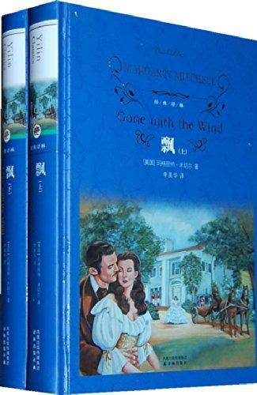

          
            
**2018.02.28**

经典的作品，每次遇到困难的时候，就想想郝思嘉是怎么做的。

在想尽一切办法，努力争取之后，告诉自己，好好睡一觉，明天又是另一个明天。
>明天又是另外一天了

明天又是另外一天了

一本名著，出一句名言就很了不起了
>作为第一部从南方女性角度来叙述美国内战的小说，《飘》着重描写了留在后方家里的妇女饱受战乱之苦的体验和感受，从战争伊始对战争怀有的崇敬心理、对战争全然的支持，到因战争而带来的失去亲人的痛苦、不得不屈服于失败的命运以及战后立志重建家园的艰辛历程。

南方女性视角写南北战争
>这其中就有女主人公郝思嘉。应该说，小说中最具吸引力的人物非她莫属。出身种植园主家庭的思嘉年轻漂亮，个性鲜明。然而，不幸的是，在她尚属青春年少的十六岁花季时，思嘉就遭遇了情场失意的痛苦。她爱上了风度翩翩的邻居卫希礼，可卫希礼却娶了善解人意的表妹媚兰。使思嘉更加不幸的是，战乱接踵而至，整个南方社会不得不投身战争岁月。在残酷的战争和艰辛的生活这双重重压之下，历经磨难的郝思嘉成了一位二十八岁的成熟女性。

也可以翻译成斯嘉丽
>面对瑞德的离她而去，思嘉虽然也感到伤心、难过，但她没有撒泼耍赖，而是坚强地接受了这一令人难以接受的事实。“我明天再想这事好了，到塔拉去想。那时我就承受得了了。明天，我要想个办法重新得到他。毕竟，明天又是另外一天了。”这就是思嘉在碰到困难时屡试不爽的法宝。

“明天又是另外一天了。”这是思嘉的座右铭。

不管怎么伤心，还是要继续生活下去
>第一部

在那张极其恬美的脸上，她那绿色的双眸显得骚动不宁，狡黠任性，而且生气勃勃，与她那副似乎很有教养的行为举止极为不符。她那副仪态纯粹是平日里在她母亲的温和训导以及她的黑人嬷嬷的严厉管教之下形成的，而这一切都是别人强加给她的。只有她的双眸才是与生俱来、能显示她本性的地方。

恬美又狡猾
>塔尔顿家的斯图尔特和布伦特兄弟俩一边一个，懒洋洋地躺在放在她两边的躺椅上。

他们肆意谈笑着，眼睛透过有薄荷属植物装点的高大玻璃窗斜睨着太阳光。他们随意地跷着二郎腿，修长的双腿穿着长及膝盖的长统靴，腿部肌肉因长期骑马而异常发达。兄弟俩都是年方十九，身高六英尺二英寸，身材高挑，肌肉发达，脸膛被太阳晒得黝黑，头发则是茶褐色的。他们眼神欢快，目光傲慢，身穿一样的蓝色上装、芥末色马裤，像足了棉花丛中的两株棉桃。

塔尔顿双胞胎，好像大小武兄弟围着郭芙
>比阿特丽斯·塔尔顿是个很忙碌的女人。她手里不但有一片很大的棉花种植园、上百个黑奴以及八个孩子，而且还拥有全州最大的马匹饲养场。

塔尔顿夫人，很彪悍的女人
>但是，你们和她谈起卫希礼先生和媚兰小姐要结亲时，她就开始不出声了，就像一只看到空中有老鹰在盘旋的小鸟一样。”

郝思嘉听说卫希礼订婚
>可他们的母亲却为此颇为烦恼，因为她一点也不喜欢郝思嘉。“如果那个狡猾的小妖精真的接受了你们中的一个，那也是你们罪有应得，”

我担心的是，你们很快就会为了那个狡黠奸诈、双眼泛绿的小尤物而喝得烂醉如泥，因争风吃醋而大打出手，甚至会用枪瞄准对方，让他脑袋开花。不过，这也许并不是什么坏事。”

塔尔顿夫人不喜欢郝思嘉
>大多数南方人出生后就手不离枪的，狩猎生活更是使他们个个都成了神枪手。

枪伤事件发生以后，就在两个月前，他们的母亲帮他们打点好行装，打发他们到州立大学去求学，责令他们待在那里。因不在家错过了军训，他们感到很痛心。只要他们能和朋友们一起骑马、叫喊、用步枪射击，那么，即使失去了受教育的机会也是值得的。

塔尔顿双胞胎不爱学习，只爱玩儿
>吉姆斯惊恐地叫了起来，“不，俺不去！俺才不想为你们所做的事让比阿特丽斯小姐打我呢，这可不是好玩的。首先，她会问俺，俺是咋的让你们俩被开除的。其次，她会问俺，为啥今晚不把你们带回家去好让她揍你们一顿。然后她就会把火发到俺身上，就像鸭子扑在绿花金龟上一样。

吉姆斯是双胞胎的贴身黑奴
>嬷嬷总是认为，郝家的人从外表到内心全都属于她，他们的秘密也就是她的秘密；哪怕只有一丁点疑点也足以使她像猎犬一样紧追不放。

嬷嬷是个黑人，但她的行为准则和自尊心跟她的主人们相比并不逊色，甚至准则还更高，自尊心还更强。她是在埃伦的母亲索兰格·罗比亚尔的闺房里长大的，而埃伦的母亲是个举止优雅、冷静严肃、鼻子高挺的法国太太，不论是她的孩子还是家里的仆人，只要他们礼仪不周，就绝对逃脱不了公正的惩罚。

嬷嬷是郝思嘉母亲的贴身黑奴，及其有教养，对人要求极高
>她满脸泛红，喘着粗气，在一个树桩上坐下来等她父亲。已经过了父亲该回家的时间了，但他今天推迟了反而使她很高兴。这一耽搁便让她有时间缓口气，让脸上的表情复归平静，这样她父亲就不会产生怀疑了。

等父亲回家，想和父亲聊聊
>年前的一天，希礼刚从欧洲旅游观光回来后到她家作礼节性拜访。自那天起，她便爱上了他。事情就这么简单。那天，他骑着马沿着长长的车道走过来时，她正好在前门的游廊上。他身着灰色的绒面呢上衣，系着黑色的领带，镶有饰边的衬衫被衬托得完美极了。即使现在，她也还能想起那天他服饰的每个细节，靴子闪闪发亮，领带夹有个浮雕宝石做成的希腊美女美杜莎的头像，还有他一看到她就脱下来拿在手里的巴拿马式帽子。

就在那一刹那，她就很想要他，就像她要食物吃、要马儿骑、要一张柔软的床好让自己躺在上面一样，既简单明了，又不可理喻。

对卫希礼一见钟情
>正当她瞪大眼睛朝越来越暗的路面上望去时，她听见从牧场的小山脚下传来一阵马蹄声，接着看见马匹和牛群因受惊而四散开来。郝嘉乐回家来了，他正纵马穿过乡野飞驰而来。

思嘉一点也不怕她的父亲，甚至认为他还比她那些妹妹们更像她的同龄人。因为他经常跳越围栏，而且保守这个秘密不让他妻子知道，这给了他一种小男孩般的得意及做了坏事后得到的快乐。而这与她智斗嬷嬷得胜后的快乐如出一辙。她于是站起身来望着他。

呼到她脸上的气息夹杂着波旁威士忌味和淡淡的薄荷香味，身上还发出嘴嚼烟草味、上了油的皮具味及马匹的气味——她一贯是把这些混合在一起的气味和她父亲联系在一起的，而且也本能地喜欢上别的男人身上的这些气味。

父亲和郝思嘉性格很像，都很粗旷
>“妈妈跟你结婚时才十五岁呢，我已经十六了。”思嘉说着，连声音也哽咽了。“你妈妈的情况不一样，”嘉乐说，“她可不像你一会风一会雨的。

“你不会的，我的女儿。只有性格相近的人结为伉俪才会幸福。”思嘉心头突然掠过一个危险的念头，她很想大声喊出来：“可你不是一直都很幸福吗？但你和妈妈的性格并不相近啊。”但她忍住了，担心自己的鲁莽会招来父亲的耳光。

郝嘉乐和夫人完全不一样，也完全不赞成女儿追求卫希礼
>他这种古怪跟其他人不一样，既不像卡尔弗特家的人那样为了一匹马可以把全部家当都赌掉，也不像塔尔顿家的人那样一喝酒就醉得一塌糊涂，更不像方丹家的人都是些头脑发热的小畜生，想到别人怠慢他们就会要人家的命。

郝嘉乐不喜欢周围几家的人
>“土地是这世界上唯一了不起的东西，”他大声叫喊着，短而粗壮的胳膊奋力挥舞着，显得愤怒极了，“它是这世间唯一永恒的东西，这点你千万别忘了！它是唯一值得为之工作、为之奋斗——为之献身的东西。”

郝嘉乐最看重土地
>嘉乐帮助妻子上了马车，嘱咐车夫驾车小心点。已经照管了嘉乐的马匹达二十年之久的托比嘟着嘴生着闷气，自己的本行活儿还要别人对他指手画脚告诉他该怎么做，他心里不受用呢。

郝嘉乐对妻子很上心
>妈妈一直就是这个样子，是力量的支柱、智慧的源泉。不管是什么问题的答案，她都是无所不知的。

郝埃伦夫人很有教养
>他的五个哥哥和他父亲的身高都超过六英尺，块头也很大，可是，年已二十一岁但身材却很矮小的嘉乐自己也明白，凭上帝的才智，至多也只能让他长到五英尺四英寸半。他从来也不为自己身材矮小而无谓地长吁短叹，也从来没发现这在他争取得到自己想要的东西的过程中是个障碍，而这正是嘉乐的特点。

更确切地说，嘉乐这副结实、矮小的体格正是使嘉乐之所以成为嘉乐的原因。他很早就知道，置身于身材高大的人群中，小个子的人要生存就得吃苦耐劳。而嘉乐就是个很能吃苦耐劳的人。

郝嘉乐家里有5个哥哥，当年自己只身来到美国
>郝家是个大宗族，不管是家道兴旺还是家道中落，他们都互相支持。这并不是为了夸大那份家人中存在的亲情，而是无情的岁月使他们认识到，要在世上求生存，一个家族就必须在世人面前紧紧抱成一团。他们借钱给嘉乐，接下来的几年，这钱就连本带利都收了回来。渐渐地，嘉乐又买下近旁更多的土地，种植园不断扩大。最后，白色的房子由梦想变成了现实。

在自己努力和家人帮助下，郝嘉乐壮大了自己的庄园
>种植园主的夫人们是最后认可嘉乐人品的人。嘉乐曾把卫太太描述成“一个具有沉默寡言的非凡天赋的贵妇人”。一天晚上，当嘉乐骑马的马蹄声在车道上渐渐远去时，她告诉她丈夫说：“他虽言谈粗鲁，可却是个绅士。”直至此时，嘉乐的绅士地位才最终得到承认。

婚后，郝嘉乐的人品被周围邻居接受
>第二年，他们的大孩子出世了，他们用嘉乐母亲的名字给她起名叫思嘉。嘉乐颇感失望，因为他想要个男孩。但看着他那头发乌黑的小不点女儿，他也够高兴的了。他在塔拉大宴黑奴，自己也喝得酩酊大醉，醉得大喊大叫，却也幸福无比。

郝思嘉是第一个孩子
>埃伦和所有有过良好教养的年轻小姐一样，也曾为结婚作过这方面的准备。更何况她还有嬷嬷、这个能使最懒惰的黑奴也变得有劲起来的帮手。

郝埃伦嫁过来之后，开始把家管得井井有条
>听到这些极富挑战性的左道邪说，嬷嬷气得低头皱起了眉头。一位年轻小姐能做什么，不能做什么，在嬷嬷看来，这其中的差别就像是黑人和白人之间的差别一样非常明显，中间是没有缓和余地的。苏埃伦和卡丽恩就像是她那强有力的手里的泥土一样，都会恭恭敬敬地听从她的劝诫。

嬷嬷无法忍受小姐妹不听话
>“噢，有时晕那么一两回也不打紧。”嬷嬷劝她说，“有时你也真不懂分寸，思嘉小姐。俺一再告诉你，看见蛇呀、老鼠呀什么的，你不晕过去就不太好。俺不是说你在家里也要这样，而是你和别人一起出去的时候。俺已经告诉过你——”

告诉思嘉，看到老鼠要像普通小姐那样晕倒
>但是，让我漂亮的马儿给那些只习惯骑骡子的乡巴佬和白人穷鬼骑！那可没门，先生！想到它们被人骑得鞍部有擦伤和肿痛，却又没有被好好饲养，我就会做噩梦。

塔尔顿夫人舍不得自己的马
>她哥哥把他叫了出来，白先生说，他宁愿挨枪子也不愿和一个傻瓜结婚。他们于是进行了一场决斗，白先生把那女孩的哥哥打死了。

白瑞德出场，拒绝了和一个女子结婚，不想和他哥哥决斗，最后还是在决斗中杀死了女孩的哥哥
>对白瑞德拒绝和一个傻瓜结婚，她隐隐对他产生了尊重感。

郝思嘉对白瑞德有了一丝尊重
>你们以为战争就是骑着一匹漂亮的马儿，还有女孩子向你们直扔鲜花，像个英雄似的凯旋归来。可是，不是这样的。不是的，先生！打仗得挨饿，因在潮湿的地方睡觉，还要得麻疹和肺炎。如果没得麻疹和肺炎，那也会得肠胃病。

战争不是游戏
>白瑞德继续说下去，“我们要不就是走的地方不够多，要不就是从我们的旅行中获益不够多。哦，当然，你们这些绅士们走的地方都很多。可你们都看到了什么呢？欧洲、纽约和费城。当然，太太小姐们也去过萨拉托加。”

白瑞德认为南方人没有眼界，根本不是北方人对手
>“什么事？”他重复了一遍，“有秘密要告诉我？”突然，她又有了说话的能力。埃伦几年来的教诲似乎突然一扫而空，嘉乐那爱尔兰血统里直截了当的个性从他女儿的嘴里表现出来了。“是的——一个秘密。我爱你。”

郝思嘉向卫希礼表白
>“我不想等。”她说，眼睛似蒙上了一层面纱。

他坐在那抓着她的手，嘴巴张得老大。

“你会爱我，这可能吗？”她一句话也没说，只是低头看着自己的大腿，查理再次又狂喜又尴尬的。也许男人是不应该对女孩问这样的问题的。

郝思嘉答应了媚兰的哥哥查理的求婚
>不到两个星期，思嘉便成了一位妻子，又过了不到两个月，她已成了寡妇。

查理上战场死了
>寡妇身份倒是紧接着婚姻接踵而至，但使她感到沮丧的是，当妈妈的日子也跟随而来了。

做寡妇很惨
>埃伦被搞得心烦意乱的，最后也只好和南方其他的妈妈们一样让步了。她们从容不迫的世界被搅得乱七八糟的，而在把他们裹胁向前的强大力量面前，她们的恳求、祈祷和建议根本无济于事。

郝埃伦也很苦恼，世界变了
>婚礼举行后一个星期，查理出发去参加韦德·汉普顿上校的部队去了，而两个星期以后，希礼和骑兵连也出发了，使整个县犹如丧失亲人一般。

查理出发，卫希礼也走了
>媚兰说：“你应该吻吻思嘉，希礼。她现在是我嫂嫂了。”于是希礼弯下腰，用冰凉的嘴唇吻了吻她的面颊。

郝思嘉成了媚兰的嫂子
>查理死了。上校本来早就要拍电报的，但是查理认为自己的病只是小毛病，不想让他的家人担心。这个不幸的男孩不但被他认为自己已经得到的爱欺骗了，而且也被他想在战场上获得荣誉的极大希望欺骗了。他得了麻疹，又并发了肺炎，只到了南卡罗来纳的营地，连北方佬的影子都没看见，便无声无息地迅速离开了人世。

查理得肺炎死了，无声无息
>到了产期，查理的儿子出世了，因为当时很时髦把男孩的名字用父亲的指挥官的名字来命名，所以孩子被叫做韦德·汉普顿。

郝思嘉生下了查理的儿子
>寡妇还得穿着可怕的黑衣裙，连镶上一点点镶边使它看上去更有生气一些都不行，还不能戴鲜花，扎缎带，配花边，甚至首饰也不能戴，只有用亡夫的头发做的缟玛瑙胸针和项链才行。帽子上的黑绉面纱必须长达膝部，只有守寡三年以后，才能缩短至肩部。

寡妇只能穿黑裙，三年
>接着她便会听到因肚子饿而躁动不安的号啕大哭，这总是——总是使她大吃一惊，一边还想：“哦，屋里有个婴儿呢！”这以后，她才会记得这是她的孩子。这太令人茫然不解了。

郝思嘉对儿子毫无感情
>第二部

嘉乐告诉她的故事也并非没有根据，即她和亚特兰大是在同一年受洗命名的。在思嘉出生前的九年中，这个城市先是被叫做特米纳斯，然后又被叫做马撒斯维尔，直到思嘉出生的这一年，才改叫亚特兰大。

郝思嘉换个环境，准备去亚特兰大，和媚兰、媚兰姑妈一起住到查理的房子。亚特兰大是和郝思嘉一年诞生的
>亚特兰大因铁路而诞生，也随着铁路的发展而发展。

亚特兰大因铁路诞生
>至于彼德大叔，他则想当然地认为，思嘉来了是会长住下去的。在他看来，查理唯一的儿子在自己无法监督的地方抚养成人，这是令人难以相信的。

彼德把查理和媚兰带大
>“弄进来——”梅利开口说道，眉头皱了起来，接着便高兴地笑了，“哦，你一定是我们经常听说的那位声名远扬的白船长吧——闯封锁线的人。噢，这里的每个姑娘都在穿你弄进来的衣服呢。思嘉，你难道不为此感到高兴——怎么啦，亲爱的？你是不是要晕倒了？快坐下。”

慈善舞会遇到了白瑞德，冒着北军封锁开船运来物资
>“你怎么敢让我这么引人注目，白船长？”

“可是，我亲爱的韩太太，你想引人注目的愿望是如此的明显！”

白瑞德高价邀请郝思嘉共舞
>“噢，我不能脱下丧服——白船长，你不该把我搂得这么紧。你再这样的话，我就生气了。”

“你生气时看上去美极了。我要再次搂紧你了——你瞧——就想看看你是不是真的会生气。那天在十二棵橡树时，你又生气，又扔东西，你根本不知道你当时有多迷人。”“噢，请你别说了——你就不能把这忘了吗？”“不能，这是我最珍贵的记忆之一——一个得到精心培养的南方美人，带有爱尔兰反——你很有爱尔兰人的个性，你知道。”

白瑞德和郝思嘉共舞
>思嘉埋头吃着蛋奶饼，起先没注意到什么，后来她听到梅利叫出声来，而且看到她泪水夺眶而出。她抬起头，看到白蝶姑妈的手又要捂住胸口了。“希礼牺牲了！”白蝶尖叫起来，头往后一仰，双臂便软了下来。

“噢，我的天哪！”思嘉也叫了起来，体内的血液似乎已经凝固成冰了。

“不！不！”媚兰叫道，“快！快把她的嗅盐拿来，思嘉！在那，在那，亲爱的，你好点了吗？深呼吸。不是的，不是希礼。真对不起，我吓着你了。我哭是因为我太高兴了。”她突然张开紧握的手掌，用力吻着手里的东西。“我太高兴了。”她又热泪盈眶了。

误以为卫希礼牺牲
>思嘉茫然地捡起那只有一页的信，看到上面黑色的字体刚劲有力：“南部邦联也许需要热血男儿为之抛头颅、洒热血，但还没有要求妇女们献出自己的生命。亲爱的太太，请接受这个礼物作为我对你的勇敢行为的敬意吧。千万不要认为你的牺牲是徒劳无功的，因为这个戒指是用十倍于它的价值的价格赎回来的。白瑞德船长。”

白瑞德帮助郝思嘉赎回戒指
>“喝得醉醺醺地和白船长这样的人一起回家来，还扯嗓门唱歌，好让每个人都听见。不仅如此，还把钱也输光了。”“这个人太精于玩牌了，根本就不是个绅士。他——”“妈妈听说这件事会怎么说？”他痛苦万分、忧虑如焚地抬头看着她。“你一个字也不会告诉你妈妈让她伤心的，对不对？”

郝嘉乐来教训白瑞德，反而输了很多钱
>战争在继续。大多数时候打的都是胜仗，但人们已经不再说“再打一次胜仗，战争就会结束”了，就像他们已经不说北方佬是懦夫一样。

奥克兰墓地里，阵亡者的一排排单调的坟墓每天都在向前延伸。

战争开始残酷
>但对刚刚从守寡的蝶蛹里冒出头来的思嘉来说，战争只是意味着快乐和激动的时光。即使衣物和食品极端匮乏也没有使她感到不安。重新融入这个世界，她感到太幸福了。

战争比守寡还好
>就这样，一八六二年秋天的几个月飞逝而去。护理、跳舞、兜风和卷绷带占据了所有的时间，只有到塔拉去作短期逗留的时间除外。

郝思嘉对这样的生活很满足
>英国的棉纺厂正停工待产，工人们都快饿死了。每个偷闯封锁线的人只要能在和北方佬舰队的斗智中取胜，就可以在利物浦漫天要价。偏偏瑞德的船只很幸运，既能为南部邦联把棉花运出去，又能把南方急需的战争物资运进来。

战争的原因从来就只会有一个。那就是钱。所有的战争实际上都是为了争钱。可没多少人意识到这一点。他们的耳朵里充斥着齐鸣的号角声，冲天的战鼓声以及待在家里的雄辩家的满口好话。有时候，煽动性的呼吁是‘不让异教徒涉足基督的坟墓！’，有时又是‘打倒教皇制度！’，有时是‘自由！’，而有时又成了‘棉花，蓄奴制和州权！’”

“除非大象能上树，你才能卖一美元一磅呢！”“我相信我能做到的。棉花现在已经卖七十二美分一磅了。战争结束后，我就会成为有钱人了，思嘉，因为我有远见——对不起，是唯利是图。过去我曾经告诉过你，有两个时机是可以赚大钱的，一个是兴建国家的时候，另一个是在国家毁灭的时候。兴建时赚得慢，毁灭时赚得快。记住我的话，也许有一天会对你有用的。”

白瑞德告诉郝思嘉，自己是怎么利用战争赚钱
>“糖果和花，亲爱的，”埃伦一再说明，“也许一本诗集，或是相册，亦或是一小瓶香水，这些才是一个名门闺秀能从一个绅士手里接受的礼物。决不能，决不能接受任何贵重的礼物，即使从你的未婚夫那里也不行。

郝思嘉想接受白瑞德送的帽子，但又想起母亲的教诲
>七月三日，连接北方的电报系统突然一片死寂，直到四日中午才有一些支离破碎、零零星星的消息慢慢传到亚特兰大的总部。在宾夕法尼亚一个叫做葛底斯堡的小镇附近，打了一场硬战，李所有的部队都参加了这场大战役。消息不太确定，来得也很慢，因为是在敌人的地盘上打仗。消息首先是从马里兰传过来，再传到里士满，最后才到亚特兰大。

葛底斯堡战役
>肯定，肯定——名单上不可能有三个姓“塔尔顿”的人。也许——也许印刷工匆忙间弄错了。可是没有。他们都在那。“塔尔顿——布伦特，中尉。”“塔尔顿——斯图尔特，下士。”“塔尔顿——托马斯，列兵。”而博伊德在战争开始那一年就死了，

埋在弗吉尼亚的一个只有上帝才知道的地方。塔尔顿家所有的男孩都走了。

汤姆，还有慵懒、双腿修长的双胞胎，以及他们热衷的闲聊、荒唐的恶作剧，还有优雅得像个舞蹈教练、说话像黄蜂般刻毒的博伊德。

塔尔顿家男孩全死了
>被敌军逼回弗吉尼亚的部队驻扎在拉皮丹的冬季营房——自葛底斯堡被打败之后，这支军队已是筋疲力尽了——因为圣诞节要到了，希礼休假回到家中。

葛底斯堡战败，卫希礼还能回家休假
>吃晚饭时也一样，他们全都缠着他，问他有关战争的问题。战争！谁在乎战争呢？思嘉认为，希礼对这一话题也并不是很在乎的。他详详细细地谈着，不时发出一阵大笑。

卫希礼不喜欢战争滑梯
>“很抱歉地通知你，自三天前希礼少校去执行侦察任务以后，他便失踪了。我们会继续和你联系。”这一路回家真是一次可怕的旅程。白蝶姑妈脸埋在手帕里号啕大哭；媚兰直挺挺地坐着，脸色苍白；思嘉萎靡不振的，缩在马车的角落里不知所措。

卫希礼失踪
>思嘉送瑞德到门口时，愤愤不平地问道：“要是你的话，你难道不加入北方佬的部队，然后再逃走，免得死在那个地方吗？”“当然会的。”瑞德说，露出了髭须下面的牙齿。“那希礼干吗不这么做呢？”“他是个绅士。”瑞德说。

卫希礼很骄傲，不愿意投降
>第三部

“我的天，思嘉小姐！你难道没听说？我们要去给白人先生挖沟，好让他们在北方佬来的时候藏起来。”这种对散兵壕的天真解释使兰德尔上尉和马车上坐的人都忍不住笑了起来。

大个子萨姆来挖战壕，遇见郝思嘉
>“围城！哦，掉转马头。我要回家去，回到塔拉的家里去，马上就走。”“是什么使你这么苦恼呀？”“围城！我的上帝，围城！我听说过围城！爸爸曾经经历过，或者是他的爸爸曾经经历过。爸爸告诉我……”“什么时候的围城？”“德罗达赫的围城，克伦威尔占领爱尔兰的时候。他们连吃的都没有。爸爸说，他们全都饿死在街上，最后他们就吃猫、老鼠，甚至吃蟑螂这样的东西。他还说他们投降之前，有过人吃人的现象。我从来就不知道该不该相信这一点。克伦威尔占领了该城之后，所有的妇女都——围城！圣母玛利亚呀！”

在亚特兰大，郝思嘉想起父亲提到的克伦威尔的围城
>埃伦来信极力要求她回家去。她在回信中把围城的危险缩小到最低的程度，解释了媚兰危险的处境，答应孩子一出生就回家去。埃伦对亲戚关系非常敏感，血缘关系也罢，姻亲关系也罢。她又回了信，勉强同意她待在那，但要求说必须马上先送韦德和普里西回家。普里西举双手赞成这个建议。现在的普里西一听到什么异常的声响，就会变成一个吓得牙齿直打颤的白痴。她很多时间都蹲在地下室里。要不是米德太太的呆头呆脑的老贝齐，姑娘们过得可就惨了。

思嘉和她妈妈一样，急于把韦德从亚特兰大送走。这不但是为了孩子的安全，而且是因为他老是害怕，那样子使她心烦。

所以她又害怕送他回家了。他也就留在了亚特兰大，像个惊恐万状、默默无言的小鬼魂，拼命跟着他妈妈，手里一时半刻没有抓住他妈妈的裙子，他就会感到害怕。

本来想送孩子离开亚特兰大，但是也没办法了
>渐渐的，思嘉从朋友们一张张勇敢的脸上获得了勇气。无法治愈的就必须忍受，大自然也在宽厚仁慈地调整着自己。

现在，她也能够一边大口吃着东西，一边无力地说：“那颗炮弹挺近的，对不对？”

炮弹越来越近，还是这么乐观
>“得啦，我一直站在散兵壕里，烂泥没到了屁股上，我怎么可能听到希礼的消息呢？”老先生烦躁地反问，“不。是他父亲的事。卫约翰死了。”

他从口袋里掏出一块挺沉的金表，表带还在晃悠着，还有久已辞世的卫太太的一幅袖珍画像和一对袖口的大扣子。思嘉曾经无数次看到卫约翰手上戴着这块手表，现在猛一看到它，这才着着实实明白过来，希礼的父亲真的死了。

卫希礼的父亲牺牲
>“情妇！那除了变成那群贱货，我还能变成什么？”

“这就是我为什么喜欢你的缘故！你是我认识的女人中唯一一个坦率的人，唯一一个用实用的眼光看问题而不会用有关有罪和道德这些大话来遮盖问题实质的女人。其他任何一个女人都会晕过去，然后让我走人。”

白瑞德就是喜欢郝思嘉的坦率
>“亲爱的女儿，你妈妈和两个姑娘都得了伤寒。她们病得都很重，可我们还是要抱最大的希望。你妈妈躺倒在床上时叫我写信给你，叫你无论如何也不能回家来，以免你和韦德染上这种病。她向你转达她对你的爱意，叫你为她祈祷。”

郝埃伦和妹妹们得了伤寒
>她绞尽脑汁，回忆韦德出生时嬷嬷和埃伦为她所做的一切。可当时多亏上帝保佑，分娩时的阵痛使她处在迷糊之中，几乎把一切都隐在云里雾里。但她还是记起了几件事，便赶快以命令的口吻吩咐着普里西。“把火炉的火生起来，水壶里要一直有水开着。把能找到的毛巾都拿上楼去，还有那捆细线。把剪刀拿给我。别来告诉我说你找不到。一定要找到它们，得赶快找到。好了，快点。”

一切都结束了。媚兰并没有死，生下的男孩哭声像只小猫。现在普里西正在给他洗平生第一次澡。媚兰睡着了。经历了那一场痛苦得叫唤不已的梦魇之后，她怎么睡得着？思嘉根本不懂接生，硬着头皮给她助产。

郝思嘉给韩媚兰接生
>“后来他说，告诉思嘉小姐别着急。如果部队还有留下的，俺会去给她偷一匹出来。告诉她，即使我被打死了也会给她弄一匹马来。接着他又笑了，说，快从小路跑回家去。

白瑞德偷马
>她知道，媚兰是要查理的银版照片，它就挂在墙上，在查理的剑和手枪下面。“有劳你了。”媚兰又低声说道，“剑。”“噢，好的。”思嘉答应着。她举着灯，让瑞德小心翼翼地走下台阶，然后又回去把剑和手枪皮带取了下来。居然要把它们和婴儿、灯一并带走，那简直太别扭了。这就是媚兰，自己快要死了倒一点也不在乎，也不担心北方佬要接踵而来，反而为查理的东西费心。

逃跑前，韩媚兰还要去拿照片、宝剑、手枪
>“噢，等等！”她叫道，“我忘了锁前门了。”他爆发出一阵大笑，马缰甩在马背上。“你笑什么？”“笑你呢——要把北方佬锁在门外呀。”他说，马车启动了，走得很慢，很勉强。人行小路上的灯在继续亮着，形成一个小小的黄色光圈。随着他们渐渐远去，光圈也越变越小。

逃难前还要锁门
>“和我们分手？你——你要到哪儿去？”“我要，亲爱的小姐，跟部队一起走。”

>他慢条斯理的声音在她耳边嘲笑着她。他在嘲笑她，她也知道，在某种程度上，他同样也在嘲笑他自己。他在说些什么呢？爱国主义、盾牌、精彩的演说？他的真正意思不可能是他说的话中所指的意思。他如此轻率地说要在这离开她，把她留在这黑漆漆的路上，和一个也许正濒临死亡的女人、一个刚刚出生的婴儿、一个愚蠢透顶的黑人小女孩以及一个惊恐害怕的孩子在一起，让她带着他们去穿越长达数英里长的战场，穿过落伍的散兵、北方佬、熊熊烈焰，以及只有上帝才知道的什么东西。

“亲爱的思嘉！你并不会孤独无助。像你这样自私、这么坚定的人，谁都不会孤独无助的。要是北方佬抓住你们，那是上帝在保佑北方佬。”

白瑞德抛下郝思嘉
>我爱你，思嘉，因为我们太相像了。我们俩都是叛逆者，亲爱的，是自私的卑鄙小人。只要我们安然无恙，舒服自在，那么，就算整个世界毁灭了，我们也一点都不会在乎。”

他现在在吻她了，胡子刺得她的嘴巴痒痒的。他灼热的嘴唇慢慢地吻着她，从容自在的，好像他拥有整晚的时间。现在的她被吻得忽冷忽热，浑身发抖，查理从来没有像这样吻过她。塔尔顿家和卡尔弗特家的小伙子们的吻也从来没有使她有过这样的感觉。他把她的身体往后仰，嘴唇顺着她的脖颈一直吻到她紧身上衣的浮雕宝石上。

白瑞德向郝思嘉表达爱意，亲吻了她
>她绕着一片犁过的田地走了一英里，直到火光被远远甩在身后。可在黑暗中她却迷了路，找不到她非常熟悉的那条马车可行的小路了，她急得直掉眼泪。后来终于找到路时，马又一屁股坐在车辙沟里，再也不想动了。她和普里西拼命去拉马勒，但也不顶事。

历尽苦难
>从昨天晚上开始，他们就没见过一个活人或是活着的动物。死人、死马，那倒是有的，还有死骡子，就躺在路边，尸体肿胀，苍蝇成堆。但活着的什么也没有。

到处死尸
>塔拉离此只有半英里，在同一条路上，正好在部队途经的路上。塔拉也被夷为平地了！星光透过已经没有屋顶的墙垣照在地上，她只会看到烧黑的砖头。埃伦和嘉乐不知去向，姑娘们也了无踪影，嬷嬷没了，黑奴们也走了，只有上帝才知道到哪儿去了，只有这可怕的宁静笼罩着一切。

快到塔拉
>思嘉放下马缰，拉起裙子。底下镶着花边的衬裙是她所拥有的最后一件漂亮的服饰了——也是全部所有了。她解下腰间的带子，从脚上退了出来，用双手把那软绵绵的亚麻布褶皱揉皱。

她坚决地拎起衬裙的边缘扯着，放在嘴里咬着，终于把裙子扯开了一个裂口，撕开一长条。她用劲咬着，再用双手撕，衬裙终于在她手里成了碎布条。她再用手指把尾部打成结。由于起泡，她的双手已经在流血，人也累得浑身发抖。

撕了裙子，把路上的奶牛拴在车上
>媚兰睁开眼睛，看到思嘉站在她身边，便低声问道：“亲爱的——我们到家了吗？”家！一听到这话，思嘉的泪水夺眶而出。家。媚兰还不知道已经没有家了，他们正孤零零地流落在一个疯狂而荒芜的世界里。

快到家了
>要是塔拉一个人都没有的话，奶牛对他们又有什么用呢？她不会给它挤奶，就算她会的话，一有人碰到它那疼痛的乳房，它很可能就会一脚把人踢开。但她已经有了这头奶牛，她最好还是留住它。现在，她在这世界上拥有的东西已经不多了。

在这世界上拥有的东西已经不多了
>“爸爸？”她沙哑着嗓子低声问道，几乎怀疑那不是他，“是我——思嘉。我回家来了。”嘉乐向她走来，沉默不语的，好像在梦游一样。他拖着那只僵硬的腿向前走着，来到她身边，用一种茫然的神态看着她，好像他认为她只是在梦中出现似的。他伸出手，放到她肩膀上。思嘉感觉到一阵战栗，好像他刚从一场梦魇里醒过来，还处在半梦半醒之间，还没完全清醒，还没回到现实中来。“女儿，”他使出全身力气叫着，“女儿。”

爸爸的声音好像一只只会说一句话的鹦鹉一样，不停地重复着：“她昨天去世了——她昨天去世了——她昨天去世了。”

郝埃伦去世，郝嘉乐精神失常
>“波克，这里有多少黑人？”“思嘉小姐，那些狗日的黑鬼都跑了，有一些跟着北方佬走了——”“还剩下几个？”“只有我，思嘉小姐，和嬷嬷。她整天都在照料年轻姑娘们。还有迪尔西，她现在也在照料姑娘们。就我们三个，思嘉小姐。”

黑奴逃跑了
>“波克，那爸爸埋在葡萄架下的用橡木桶装的玉米威士忌呢？”那张黑脸上又掠过一丝鬼魂般的微笑，微笑中既有高兴的成分，也有尊敬的成分。

“思嘉小姐，你真是最聪明的孩子！俺怎么就把那给忘了？可是，思嘉小姐，那威士忌不好。埋在那才一年，而且，太太小姐们喝威士忌不好。”

还有幸存的番薯和威士忌
>“他们为什么没把塔拉烧了呢？”嘉乐盯着她看了一会，好像没听到她说什么。她又问了一遍。“为什么——”他寻找着词句，“他们把房子用做司令部了。”

塔拉作为司令部，免于大火
>“是这样的，女儿。他们还没来时，我们看到十二棵橡树浓烟滚滚，漫过河来。但哈尼小姐和英蒂小姐，还有他们家的一些黑人都逃到梅肯去了，我们也就不为他们担忧了。可我们不能逃到梅肯去。姑娘们病得这么厉害——还有你的妈妈——我们不可能走的。

苏埃伦和卡丽恩躺在同一张床上，翻来翻去，说着胡话，一团破布绞在一起，放在一碟咸肥肉上燃烧着，发出令人作呕的气味，可这是房间里唯一的照明用具。

思嘉摇摇晃晃地站起来，一只手放在迪尔西的胳膊上。“你留下来了，你真是太好了，迪尔西。”“我怎么能跟那些垃圾般的黑人一起走呢？思嘉小姐，你爸爸这么好，把我和小普里西一起买过来，你妈妈又这么善良。”

迪尔西留下来照顾病人
>嬷嬷笨重的身子向门这边走来，楼上的过道好像都在摇动。接着，嬷嬷便出现在房间里了，她的双肩被两木桶沉重的水拉了下去，那张和蔼的黑脸满是忧伤，就像猴子脸上那种不可言喻的忧伤神情一样。看到思嘉，她的眼睛都发亮了，洁白的牙齿也露了一下。她把水桶放下，思嘉便向她跑去，把头埋在那宽厚、下垂的胸口。这怀里曾抱过多少人的头啊，黑人也有，白人也有。这里有种稳定感，思嘉想，某种意味着过去的生活还没变化的感觉。可嬷嬷一开口就把这种幻觉粉碎了。

“小乖乖，你的手！”嬷嬷拉起她那起泡、起茧的手，一脸惊恐，极不赞成地端详着，“思嘉小姐，俺一再告诉你，从一个人的手就可以看出她是不是名门闺秀——你的脸也被太阳晒黑了！”

终于见到嬷嬷了，还是这么讲究
>可怜的嬷嬷，即使战争和死神刚从她头顶掠过，她对这些无足轻重的小事还是这么严格！再过一会，她就会说，手起了泡、皮肤上有雀斑的年轻小姐一般是找不到丈夫的。思嘉于是先发制人地说道：

“嬷嬷，我要你告诉我有关妈妈的事。听爸爸谈她的事，我受不了。”

“棉花被烧了吗——快告诉我！”“是的，被烧了。士兵们把棉花滚到后院，大叫着‘这是佐治亚最大的营火’，就放火烧了。”存了三年的棉花——十五万美元哪，一把火就烧了！

她要待在塔拉，继续拥有它，养活她父亲、妹妹、媚兰和她的孩子以及黑人们。明天——噢，明天！明天，她就要把枷锁套在自己的脖子上。明天有很多事要做。到十二棵橡树和麦金托什家去看看，废弃的花园里还剩下什么东西；到河边的沼泽地里去到处敲一敲、打一打，找找有没有走散的猪或是鸡呀什么的；拿着埃伦的首饰到琼斯伯勒和拉夫乔伊去——那里肯定有剩下的什么人会出售吃的东西的。明天——明天——她的大脑像一只越走越慢的钟一样，滴答滴答地缓慢地走着，但思维却一直是非常清晰的。

郝思嘉想着，明天要做什么
>只有媚兰没有抱怨。媚兰的脸已经越来越消瘦，脸色也越来越苍白了，连睡梦中也会痛得直抽搐。“我不饿，思嘉。把我的那份牛奶给迪尔西吧。她要给孩子喂奶，用得着。生病的人是从来都不会觉得饿的。”

韩媚兰从不抱怨
>出现的那个全新的“她”。现在，思嘉在塔拉有了至高无上的统治权。和那些突然掌权的人一样，她个性里那种恃强欺弱的本能全都暴露无遗了。

她没有停下来去思考一下，埃伦那秩序井然的世界已经逝去，代之而起的是一个残酷的世界。在这个新世界里，每条标准、每种价值都已经变了。她只看到，或者说她认为她看到了，她妈妈错了。她迅速调整自己，好去适应这个她毫无准备去接受的新世界。

她现在明白，不管她愿不愿意，她都得用她毫无经验的双手撑起这个种植园，养活它的所有成员，因为嘉乐还是安安静静地坐着，就像个还在梦中的人一样，性情很和善，可人在塔拉，心却不在塔拉，那神情令人觉得很可怕。

冬天要来了，那时就没有食物了，连邻居果园里剩下的那些可怜兮兮的蔬菜也没有了。他们必须有干豌豆、高粱、玉米片、大米以及——以及——噢，要这么多东西。还要有第二年春天下种用的玉米和棉花，还有新衣服。这一切都从哪来呢？她用什么付账呢？

韦德瘦得皮包骨的脸蛋出现在她面前。他不喜欢甘薯，他一再重复着，他要鸡腿、鸭腿、米饭和肉汁。

郝思嘉成了这里的主人，要养活所有人
>“这么说家里有人，”他说，把手枪塞回枪套里，走进过道，直挺挺地站在她下方，“就你一个人，小夫人？”她闪电般地把武器架到扶手上，对准了那张大吃一惊、满面胡须的脸。还没等他的手摸到皮带，她便扣动了扳机。手枪往后的冲力使她感到头晕，爆炸声震耳欲聋，鼻腔里满是辛辣的烟味。那个人咚的一声往后倒在地上，四脚朝天直摔入了餐厅，摔得很重，连家具都被震动了。

是的，他死了。毫无疑问。她把他杀了。

每当她碰到令人不快的事或是难题时，这个念头就会从头脑里蹦出来，给她增添了力量：“我连人都杀过，所以肯定能把这事做好。”

郝思嘉开枪杀了北方军人，和韩媚兰一起埋尸体
>亲自去看看邻居家都发生了什么事了。自从她回家后，她不下千次绝望地想：“我们是不是县里留下的唯一一户人家呢？有没有别的人没有被大火烧得无家可归的？他们是不是全逃到梅肯去了？”

丹家还有牲畜和粮食。但是，弥漫在塔拉周围以至整个乡间的那种奇怪的寂静同样笼罩着含羞草庄园。所有的黑奴都被北方佬要来这一消息吓坏了，几乎逃得精光，只剩下四个屋里使唤的女仆。这个地方一个男人也没有，只有萨莉的小男孩乔，他几乎还离不了尿布，根本算不上一个男人。孤零零地留在大房子里的有：已经七十多岁的方丹老太太，年过五十却还总被称为少奶奶的她的儿媳，还有刚刚才二十岁的萨莉。她们远离邻居，没人保护。

“我的天哪，‘我们家干农活的黑奴全走了，没人去摘棉花了’！”老奶奶模仿着她说话的语调，讥讽地看了思嘉一眼，“你自己漂亮的双手哪去啦，小姐？还有你妹妹们的呢？”

“白人穷鬼，确实如此！哦，可不是吗？这代人都吃不了苦，小姐气十足的！我告诉你吧，小姐，我小的时候，爸爸破产了，我也只得用双手做普通的工作，也到田里去干活，直干到爸爸有足够的钱买更多的黑奴。我锄过地，也摘过棉花，要是不得已的话，我现在还能再去干一次。再说，我好像也非得这么做不可了。白人穷鬼，确实如此！”

郝思嘉有了马，去看邻居
>可是，如果你们的粮食也不够的话，请跟我直说——”“叫波克赶辆马车来，你们就可以把我们所有粮食的一半借走，大米、玉米、火腿，还有一些鸡。”老太太突然敏锐地看了思嘉一眼，说道。“噢，那也太多了！真的，我——”“别说了！我不想听。要不还做什么邻居？”

“好了，”老奶奶打量着她的脸，“塔拉出了什么事？你在隐瞒什么事？”思嘉目不转睛地看着那双深邃的老眼，知道自己不用掉眼泪就可以告诉她实话了。在方丹老奶奶面前，未经她允许，谁也不许哭的。“妈妈去世了。”她平淡地说。抓住她手臂的手抓得更紧了，直捏到肉里去，黄色的眼睛上方布满皱纹的眼睑眨了几下。“是北方佬杀了她吗？”“她死于伤寒。死在——我回家的前一天。”

郝思嘉告诉方丹老奶奶，自己母亲去世了
>“别去想这事了。”老奶奶坚定地说，思嘉看到她吞了口唾沫，“你爸爸呢？”“爸爸——爸爸全变了。”“你这是什么意思？说下去。他病了吗？”“是惊吓——他变得完全陌生了——他已经不是——”“别跟我说他全变了。你是不是说，他的神经失常了？”

你以为我不理解你告诉我的事——你所经历过的事？哦，我非常理解。我像你这么大的时候，遇上了印第安人克里克部落的起义，是紧接着米姆斯堡大屠杀之后发生的——是的，”她说着，声音似乎是从很远的地方传来的，“就跟你差不多大，因为那是五十多年前的事了。我设法跑到灌木丛里躲起来。我躺在那，看着我们的房子被烧了，还看见印第安人在剥我兄弟姐妹的头皮。我只能躺在那，祈祷着火光不会把我藏身的地方暴露出来。他们把妈妈拖出来，就在离我躺的地方大约二十英尺远处把她杀了，还揭了她的头皮。时不时还会有印第安人走过来，把他的斧头朝她的头上砍去。我——我是我妈妈最宠爱的女儿。我躺在那，把这全看在眼里。早晨，我出发到最近的拓居地去，那也在三十英里以外。我走了三天时间才到了那里，途中还穿过沼泽地和印第安人的营地。这以后，他们认为我疯了……我就是在那遇见方丹医生的。

他照看我……啊，哦，我说过，那是五十年前的事了。自那以后，我就什么都不害怕了，什么人也不害怕了。思嘉，一定要留着某些东西让自己感到害怕才好——甚至要像你留着某些东西去爱一样……”

方丹老奶奶讲了自己遇到印第安人起义的往事，一定要留着某些东西去爱
>思嘉到方丹家走的这一趟使她大受鼓舞，但实际上受到的鼓舞并不大，这她自己可没有意识到。知道她还有邻居，知道一些两家素有交往的朋友和古老的家族幸存了下来，单单这一点就把刚回塔拉那几周里压迫着她的那种可怕的失落感和孤独感都给赶跑了。

方丹家和塔尔顿家的种植园正好不在部队经过的路上，他们都极为慷慨地和他们分享着所剩不多的东西。邻居帮邻居，这是县里的传统，而且，他们不接受思嘉的一分钱，只是对她说，如果情况相反，她也会为他们做同样的事的。第二年塔拉重新出产东西时，他们可以用食物来还给他们。

日子一天天过去，她眼看着原来空空如也的黑奴小屋里，棉花越堆越多。如今，这里是种植园里唯一可以放东西的所在了。田里的棉花比她和波克原先估计的还更多，很可能会有四包，小屋很快就会装满的。

郝思嘉大受鼓舞，地里剩下的棉花比想得还多
>她原来打算让黑奴到田里去干农活，她和正在康复的姑娘们则留在家里料理家务。可是，黑奴社会等级观念比她自己的还更根深蒂固。波克、嬷嬷和普里西对要去田里干活的主意表示强烈抗议。他们反复申明，他们是屋里使唤的黑奴，不是干农活的。

特别是嬷嬷，言辞激烈地宣称，她连在院子里干活都从来没有干过。她出生在罗比亚尔的深宅大院里，不是出生在黑人小屋里，而且从小在老太太的卧室里长大，就在大床脚下打地铺睡觉。只有迪尔西什么也没说，眼睛一眨不眨地盯着普里西，看得她浑身不自在。

接着，思嘉就试着把她的妹妹和媚兰派到田里去，可那照样没起什么作用。媚兰倒是很乐意，她摘得又灵巧又快。但是，在炎热的阳光下摘了

一个小时后，她就一声不响地晕倒了，不得不在床上躺了一星期。

苏埃伦一脸不高兴，眼泪汪汪的，也假装晕过去。思嘉往她脸上泼了一葫芦水，她马上就苏醒过来，一边还像只猫一样乱吐。最后，她干脆拒绝下地。

思嘉站在一排排棉花丛中，头顶着烈日干活。不停地弯腰使她的背都快断了，而双手也被干燥的棉桃弄得很粗糙。她真希望自己有个既有苏埃伦的精力和力气又有卡丽恩的好性情的妹妹。

在一排排长长的棉花丛里，只剩下迪尔西和普里西还跟她在一起。普里西懒洋洋地摘着，摘一阵，休息一阵，还不停地抱怨脚酸了，背痛了，身体又不舒服了，完全累垮了等等，直到她妈妈折了根棉花梗，打得她直叫唤，那以后她才干得好一些了，还小心地躲着她妈妈，使她够不着她。

迪尔西不知疲倦、默默无言地干着，就像台机器一样。思嘉的背也在痛，手里拿着的棉花包一直往下拉，连肩膀也被拉得生疼。她心想，迪尔西的价值真可以用金子来衡量。

要亲手干农活，每个人反应都不一样，郝思嘉只能自己亲手摘棉花
>现在还是有希望的。战争不可能永远打下去。她有了点棉花，她有了吃的，她有了匹马，还有点珍藏着的秘而不宣的钱。是的，最糟的时候已经过去了！

郝思嘉又有了希望
>媚兰绝望地往后看着，但两只后脚跟一直夹着马肚子。路上砾石飞溅开来，她沿着车道朝牧场奔去。思嘉心想：“我从来没想到能看见韩梅利骑马呢！”

北方军又来了，韩媚兰起马去牧场
>“噢，我会照你的话去做的。”中士情绪极好，转过身去又吐了一口痰。思嘉把孩子重新抱好，哄着他，把手放在他身上藏钱包的包尿布的部位，不禁为媚兰有个婴儿而婴儿又还要用尿布而感谢上帝。

中士在手上把剑翻过来，把剑柄凑在阳光下读上面刻的字。“‘给威廉·R．韩’，”他辨认着，“‘为纪念他的勇敢豪侠。他的部下送。于比尤纳维斯塔。一八四七年。’”“咳，夫人，”他说，“我自己也到过比尤纳维斯塔。”“真的吗？”思嘉很冷淡地说。“可不是？那可真是场恶战，我跟你说吧。在这场战争中，我还没看到像那次战争中的那种恶战呢。这么说，这把剑是这小孩的爷爷的？”“是的。”“好吧，那就给他吧。”中士说，他得到了首饰和小饰物，已经包在他手帕里，对此他已经感到够满意的了。

北方军把剑留给了韦德
>“黑奴小屋挖过了吗？他们通常都会把东西埋在那。”“小屋里什么也没有，只有棉花。我们放火烧了。”那一瞬间，思嘉似乎又回到了待在棉花田里那炎热而漫长的日子，又感觉到背上钻心的疼痛，肩膀上擦伤的白生生的肌肉。一切都徒劳无益了。棉花又被烧光了。

谈话。现在想起来，那就像是好多年以前发生的事。两个月前的那天下午，她告诉老太太，说她已经知道了可能发生在她头上的最糟的事，而且这话是她发自内心的话。现在，那话听起来就像是小女生的夸大之词。舍曼的人第二次来到塔拉以前，她还小有资财，有些食物，也有点钱，有比她更幸运的邻居，还有些棉花，能挺过这个严冬，熬到春天。现在棉花没了，食物也没了，钱对她来说一点用处也没有，因为有钱也没地方买食物。而邻居们比她的境遇还糟。她至少还有奶牛和小牛、几头小猪崽和一匹马，而邻居们什么也没有，只有他们过去藏在树林里和埋在地下的少量食物。

幸存的棉花又被烧了，事情更糟糕了
>她吩咐把小牛杀了，因为那宝贵的牛奶被它喝掉太多了。那天晚上，每个人都吃了很多牛肉，以致大家都不舒服了。

杀牛为了喝奶
>“你随时都得记住，亲爱的，”埃伦说过，“对上帝委托你照管的黑人，你对他们的身体和道德同样负有责任。你应该意识到，他们就像孩子一样，必须像孩子一样照看着他们，而且，

母亲教导郝思嘉要照管黑人
>“即使我没有做梦，大白天也已经像梦魇一样了。”她绝望地想，开始把她每天的配给省下来，到睡觉前再吃。

每天都是噩梦
>正是春耕的高峰期，波克从梅肯带回来棉花籽和果树籽，它们都被播撒到地里去了。这次出行，波克带了一马车衣物、种子、家禽、火腿、肋肉和粗粉，安然无事地回家来，他为此得意得不得了，尾巴都翘到天上去了。

思嘉还在前面的游廊和小伙子们说话，可一听到投降的消息，媚兰、苏埃伦和卡丽恩都默默地溜进屋里。

然而，思嘉却一滴眼泪也没有。刚刚听到这消息的那一刻，她只是想：“谢天谢地！现在奶牛不会被偷走了。现在马也安全了。现在我们可以把银器从井里拿出来，每个人都能使用刀叉了。现在我在乡间四处跑跑寻找食物，再也不用害怕了。”

南方投降了，好日子要来了
>“我敢发誓，现在，既然我那些亲爱的孩子已经不在了，我真不知道自己该怎么办。”塔尔顿太太说着，从栅栏上爬了下来。不知道的人也许会认为她指的是她四个已经死去的儿子，可从塔拉来的姑娘们都知道，她心里想的是她的马。“

塔尔顿太太不心疼儿子，心疼自己的马
>在布伦特和斯图尔特的坟墓之间，有一块墓碑上刻着这样的字：“他们活着的时候既可爱又快乐，死了也永远不分离。”

双胞胎的墓碑
>“得了，别再说了！”嬷嬷尖刻地说，因为她听到塔拉被称为“老农场”，心里便不受用。她相信，一个在城里长大的无知的黑人是不知道农场和种植园之间的区别的。“

嬷嬷无法忍受别人说种植园是农场

**个人微信公众号，请搜索：摹喵居士（momiaojushi）**

          
        