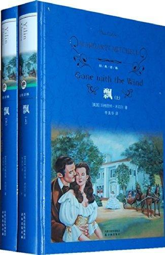

          
            
**2018.03.07**

经典的作品，每次遇到困难的时候，就想想郝思嘉是怎么做的。

在想尽一切办法，努力争取之后，告诉自己，好好睡一觉，明天又是另一个明天。
>第四部

还有那些只拿着一个旅行袋到南方来牟利的投机家，这些北方佬就像虫子一样，南方投降后，他们就用一个旅行袋装着他们在这世界上的所有家当到南方来了。

威尔克森和希尔顿又对他们说，不论从哪方面说，他们跟白人都是平等的。很快，白人和黑人通婚就会得到允许；他们原来的主人的地产也很快就会被分掉，每个黑人都能分到四十英亩土地和一匹骡子。他们告诉黑人，白人如何如何残酷地对待黑人，以此来煽动黑人。于是，在一个长期以来都以黑奴和奴隶主之间的友爱关系著称于世的地方，开始有了仇恨和疑问。

她一直在想，如果她能坚持到春天，那一切就会好起来的，她真是太傻了。一年来，她累得腰背都要断了。可威尔带来了这个毁灭性的消息，再压在她那快要断裂的脊背上，使满心的希望又得往后推，这真是不堪忍受的最后一击。

“我不知道，”她说，“可是，不要让爸爸知道。这会使他担心的。”“我不会的。”“你告诉别人了吗？”“没有，我直接找你来了。”是的，她心想，每个人有坏消息的时候总是直接来找她，而她对此厌烦透了。

威尔带来坏消息，还要交300美元税金
>看着自己的孩子围着用麻布袋做的围兜、姑娘们穿着褴褛的方格花布衣裙，她可以受得了。威尔比任何干农活的黑奴工作都更辛苦，她也受得了。但若是希礼，她就受不了了。

总有人会有钱的。接着，希礼说笑的话重新浮现在她脑海里：“只有一个人，白瑞德……有钱。”

她回忆起在亚特兰大的那个炎热的晚上，当时围城已经接近尾声了，他坐在白蝶姑妈的游廊上，身子在夏夜里若隐若现，他说：“我想要你的感觉比想要任何女人的感觉都更强——我等你的时间比等任何女人的都更长。”此时此刻，她又一次感觉到了他的手放在她手臂上的灼热感。“我要嫁给他，”她冷静地想，“那样我就再也不用为钱操心了。”

郝思嘉要去亚特兰大找白瑞德借钱
>一直有两个希望在支撑着她。她曾经希望，战争结束以后，生活会慢慢恢复本来的面目。她还希望过，希礼的归来会给生活带来些意义。现在，这两个希望都破灭了。

希望在不断破灭
>在昏暗的过道里，他注视着威尔，心里却在想，他从来没见识过像郝思嘉这样的英勇行为。她居然要穿着用她妈妈的天鹅绒窗帘做的裙子，戴着用公鸡的尾部羽毛装饰的帽子去征服这个世界。

郝思嘉用母亲的窗帘改成裙子，去征服世界
>她正站在那东张西望，一个脸色像马鞍一样的中年黑人把有篷马车赶到她身边，从车座上倾过身子问道：“要马车吗，夫人？两角五分，到亚特兰大任何地方都行。”

嬷嬷瞪了他一眼，好像要吃了他似的。“出租马车！”她嘟哝着，“黑鬼，你知道我们是谁吗？”

嬷嬷是个乡下黑奴，但她不是生来就是乡下黑奴的。她知道，如果没有家里的男性陪同，贞洁的女人是不会坐出租车辆的——特别是有篷马车。连有黑人奴仆在场也还是不符合传统习俗。她看到思嘉带着渴望的心情望着马车，不禁看了她一眼。“我们走吧，离开这，思嘉小姐！出租马车和自由黑鬼！哦，这结合倒是不错。”“我不是自由的黑人。”车夫生气地说，“俺是老塔尔博特小姐家的。这就是她的马车，俺赶马车是为了给我们挣钱的。”

嬷嬷看不起赶车的黑奴
>还有——亲爱的，我有没有告诉过你，白船长也入狱了？”“白瑞德？”即使这是个令人吃惊的消息，思嘉还是很感激白蝶姑妈。这样，她自己就不必把他的名字带进话题了。

有一刻，想到自己会被北方政府善意的干涉变成一个寡妇，她的想象力不禁纵横驰骋起来。几百万美元的黄金！她可以修复塔拉，雇用干农活的人手，种植一英里又一英里的棉花。她还可以穿漂亮的衣服，想吃什么就吃什么，苏埃伦和卡丽恩也可以。韦德也可以有营养食品吃，让他瘦削的双颊长胖些，还可以有温暖的冬衣，请个家庭教师教他，以后再去上大学。

他就不会打着赤脚长大，无知得像个穷苦白人了。还可以请个好医生给爸爸看病，至于希礼——为了希礼，她什么不能做呢？

听说白瑞德入狱，郝思嘉盘算嫁给他，然后做寡妇继承遗产
>“瑞德，别这样！我把一切都告诉你吧。我确实急需这笔钱。我——我说一切都很好，那是谎话。一切都乱套了。爸爸他——他——他已经不是个正常的人。自从妈妈死后，他就一直怪怪的，一点也帮不了我的忙。他就像个孩子一样。我们连一个干农活的人手也没有，没人摘棉花，而我们又有这么多人吃饭，总共是十三口人。还有税款——它们太高了。瑞德，我什么都告诉你。有一年多时间，我们都在忍饥受饿。噢，你不会知道的！你不可能知道！我们从来就吃不饱，醒着是饿，去睡时也是饿，那真是太可怕了。我们没有御寒的冬衣，孩子们总是在受冻，在生病——”

“我不喜欢你的附属担保。我不是种植园主。你还有什么可以用作担保的吗？”哦，她终于要说到这点了。那就开始吧！她深吸了口气，平视着他的

眼睛，她的理念全冲了出来，与她最害怕的事进行搏斗，于是，所有的娇嗔和媚态以及假作正经都随之消失了。“我——我还有我自己。”“什么？”

她下颚的线条紧绷着，变成了方下巴，眼睛变成了祖母绿的颜色。“你还记得围城时那个晚上你在白蝶姑妈的游廊上说过的话吗？你说——你那时说你想要我。”

白瑞德不借钱
>两个星期以后，她便成了弗兰克·肯尼迪的新娘。他对她展开了旋风般的猛烈攻势，她红着脸告诉他，这使她连气也透不过来，再也无法抵挡他的热情了。

郝思嘉抢了苏埃伦的未婚夫
>他还没弄明白是怎么回事，他就已经结完婚了。弗兰克给了她三百美元，他被她那种可爱的催逼方式弄得有点茫然，起初还有点不情愿，因为，这就意味着他要马上买锯木厂的希望破灭了。

弗兰克借了300美元给郝思嘉，交了税，但是没钱买锯木厂
>她已经做了笔交易，她打算就这么做下去。弗兰克救了塔拉，她对此很感激，对他也就有了一股温情的爱意，同样也下了个温情的决心，要让他永远也不要因为跟她结婚而后悔。

郝思嘉很感激弗兰克
>这时，前门开了，一股强大的冷空气袭入店内。一个高大的男人走进昏暗的房间，步点轻轻的，像个印第安人一样。她抬头一看，原来是白瑞德。

我用很微妙的方式敲诈在华盛顿的一个朋友，他在联邦政府委员会中的地位相当高。他真是个杰出人物——是联邦的一个忠诚的爱国者，我过去常常从他那为南部邦联购买滑膛枪和有裙环的裙子。当我令人沮丧的处境通过适当的渠道引起了他的重视时，他便赶快利用了他的权势，我就这么被放了。权势就是一切，思嘉。你要是被捕了，千万记住这一点。权势就是一切，而有没有罪，那只是个学术问题。”

“我还不太清楚需要多少钱，”她阴沉着脸说，“可我要买下一家锯木厂——我想，我能用便宜的价格得手。我还需要两辆运货马车和两匹骡子。我也要好骡子。还要一匹马和一辆轻便马车，供我自己使用。”

“上帝呀！”他不耐烦地叫了起来，“你难道除了钱就不会想点别的吗？”“不会。”她坦率地回答说，绿色的眸子里放出坚定的目光直视着他，“如果你也经历过我所经历的事，你也不会的。我已经明白，钱是这世界上最最重要的东西，上帝作证，我再也不想让自己没有钱了。”

我要有足够的钱，这样北方佬就再也不能从我手里把塔拉夺走了。我要给塔拉修一个新屋顶，一个新谷仓，有好骡子耕地，而且要种比你所见过的更多的棉花。韦德也不用去弄明白，没有他需要的东西将就着过是怎么回事。再也不会了！他会拥有这世界上所有的一切。而我家里所有的人，他们再也不会挨饿了。我是认真的。一字一句都是认真的。你不会理解的，你是一只自私自利的猎犬。从来没有投机家想把你赶出家门。你从来没有受过冻，没有穿过破衣烂衫，不用为避免饿死而不得不把背都累断掉！”

她每个月赚的钱中，一半交给塔拉的威尔了，一部分拿去还瑞德的贷款，余下的她全都藏了起来。没有哪个守财奴像她那么经常数金币的了，也没有哪个守财奴比她更害怕失去这些钱的了。

郝思嘉和白瑞德借钱，买了锯木厂
>三

杯酒下肚后，她总是能对自己说：“等到明天我更能忍受的时候，我再来想这些事吧。”

遇到困难，不气馁，明天继续想办法
>因为七月刚开始，威尔就来了封短信，说是嘉乐去世了。

郝嘉乐去世
>在亚特兰大沦陷的那个可怕的夜晚，瑞德把她扔在城外黑漆漆的路上，可怕的眼泪把她的心都给撕碎了，却怎么也止不住。

回忆起在亚特兰大的夜晚
>部队里总是有东西吃，哪怕是只有玉米面包，总是有人发出命令，根本没有这种面对无法解决的问题的折磨人的感觉——除了被杀，部队里没什么可烦恼的。

部队里
>“什么事，威尔？”他转过身，温和持重的眼光在她身上停留了一会。“我只想让你同意我跟苏埃伦结婚。”

威尔说，“我想你是会理解的。我不能离开塔拉。这是我的家，思嘉，是我所知道的唯一的真正意义上的家。我爱这家里的每一块石头。我把它当成自己的家一样为它工作。一旦你为了什么东西付出过劳动，你就会渐渐爱上它。你明白我的意思吗？”

威尔要和苏埃伦结婚
>“你没有听说吗？北方政府在赔偿支持联邦的南方人被毁掉的财产。”“我当然听说了，”思嘉说，“可那跟我们又有什么关系呢？”

“十五万美元。”思嘉嘟哝着，她对宣誓的害怕心理慢慢消失了。那是多大的一笔钱哪！而且只要签署对美国政府效忠的誓言，一份说明签署人一直都支持政府，从来没有给过它的敌人任何援助和支持的誓言，就能得到这笔钱。十五万美元！

只要向美国政府效忠就能得到赔偿
>对侍弄这一切的威尔，思嘉心里充满了爱慕及感激之情。虽然她对希礼很忠诚，但这也无法使她认为这一片安乐之景是他的功劳，因为塔拉的兴盛不是一个种植园贵族干出来的，而是一个热爱土地、不知疲劳的“小农夫”耕耘出来的。

威尔把塔拉打理得很好
>她吃了一惊，抬起头，看到了一双痛苦、疲惫而无奈的灰眼睛。“思嘉，我会到亚特兰大去……我斗不过你们俩。”

卫希礼同意和韩媚兰去亚特兰大帮郝思嘉经营锯木厂，郝思嘉要生孩子
>苏埃伦和威尔完婚了，卡丽恩也到查尔斯顿的女修道院里去了。希礼、媚兰和博来到亚特兰大，把迪尔西也带来煮饭，带孩子。

苏埃伦和威尔晚婚，老三卡丽恩去修道院
>卫英蒂从梅肯回来了，她和哈尼自一八六四年起就住在那里。现在，她来和她哥哥住在一起，使这所小房子更加拥挤。可是希礼和媚兰欢迎她来。时代变了，也没什么钱，但南方生活中那种乐意为贫苦或者没结婚的女性亲戚提供住宿的做法并没有改变。

卫英蒂回来和卫希礼一起住
>弗兰克想要个大家庭，可她能够控制弗兰克。她已经下定决心。这是她生的最后一个小孩。锯木厂比这重要多了。

思嘉生下的是个女孩，一个光头的小家伙，难看得就像一只没有毛发的猴子。滑稽的是，她非常像弗兰克。除了溺爱的父亲，谁也看不出她有什么漂亮的地方，可是邻居们都很仁爱，说所有难看的婴儿最后都会出落成漂亮的姑娘。她取名叫埃拉·洛雷纳，埃拉是跟她的外婆埃伦取的，而叫洛雷纳是因为那是当时为女孩取的最时髦的名字，甚至像罗伯特·E.李和石墙杰克逊是很流行的男孩名一样，而亚伯拉罕·林肯和解放则是时髦的黑人小孩的名字。

郝思嘉生下了孩子
>“像他们那样的人是值得帮助的。可是卫希礼——呸！像我们这样乱七八糟的社会里，他那种人根本没有用，也没有价值。世界发生天翻地覆的变化时，他那种人总是首先要灭亡的。为什么不呢？他们不该活下去，因为他们不奋斗——也不知道怎么去奋斗。

白瑞德认为卫希礼没有用，不知道奋斗
>“弗兰克也在——贝尔·沃特琳那里？”“不。”瑞德的声音非常生硬。“阿奇正把他搬到贝尔的妓院附近那块空地去。他死了。头部被打穿了。”

3k党的事件，弗兰克死了，卫希礼受伤被白瑞德就回来
>弗兰克死了，那种失去亲人的感觉已经使她惊呆了，可是，不仅如此，还夹杂着突然醒悟过来的后怕、后悔和痛苦。平生第一次，她为自己所做过的事感到后悔了，后悔之中还有一种迷信的恐惧向她袭来，使她不禁斜眼一次又一次地打量着她和弗兰克一起睡过的那张床。

郝思嘉有点想念弗兰克
>“可是，我可怜的孩子，你从来就没有真正结过婚。你怎么会知道呢？我承认你运气不好——一次结婚是因为出于怨恨，另一次是为了钱。你有没有想过为了——就为了婚姻的乐趣而结婚呢？”

“快说好的！”他的嘴巴悬在她的嘴上方，眼睛离她太近了，它们看上去非常大，填满了整个世界，“说好的，去你的，否则——”她想都没想就嗫嚅着“好的”。

郝思嘉答应了白瑞德的求婚
>第五部

“你为什么对听到真话这么反感呢，亲爱的？你应该给嬷嬷带件礼物。你如果没买，她会心碎的——而像她那样的心太珍贵了，不能碎掉。”

“那就我给她买好了。我记得，我的嬷嬷老是说，她上天堂的时候，她想要件硬硬的塔夫绸裙子，硬得可以自己立住，沙沙发响，那上帝就会认为它是天使的翅膀做的。我要给嬷嬷买些红色的塔夫绸，做件漂亮的裙子。”

嬷嬷骂郝思嘉和白瑞德是骡子，白瑞德还是坚持给嬷嬷买礼物。回忆起自己小时候的嬷嬷想要一件沙沙作响的塔夫绸
>“你吃的样子就好像每餐饭都是你的最后一顿饭似的。”瑞德说，“别把盘子也刮得干干净净的，思嘉。我肯定厨房里还有更多的食品。你只要向服务员点就行了。如果你还这么贪吃，你就会像古巴太太一样胖，然后我就要跟你离婚了。”

郝思嘉度蜜月，吃起饭来不要命
>当她就消化不良向米德医生咨询时，她知道了一个她无法用耸肩去除的令人不快的事实。黄昏时，她怒气冲天地闯进卧室，告诉瑞德说她又怀孕了。此时，她眼里真的满是仇恨。

郝思嘉又怀孕了
>他突然低下头，把嘴唇埋在她的头发里，“你要把孩子生下来，思嘉，哪怕在接下来的九个月中我必须把你和我的手腕用手铐铐在一起，也要把孩子生下来。”她在他腿上坐直身子，坦率而好奇地盯着他的脸。在她的注视下，那张脸突然又变得平静而又毫无表情，好像是被魔法抚平了似的。他的眉毛耸了起来，嘴角却往下撇。“你对我这么在乎吗？”她问道，垂下了眼睑。他平视着她，好像在揣度那问话后面藏着多少调情意味似的。看到她问的是真心话，他便随意地回答着：“哦，是的。你知道，我在你身上已经投了一大笔钱，我可不愿意蚀本。”

白瑞德怕郝思嘉有生命危险，不允许她去吃药流产
>“瑞德叔叔，你难道不想要个小男孩，反而想要个小女孩吗？”韦德充满希望地问。“不。”瑞德马上回答道。看到小男孩的脸沉了下去，他又继续说道：“哦，我已经有了一个男孩，干吗还要一个呢？”“你有了？”韦德叫道，听到这消息，他嘴巴都张开了，“他在哪？”“就在这里。”瑞德回答说，把孩子抱起来，放到膝上，“你这个男孩对我来说已经足够了，儿子。”那一刻，知道自己有人要，这种安全感和幸福感太强烈了，他差点又要哭起来。他喉咙哽咽着，把头埋在瑞德的马夹上。“你是我的儿子，对不对？”“你能做——哦，两个男人的儿子吗？”韦德问道，他对他那个从来没见过的父亲的忠诚和对这个如此善解人意的男人的爱在互相斗争着。“可以的，”瑞德肯定地说，“就像你可以做你妈妈的儿子，同时也做梅利姑妈的儿子一样。”韦德琢磨着这话。他明白了，不好意思地笑着要挣脱瑞德的手臂。

白瑞德和韦德成为了好父子
>“再喝一杯吧，嬷嬷。”嬷嬷听到他的声音挺严厉，但他眼里在发光。“我听到的那种窸窸窣窣的声音是什么？”“上帝，瑞德先生，就是我红色的丝绸裙子！”嬷嬷咯咯咯地笑着，转着身子，庞大的身躯都摇晃起来了。

“不再是套着马具的骡子了？”“瑞德先生，思嘉小姐太坏了，怎么把这告诉你了！你不会为此记恨俺这个老黑人吧？”

庆祝郝思嘉第三个孩子出生，嬷嬷穿上了白瑞德送的塔夫绸裙子，一笑泯恩仇
>“不明白？哦，你不会明白的。原因就是，她是第一个完完全全属于我的人。”“她也属于我！”“不，你已经有了另外两个孩子了。她是我的。”

白瑞德很爱自己的女儿邦妮
>思嘉说，“是我生的孩子，对不对？再说，亲爱的，我也属于你。”瑞德从孩子长着乌黑头发的头顶上方看着她，古怪地笑了。“真的吗，亲爱的？”

两人还是互相逗
>现在一切似乎都一团糟了，她半心半意地希望她什么也没有说。她会失去和瑞德在床上进行的有趣的长谈，看不到他雪茄在黑暗中一闪一闪的光亮。她梦见自己在寒冷的迷雾中奔跑，然后从梦中惊醒过来时，她将失去瑞德臂膀的安慰了。她突然感到很难过，便把头靠在椅子扶手上，哭了起来。

郝思嘉不想生孩子，和白瑞德分开睡
>韦德看上去很不快活。“我——我说——我对他们说，我不知道。”然后又脱口而出，“可我不在乎，我还打了他们。你参加战争了吗，瑞德叔叔？”

“参加了，”瑞德说，言辞突然变得很激烈，“我参加了战争。我在部队过了八个月。我从拉夫乔伊一直打到田纳西的富兰克林。约翰斯顿投降的时候，我就跟他在一起。”

韦德手舞足蹈、高高兴兴地走了出去，一边还叫着波克。瑞德又抱起了孩子。“好了，为什么要撒这么多谎，我勇敢的士兵老弟？”思嘉问。“一个男孩子应该为他的父亲——或者是继父感到骄傲。我不能让他在别的小畜生面前感到丢脸。孩子真是残忍的生灵。”

韦德为白瑞德的战斗经历骄傲
>你要上佐治亚大学，毕业以后，你就帮我经营这店铺。至于你父亲是个勇敢的战士——”“别说了。”瑞德厉声说道，他看到了韦德说起他从来没见过面的父亲时眼里洋溢着的那种光彩，“你长大后就做个像你父亲那样勇敢的人，韦德。尽力像他那样，因为他是个英雄，不要听别人的胡说。他跟你妈妈结了婚，对不对？哦，那就是英雄最好的证明了。

白瑞德不想让郝思嘉告诉韦德，查理是怎么死的
>他那么重视邦妮晚上怕黑的恐惧心理，这使思嘉很生气，但她认为，她最终可以使这事情恢复正常，让孩子回到婴儿室去睡觉。所有孩子都怕黑，唯一治疗的方式就是要坚决。

白瑞德溺爱女儿
>明天——哦，明天又是新的一天了。到了明天，她就会想出一些借口，想出一些反驳的话，想出某种反倒使瑞德觉得内疚的方法来。

郝思嘉抱了卫希礼，被英蒂和阿奇看到，白瑞德很生气
>一整个可怕的晚上，媚兰一直让思嘉站在她身边，她使这一丑闻化为了泡影，这方法有多巧妙呀！人们有点冷淡，又有点茫然不解，但他们都还很有礼貌。

“亲爱的，我不想要你作任何解释，我什么解释都不要听。”媚兰坚定地说，轻轻地把一只小手放在思嘉的嘴唇上，不让她说出话。思嘉正感到为难，不知怎么说才好。“在我们之间，没必要解释的。你连有这个想法都是对你自己、希礼和我的侮辱。哦，我们三个曾经——曾经像战士一样在这个世界里一起奋战了那么多年。你若以为在我们之间闲言碎语能插得进来，那我就真要为你感到害臊了。

媚兰不需要郝思嘉解释，完全站在郝思嘉一边，赶走了英蒂
>瑞德已经走了三个月了。这期间，思嘉一直没有他的任何消息。她既不知道他在哪里，也不知道他要走多久。其实，她根本就不知道他到底还会不会回来。

白瑞德生气走了
>思嘉生完病后的日子里，她注意到瑞德有了某种变化。她并不确定自己是不是喜欢这种变化。他不会喝醉，人很安静，一副心事重重的样子。他现在也更经常在家吃晚饭了，对仆人也更和气，对韦德和埃拉也倾注了更多的爱。

郝思嘉终于生病，白瑞德也干回来了
>邦妮四岁的时候，嬷嬷开始抱怨，一个女孩子“双脚分开坐在她爸爸前面，衣服飘起来”不合适。

白瑞德过于宠爱女儿
>就在她从窗口探出身子的时候，传来了一声木头断裂的可怕的声音，还有瑞德嘶哑的叫喊声。蓝色的天鹅绒和飞奔的马蹄混作一团，摔到地上。接着，白先生忙乱地从地上爬起来，带着空空的马鞍一路小跑着跑开了。邦妮死后的第三天晚上，嬷嬷大摇大摆、慢吞吞地走上媚兰家厨房的台阶。她从头到脚都穿着黑衣服，脚上穿着大号的男鞋，鞋子被割破了，好让她的脚趾自由些。

邦妮骑马出意外
>今天晚上，他回家时，思嘉小姐在楼上过道里碰到他，她跟着他进了房间。她说：‘葬礼定在明天早晨举行。’他说：‘你举行吧，我明天就杀了你。’”

郝思嘉和白瑞德因为邦妮的死互相伤害
>她还记得，瑞德总是能够大笑一番，使她的恐惧跑得无影无踪。她还记得从他宽大的褐色胸脯上和有力的双臂中获得的安慰。于是，她两眼专注地望着他。几个星期以来，她还是头一次真正地看着他。她看到的变化使她大为震惊。这个男人不会再笑了，他也再也不会安慰她了。

白瑞德这次彻底变了
>瑞德的电报是这么说的：“卫太太病重。速回家。”

媚兰为了生孩子，病重
>“答应我好吗？”“噢，什么事都行！”“博——好好照顾他。”思嘉只能一个劲地点头，喉咙里哽得难受。她轻轻按了按她握着的手表示答应。

“我把他交给你了。”她脸上露出一丝难以察觉的微笑，“我把他交给你了，过去也有过一次——记得吗？——在他出生之前。”

“你知道我会答应的。我会像待我的亲生儿子一样待他。”“大学呢？”媚兰微弱、平淡的声音问道。“噢，会的！大学，哈佛，欧洲，任何他想去的地方——还有——还有——小马——音乐课——噢，求你了，梅利，一定要试试！一定要努力！”

媚兰托付自己的儿子博
>“关照——他的生意——你明白吗？”“是的，我明白。我会的。”她又使了使劲。“希礼是——不现实的。”只有死才会逼媚兰说出这种不忠的话来。“关照他，思嘉——可是——决不能让他知道。”

媚兰托付卫希礼
>她曾经不择手段，试图把希礼从她身边夺走，这真是糟透了。可是现在，盲目信任了她一辈子的媚兰在临死的时候还对她给予同样的爱和信任。不，她不能说。她甚至连再说一遍“努力活下去”都不行。她必须让她轻轻松松地走，没有挣扎，没有眼泪，没有悲伤。

郝思嘉曾经恨媚兰
>“什么我都答应，亲爱的。”“白船长——好好待他。他是——这么爱你。”“瑞德？”思嘉心里想着，感到很茫然，这话是什么意思，她一点也不明白。

媚兰让郝思嘉好好爱白瑞德
>思嘉的思绪回到多年以前，回到塔拉那个炎热的中午，灰蒙蒙的烟雾在那个穿蓝色制服的尸体上方萦绕时，媚兰手里拿着查理的配剑站在最上面的楼梯口。思嘉还记得她当时的想法：“多可笑呀！梅利连那剑都举不起！”可是现在，她知道，只要有必要，媚兰是会冲下楼梯，杀死那个北方佬的——要不就让自己被杀死。

是的，那天，媚兰的小手里拿着一把剑就在那，随时准备为她而战。而现在，思嘉回首这些往事的时候，她意识到，媚兰一直手里拿着剑站在她的身边，像她自己的影子一样不引人注目，但却爱着她，带着盲目的忠诚为她而战，跟北方佬、大火、饥饿、贫困、公众舆论，甚至跟她有血缘关系、她深爱着的亲戚作战。

思嘉意识到，横在她和这个世界之间的那把闪着寒光的剑已经永远插入剑鞘了。她觉得自己的勇气和自信也在逐渐消失。“梅利是我拥有的唯一一个女性朋友，”她可怜兮兮地想，“是除了真正爱我的妈妈以外唯一的女性。她也像妈妈一样。每个认识她的人都粘伏在她裙子边上。”

郝思嘉回忆媚兰和自己出生入死的日子
>她在床上躺了下来，疲倦地把头躺到枕头上。试图与这想法抗争是没有用的，对自己说：“可是我真的爱他。我爱他爱了很多年了。爱不可能在一瞬间就变成无动于衷的。”说这些话也是没有用的。然而，这是会变的，而且已经变了。

>“他从来就没有真正存在过，只在我的想象中存在过。”

郝思嘉发现自己并不真正爱卫希礼
>这么多年来，她一直对瑞德那堵爱的石墙置之不理，把它当成是理所当然的事，就像她把媚兰的爱看成理所当然的事一样，还自以为她所有的力量都来源于她自身。

今晚早些时候，她已经意识到，媚兰一直在她身边，跟她一起和生活进行艰苦卓绝的战斗。像那时一样，她现在也明白了，瑞德一直默默地站在她的身后爱着她，理解她，随时准备帮助她。

在义卖会上，瑞德看出她眼里露出不耐烦的神色，让她在跳里尔舞时领舞，瑞德帮助她解除了服丧的束缚；亚特兰大沦陷那天，瑞德护送她在大火和爆炸声中逃难；瑞德借钱给她开始创业；晚上她从梦中吓得大哭起来的时候，也是瑞德在安慰她——哦，一个男人若不是爱一个女人爱得发狂，他是不会做这些事的！

郝思嘉回忆起白瑞德为她做的所有事
>“我爱他。”她心想，像往常一样，她并不怎么惊奇就接受了这个事实，就像一个小孩接受一件礼物一样，“我不知道我爱上他已经有多久了，但这是真的。要不是有希礼，那很久以前我就已经意识到了。我一直没法看清这个世界，因为希礼一直在挡着道。”

“我要把一切都告诉他，”她想，“他会理解的。他总是能理解的。我要告诉他，我一直就是个傻瓜，告诉他我有多爱他，我要为所有的一切对他做出补偿。”

郝思嘉决定要补偿白瑞德
>可是，我太老了，不相信像清白的历史这类多愁善感的事，而后一切重新开始。我太老了，不能承担不断说谎的负担，而这个负担是因生活在彬彬有礼的理想幻灭的时候伴随而来的。我不能既跟你生活在一起，又对你撒谎，我自然也不能对自己说谎话。我现在连对你也不能说谎了。我希望我还能在乎你做的事，或是你到哪里去，可我做不到了。”

白瑞德万念俱灰
>她从来都不理解她爱过的两个男人，所以她失去了他们。现在，她依稀觉得，如果她过去了解希礼，她决不会爱上他；而如果她过去了解瑞德，她决不会失去他。她孤苦伶仃地想，在这世界上，自己到底有没有真正了解过什么人。

她曾经在恐惧和失败中回到塔拉去。在它的保护墙下，她重新站了起来，强大起来，准备好重新去赢得胜利。她曾经做过的事，不管怎么样——求你了，上帝，她一定能再次去做的！怎么做，她还不知道。她现在也不想考虑这一点。她需要有个呼吸的地方让她去伤心，有个安静的场所让她去舔愈伤口，有个让她规划自己的战役的避难所。

突然，她想要嬷嬷想得要命，就像她小时候想要她那样。她需要她那宽大的胸脯，好让她把头枕在其中

她家的人是不知道什么是失败的，哪怕是失败已经在面对面盯着他们也白搭，这股精神使她扬起了下巴。她能够重新得到瑞德。她知道她做得到。还从来没有过她得不到的男人，只要她下定决心要得到他。“我明天再想这事好了，到塔拉去想。那时我就承受得了了。明天，我要想个办法重新得到他。毕竟，明天又是另外一天了。”

白瑞德离去，郝思嘉决定回到塔拉，然后想办法重新得到他

**个人微信公众号，请搜索：摹喵居士（momiaojushi）**

          
        