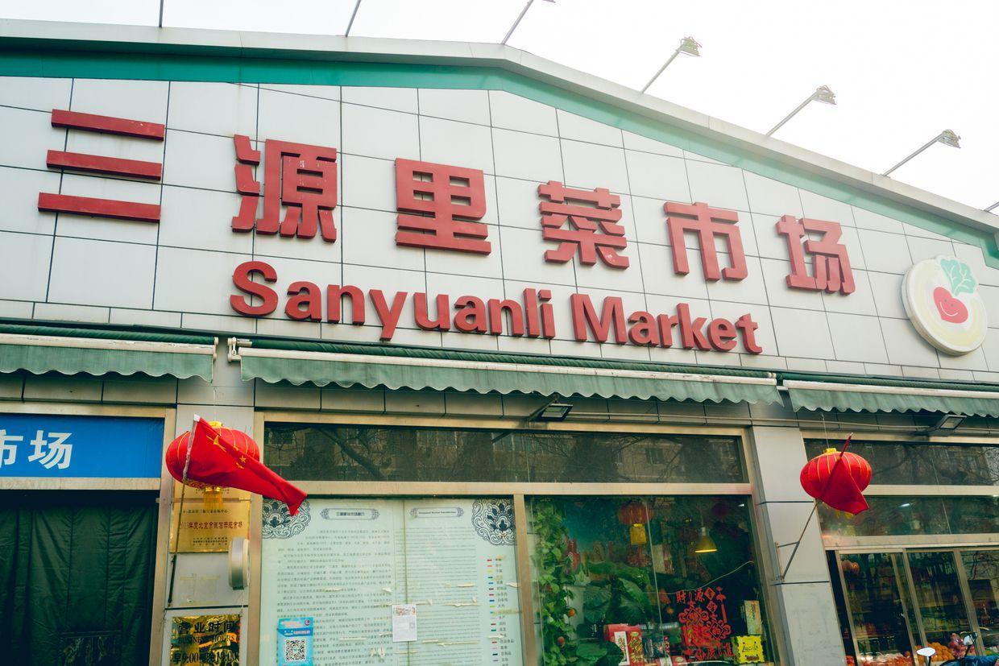

          
            
**2018.03.08**

春节的时候，终于去了一次大名鼎鼎的三源里菜市场。

说起来，里面的东西真是不错，有些肉虽然贵，但是品质是够的，而且有些是别的地方买不到的。

然而来这里，主要不是为了看菜市场，而是看看以前小时候常来的这个地方变化有多大。

以前的邮局还在这里，经常来这里看杂志。

这个社区卫生服务中心，印象以前是个小医院。

以前发烧的时候，如果不厉害，就带我去楼下车棚的小卫生所看看。

如果需要打针的话，就骑自行车带我来这里，屁股上挨上一大粗针管的青霉素。

打完针，母亲会在曾经的新源里菜市场买一个北冰洋的袋淋冰激凌给我吃，说是帮我降温。以至于现在一看到袋淋，都有一种发烧的感觉。

封面

新华书店也还在这里，以前一进去就是铺满的书香，无数人静静地在里面看书。

再往东，就是以前上的幼儿园了。

夏天，父亲下班去接我，在幼儿园门口的喷水池游会儿泳。

路边再买上一个面人儿孙悟空，快到家的时候，抓一只像大苍蝇的蝉，回家放到纱窗上。

在知了知了的叫声中，时光便一去不复返了。

**个人微信公众号，请搜索：摹喵居士（momiaojushi）**

          
        