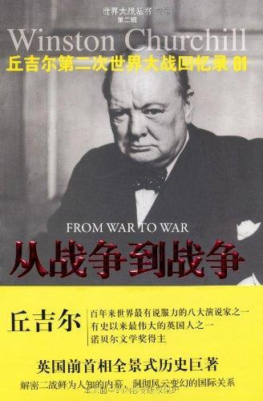

          
            
**2017.03.14**

文笔相当不错，而且内容也是“独家”的，后来被古德里安的《闪击英雄》批评杜撰。
>序言

我也许是唯一的身居政府高位并经历了有历史记载以来两次最大劫难的人。不过在第一次大战中，我担任的还是次要的职位，而在第二次对德战争中，有五年多我是英王陛下政府的首脑。

丘吉尔身居高位，经历两次世界大战，第二次还是首相
>有一天，罗斯福总统告诉我，他正向公众征求意见，对这次战争应该起个什么名称。我立即说：“不需要的战争。”

没有战争是需要的
>第一章胜利者的蠢事

法国凭它的努力和牺牲，理所当然地居于领导的地位。法国人为了保卫法国的国土，在国土上抵抗入侵者的战斗中，几乎死了一百五十万人。巴黎圣母院的钟楼，在一百年内曾五次（1814年、1815年、1870年、1914年和1918年）目睹普鲁士刺眼的刀光剑影，听到震耳的枪炮轰鸣。

法国前后五次和德国兵戎相见
>凡尔赛和约中关于领土的条文，实际上是让德国领土原封不动。它仍然是欧洲最大的单一民族的国家。当福煦元帅听到凡尔赛和约签订的消息时，他非常精确地说：“这不是和平。这是二十年的休战。”

凡尔赛合约不会达成和平
>第二个重大的悲剧就是圣·日耳曼条约和特里亚农条约彻底拆散了奥匈帝国。多少世纪以来，这个神圣罗马帝国的幸存化身，曾使许多不同的民族得享一种共同的生活，享有贸易和安全的利益。

奥匈帝国瓦解，出现许多小国家
>其实，明智的政策应该是使魏玛共和国改变为立宪君主制度，由德皇的年幼的孙子当立宪君主，另设摄政院执政，从而使它得以加强和巩固起来。但可惜没有这样做，这样就使德国人民的国家生活中出现了一个真空。所有的实力派，包括封建势力和军人，本来可以在立宪君主制度之下集结起来，并为了这个制度而尊重和支持新的民主议会制，现在却暂时处于分崩离析之中。

丘吉尔还是喜欢君主立宪
>其后不久，种种强大的力量陷于彷徨无主的状态，真空暴露了出来，过了一阵之后，一个具有残暴天性的狂人，前所未见的侵蚀人类心灵的极其刻毒的仇恨的集中代表，就大踏步地跨进了这个真空——这个人就是下士希特勒。

希特勒就要来了
>福煦元帅为了法国的安全和应付远为强大的邻邦，要求把法国国界推至莱茵河。

法国国界推到莱茵河
>国际联盟刚刚成立就受到一次几乎致命的打击。美国抛弃了威尔逊总统所提出的原则。总统本人准备为他的理想继续奋斗，但他正在着手进行竞选运动时突患中风，在共和党取得胜利以后，在大西洋彼岸，孤立主义思想立即就大行其道。让欧洲去自作自受好了，但法律规定的债务则非偿还不可。

威尔逊被美国抛弃，没有参加国联，自己又中风
>在1921年的华盛顿会议中，美国提出了影响深远的裁减海军的建议，英美两国政府很热心地凿沉它们的舰只和拆毁它们的军事设备。根据奇妙的逻辑，认为除非战胜国自己也解除武装，否则在道义上便无解除战败国武装的理由。

毫无逻辑地自我解除武装
>希特勒下士在慕尼黑竭力煽动士兵和工人疯狂地仇恨犹太人和共产党人，说他们应负德国战败之责，以此来使他自己能够为德国军官阶层效劳；而另一个冒险家本尼☐托·墨索里尼则为意大利提供了一套新的治理方案，声称它可以把意大利人民从共产主义中拯救出来，并趁机为自己夺取独裁权力。

希特勒开始活动
>一个可靠的和平保证还是依然存在的。德国已被解除武装，它的所有大炮和武器已被摧毁，它的舰只已在英国的斯卡帕湾自行凿沉，它的庞大军队已被解散。根据凡尔赛和约，德国为维持国内秩序，只许有一支人数不超过十万人的长期服役的专业军队，并不能以此为基础增加后备人员。

德国军事力量被彻底摧毁
>第二章和平的鼎盛时期

这样就开始了从1923年起的十四

十四年时期，这也许可以称为“鲍德温—麦克唐纳的统治时期”。

鲍德温执政
>在名义上，他们代表互相反对的两个政党，代表两种不同的理论和互相敌对的利益，但实际上他们气味相投，见解一致，方法相同，这确实是我国宪法自有首相一职以来任何两个首相之间从未有过的。奇怪得很，两个人彼此极为投机。拉姆齐·麦克唐纳抱有古老的托利党的许多看法，而斯坦利·鲍德温除了工业家那种根深蒂固的拥护保护关税这一点之外，在性格上比起工党内的许多人来，却是一个温和的更为真诚的社会主义代表。

两个党竟然能够见解一致
>我一向希望看见德国恢复它的荣誉和自尊心，让战争带来的仇恨心归于消失。

丘吉尔希望德国恢复信息，这样就不想打仗了
>我们之间发生断然的决裂，是由印度问题而起的。首相在保守党的印度总督欧文勋爵以及其后的哈利法克斯勋爵的大力支持甚至鼓动之下，提出他的印度自治方案。于是在伦敦举行了一个奇特的会议，刚从宽敞方便的拘留所中释放出来的甘地先生，竟成为会议的中心人物。

甘地又出现了，印度要自治
>第三章潜伏的危险

全部人口以这种或那种身份参加战争，同样都是袭击的对象。天空中开了一条道路，可以把死亡和恐怖带到远离战线的后方，带给老、病、妇、孺这些在以前的战争中不得加以侵犯的人。铁路、轮船和汽车等运输工具神奇地被组织起来，使千百万人可以不断地进行战斗。医疗和外科手术精益求精的进步，把他们一而再、再而三地送回屠杀场。凡是可以用于这种大规模浪费事业的东西，都不会被浪费掉。士兵的垂死挣扎也可以使之产生军事上的效果。

先进的技术，让所有人卷入战争
>赛克特认为，必须避免从第一次世界大战的个人经验中引申出错误的理论。那次战争中的一切教训，都经过透彻的和有系统的研究，拟出了新的训练原则，并编订了各种新教程。一切现有的操典都重新编写，而且不是为那十万兵员的军队而是为德意志帝国的武装力量来编写的。

赛克特暗中计划德军的重振
>第四章阿道夫·希特勒

《我的奋斗》的主题是很简单的。人是一种战斗的动物，因而，国家，作为战斗者的集合体，就是一个战斗的单位。任何有生命的有机体，如果停止求生存的战斗，那就注定要灭亡。一个停止战斗的国家或种族，也同样注定要灭亡。一个种族的战斗力，取决于它的纯粹性，因此，必须排除外来的玷污。

我的奋斗
>这时，经济风暴袭击到德国来了。美国各银行鉴于国内债务日益增多，都不肯增加极不合算的对德贷款。影响所及，弄得德国各地的工厂纷纷倒闭，许多企业也突然破产，而这些工厂和企业都是德国和平复兴所依赖的基础。

经济危机
>第五章被蝗虫吃光的年代[7]

1933年1月30日，希特勒就任德国总理。

1933年2月27日晚，形势达到了高潮。国会大厦忽然失火，褐衫队、黑衫队，以及其他附属组织奉命出动。一夜之间有四千人被捕，其中包括共产党的中央委员。这些措施是由新就任普鲁士内政部长的戈林负责办理的。

希特勒上台，国会纵火案
>当队伍经过他们的领袖面前，行异教徒式的敬礼。这是一个长期的斗争，对于外国人，尤其是对于那些不知战败痛苦的人来说，是很难理解的。希特勒终于来到了，但他不是一个人来的。

希特勒代表了那时一大批德国人
>比较正确的分类，我想，应该禁止的武器，就是那些在使用时会漫无目标的武器，这些武器不仅导致战场上战斗人员的伤亡，而且导致远离战场的居民，男的、女的和儿童的伤亡。在我看来，这才是在日内瓦开会的各国有希望获得谈判结果的方向。……

什么是应该被禁止的武器
>在1931年初，我安排了在美国做一次范围广泛的演讲旅行，到了纽约。在那里，我遇到一次几乎把命都送掉的严重意外事故。

我横过第五街时，根本没想到美国车行靠右的规则刚巧和欧洲相反，也没有注意到在那时英国尚未采用的红灯信号，结果被汽车猛烈碰撞。我变成残废达两个月。

靠右规则
>日本于1月28日在上海公共租界以北登陆。中国进行了英勇的抵抗，虽然缺乏飞机、反坦克炮和任何现代武器，但仍然坚持抵抗达一个月以上。至二月底，在遭到极其严重的损失之后，他们不得不撤出吴淞口炮台，退至离海岸约十二英里的新阵地。1932年初，日本成立了满洲傀儡国。一年以后，中国的热河省又被兼并，而且日本军队深入到没有设防的区域，直达长城。这种侵略行动，是和日本远东势力的增长以及它在海洋方面所取得的新的海军地位相一致的。

淞沪会战
>中国是国际联盟的会员国，虽然它没有付清应缴纳的款项。它向国际联盟呼吁，完全是正义的。

黑国民党征服不交会费
>第六章日益阴暗的景象

德国要取得奥地利，这是希特勒蓄谋已久的野心。在《我的奋斗》的头一页就有这样的一句话：“日耳曼的奥地利必须回到伟大的日耳曼祖国。”

准备搞奥地利
>罗马人有一句格言：“握紧你的武器，延长你的疆界。”但我们的格言似乎是：“裁减你的武器，增加你的义务。”还有，你朋友的武器也得裁减。

不能只是自己放下武器
>在褐衫队体制之内，有一群人数较少而受过高级训练的骨干分子。他们穿黑色制服，称为党卫队，后来又称为黑衫队。这个组织，用意在于保护元首个人和担任特殊的机密工作。他们是由海因里希·希姆莱统率的。

希姆莱准备代替罗姆
>七点钟，元首的一列汽车开到罗姆的别墅门前。希特勒独自一个人，不带武器，径直地上了楼梯，走进罗姆的卧室。两人之间究竟发生了什么事情，将成为永远的秘密。这完全出乎罗姆的意料之外，罗姆和他的私人僚属束手就擒，没有出什么乱子。希特勒一帮人带着他们的俘虏乘车回慕尼黑。

希特勒去逮捕罗姆
>在路上，他们遇到一队载着武装褐衫队员的卡车，这批人是奉命到维塞去出席中午的会议，为罗姆捧场的。希特勒从他的汽车下来，召见他们的指挥官，以充分自信的权威，命令他把这些人带回去。他立刻服从了。如果希特勒迟到一个小时，或者这批褐衫队早到一个小时，那么，整个大局就完全不同了。

希特勒差点被罗姆一锅给端了
>把裁军与和平混为一谈，那是极大的错误。有了和平，才能有裁军。

裁军与和平
>第七章空中均势的丧失

然而，由于未成熟的文明不幸发明了内燃机和飞行技术，一种可供各国进行战争之用的新武器突然出现了，它可以很快地改变各国战争实力的对比。一个头等大国，假使在人类不断积累的知识中和在科学的进步中有自己的一份，那么，它只需四五年的努力经营，就能够建立一支强大的、也许是所向无敌的空军。

科技革命，导致德军迅速武装起来
>第八章挑战和反响

1935年3月9日，德国空军宣布正式成立，16日，宣布德国陆军今后将以国民征兵制为基础；

恢复征兵
>美国除了希望每一个人都过得好之外，对欧洲的一切事情都不愿过问，而且决定以后绝不再为了欧洲的事情来自找麻烦了。

美国孤立主义
>斯大林和莫洛托夫所急于知道的，当然首先是法国军队在西线的实力：究竟有多少个师，服役期多长？对这一方面进行了探讨之后，赖伐尔说：“你能不能设法对俄国的宗教和天主教徒给以一些鼓励？这将对于我和教皇的关系，有极大的帮助。”斯大林说：“啊哟！教皇！他有几个师？”

斯大林只关心朋友的实力
>至于新战列舰的设计，因为德国不是华盛顿海军协定或伦敦会议的签署国，他们就有多一层便利。当英、法、美三国都受三万五千吨的限制时，他们就立即建造“俾斯麦”号和“提尔皮茨”号。这两艘巨型军舰的设计，其排水量都超过四万五千吨，一旦完成，就肯定成为世界海面上最强大的军舰。

德军海军不受吨位限制
>根据1935年6月26日的法律，参加劳动营成为每一个年满二十岁的德国男子的一种强迫义务。他必须为国家服务六个月，修筑道路，建造兵营，或填平沼泽，从而使他在身体上和精神上能够适合于尽一个德国公民的最高义务即服兵役。在劳动营中，强调不分阶级，加强德国人民的社会团结；在军队中，则强调纪律和国家领土的统一。

劳动营成了预备役
>第九章空中和海上的问题

1935年7月25日，防空研究委员会举行第四次会议，亦即我第一次出席的会议，蒂泽德提出了关于无线电定位的报告。我们做了初步试验，证明有采取进一步实行措施的必要。军事各部门奉命制定计划。于是成立了一个专门机构，并在多佛—奥尔福德纳斯地区设立一系列的试验站。对于雷达侦察船只位置的可能性，也进行探索。

德国人如果收听到我们的雷达脉冲波，也不会感到惊奇，因为他们已造出了一种技术上效能很高的雷达系统，在某些方面还比我们的先进。但可以使他们惊异的就是我们在实际运用新发明上所达到的规模，而且把这一切联合起来，构成总的防空体制。

>在这一点上，我们在世界上是领先的，英国的成ji就并不在于设备的新奇，而在于实际运用的功效。

新技术的关键是应用
>第十章对意大利的制裁

在意大利，报阿杜瓦战败之仇，就像法国收回阿尔萨斯和洛林一样，令人扬眉吐气。墨索里尼想不冒很大危险，不费重大代价，轻易地巩固他本人的权力，或者正如他所认为的那样，提高意大利在欧洲的威势，这似乎只有洗雪几十年前所蒙受的污辱，并且把埃塞俄比亚并入最近建成的意大利帝国版图才能办到，此外就没有其他办法了。

意大利一直想染指非洲
>第十一章希特勒动手了

如果法国政府真的动员了近一百个师的法国陆军（当时，大家还错误地以为这是欧洲最强的陆军），德国参谋部就肯定会迫使希特勒撤退进驻的军队。

希特勒成功地重占莱茵兰之后，与他的将领会晤时，他已经能够向他们证明他们的恐惧都是杞人忧天，并且证明他的判断或“直觉”如何高出于普通军人之上。

将领们对他低头了。他们都是善良的德国人，自然喜欢看到自己的国家如此迅速地在欧洲赢得地位，看到他们从前的敌人这样地分裂和驯服。这一幕戏肯定大大增加了希特勒在德国最高权力阶层中的声望和权威，也鼓励了他使他能够再往前走，做更大的尝试。他向全世界说：“德国的领土野心已完全满足了。”

占领了莱茵兰，说自己满足了

**个人微信公众号，请搜索：摹喵居士（momiaojushi）**

          
        