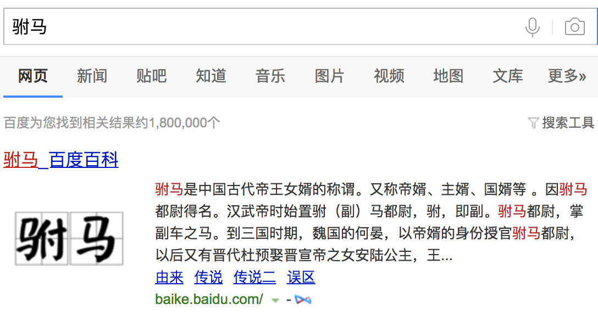

          
            
**2018.03.15**

>“驸马”一词的原始义是：古代几匹马共同驾一辆车，辕马之外的马都称之为“附”。《说文·马部》中有：“附，副马也。”段玉裁注：“副者贰也……非正驾车皆为副马。”原来，先秦及两汉时皇帝出行多乘车，从安全角度考虑，为使行踪不让世人知晓，除将自己乘的车称为正车外，还设有许多和正车形式完全一样的副车，同时还特地设一个替身，掩人耳目，借以表明皇帝在“副车”上。秦朝时，张良会同大力士在博浪沙（今河南原阳县）阻击秦始皇，就因其只击中副车，秦始皇才幸免于难。“驸马”一词成为“驸马都尉”官名的简称，始见于汉武帝时（见《汉书·百官公卿表上》）。

公主的丈夫，驸马的来历众说纷纭，从百科上看，最早的驸马应该是皇上的替身。

到后来，这种皇帝的亲近人，演化成了公主丈夫的职称。

最近听百家讲坛赵冬梅老师讲司马光，提到宋代的驸马升格。

在宋英宗之前，一个人娶了公主，当了驸马之后，他在自己家族里的辈分要提高一辈。

和自己的父亲兄弟相称，同时名字的排字也要修改。

这种违逆人伦的事为什么会出现？

因为太宗是太祖的弟弟，但是年龄小十二岁，所以太宗的女儿嫁的驸马，都比太祖女儿的驸马小了一辈人。

这样公主们在娘家是同一辈分，到了婆家就不同了。

于是太宗要求驸马都要升格，于是自己女儿的辈分又和太祖女儿一样了。

这是对自己低位来路何等的不自信，又是对自己掌握朝局的何等自信。

几乎算是指鹿为马了。

**个人微信公众号，请搜索：摹喵居士（momiaojushi）**

          
        