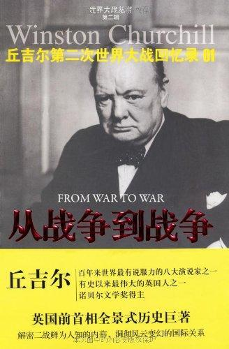

          
            
**2018.03.21**

文笔相当不错，而且内容也是“独家”的，后来被古德里安的《闪击英雄》批评杜撰。
>第十二章重整军备的间歇期西班牙

在圣胡尔霍将军因飞机失事遇难后，佛朗哥将军就举起叛乱的大旗。他获得了军队的支持，包括普通士兵在内。在教会方面，除了黑袍教派这个值得注意的例外情况之外，几乎所有的右派和中间派都支持他。

弗朗哥来了
>一个君王逊位，另一个君王登基。直到1937年5月底，在国内以及在整个帝国，充满人们心中的事就是到处举行盛大而庄严的对新君王的效忠仪式和圣奠。

内维尔·张伯伦先生则是一个极其精明能干、固执而自信的人。他和鲍德温不同，他认为他对欧洲整个局势，甚至对整个世界都了如指掌。我们现在有的是在他所深信的政策的限度之内的精细而锋利的效率，而不是模糊的但又顽固的直觉。他不论任财政大臣还是任首相，都严格控制军事开支。在他的任期内，他是一切紧急措施的最有力的反对者。

张伯伦来了
>第十三章德国武装起来了

那时德国每年都做预算而且还加以公布。不过单从他们的一大堆数字来看，是很难知道真实情况的。1936年4月，我自己通过两条途径来进行调查研究。第一条途径是依靠两个在英国政治避难的德国人，他们不但极其能干，而且有着坚定不移的目的。他们懂得德国预算数字所表示的详细情况和马克的价值等等。同时我又请教我的朋友斯特拉科斯契爵士，问他能否查清真实情况。斯特拉科斯契是“联合公司”这家商行的主持人，这家公司资金雄厚，还有一批极其干练和忠心的工作人员。这家在伦敦的公司的一些人才用了几个星期的时间来专门研究这个问题。不久他们提出了精确而详尽的报告，说德国每年军事开支肯定在十亿镑左右。

德国军费每年十亿英镑
>第十四章艾登先生担任外交

任何外交大臣，如果没有首相经常支持，他就无法进行工作。为了使事情进行顺利，首相和外交大臣之间不但在根本原则上要取得一致，就是在看法上，甚至在相当范围内，在脾气上，也应该非常调和。如果首相本人对外交问题特别关心，那么他们两人之间的合作就显得更为重要了。

首相和外交大臣的关系
>张伯伦先生自认为他有一种个人的和特殊的使命，一定要同意、德两个独裁者取得友好的关系，而且也认为他确实能够建立这种关系。

对于墨索里尼，张伯伦先生同意对意大利征服埃塞俄比亚给予承认，作为全面解决两国纠纷的前提。对于希特勒，他准备在殖民地问题上表示让步。而同时，他却很惹人注目地表示不愿意考虑改善英国军备的状况，也不愿意考虑英法两国之间在参谋部级或政治方面进行密切的合作。

事实是，各种形式的“绥靖政策”只是鼓励侵略和加强独裁者对他们本国人民的权力；

绥靖政策
>这次的会晤并不顺利，很难设想出有比他们这两个人更难互相了解的了。一个是约克郡高派教会出身的贵族和热爱和平的人，在英国旧式生活中彼此笑脸相迎、善意相处的环境中长大；他参加过战争，是个好军官。会晤的对方却是个出身于穷苦深渊的恶棍，由于受国家打败仗的刺激，充满着仇恨心和报复心，疯狂地要使日耳曼种族成为欧洲甚或全世界的主宰。这次会面除瞎说一通和手足无措之外，毫无所获。

英国和德国会晤，鸡同鸭讲
>在这里也许可以提一提，里宾特洛甫曾经两度邀请我去访问希特勒。

丘吉尔拒绝去见希特勒
>第十五章强夺奥地利

如果奥地利归德国所有，就是既打开了捷克斯洛伐克的门户，也获得了通往西南欧的更为宽广的道路。

吞并奥地利
>向维也纳胜利进军向来是这位奥地利下士的梦想。3月12日星期六的晚上，奥地利首都的纳粹党曾计划举行火炬游行，以欢迎这位英雄征服者，但到时却不见大军驾临。

希特勒自己乘汽车经过林茨时，看到车辆拥塞的情形，大为震怒。轻坦克在拥挤混乱的道路上设法开了出来，七零八落地在星期日清晨开进维也纳。装甲车和摩托化重炮只好用火车运到维也纳，用了这种办法才算及时赶到参加仪式。

德军一片混乱进入维也纳
>第十六章捷克斯洛伐克

西方民主国家竟然接受了德国对奥地利的征服，这就鼓励了希特勒加紧推行对捷克斯洛伐克的计划。事实上，在军事上控制奥地利领土，是进攻波希米亚堡垒所不可缺少的准备工作。

拿下奥地利，下一步是捷克斯洛伐克
>德国的将军们不相信法国和英国会对元首的挑战表示屈服，因为他们考虑到协约国的实力除空军外仍然比德国强大得多。要击败捷克斯洛伐克军队，突破或包抄波希米亚防线，就必须出动整整三十五个师。德国参谋部的将领告诉希特勒，要考虑到捷克斯洛伐克军队是有效率的，而且拥有最新式的武器和装备。“西墙”或称“齐格菲防线”的防务构筑虽然已经筑好了野战工事，但距全部完成还很远。而在进攻捷克斯洛伐克时，德国只能抽出五个正规师和八个后备师来保护西线以防可能动员一百个师的法国军队的进攻。将领们听到要冒这个危险，不禁大吃一惊。

德军将领觉得不可能拿下捷克斯洛伐克
>虽然由于协约国的和平主义和软弱性，使德国在实行征兵、进占莱茵兰和强夺奥地利这几个事件中，证明了希特勒的政治判断非常正确，但是，德国最高统帅部却不能相信希特勒的虚张声势的恫吓会获得第四次成功。

德军将领认为不可能第四次耍赖成功
>革命时期的老领导人，如季诺维也夫、布哈林等，还有派去伦敦参加英王乔治六世加冕大典的苏联代表图哈切夫斯基元帅以及不少陆军高级军官，都被枪毙了。文官和上尉以上的军官，被“清算”者总共约有五千人以上。俄国军队以牺牲其军事效率为代价肃清了亲德分子。

苏联大清洗
>第十七章慕尼黑的悲剧

法国确实有这样的条约约束：如果德国进攻捷克斯洛伐克，法国必须对德作战。二十年来，贝奈斯总统始终是法国的忠实盟友，而且几乎是法国的附庸，在国际联盟和其他场合都支持法国的政策和利益。如果世上还有所谓神圣庄严的义务的话，那么现在的法捷关系就是了。

捷克一直抱法国大腿
>椐据哈尔德的供述，柏林警察局局长赫尔多夫当时对于拘捕希特勒、戈林、戈培尔和希姆莱等，曾作过极其周密的布置。“当时不可能出任何意外。只要希特勒在柏林，则政变取得完全成功所需的条件就全部具备了”。

会议中哈尔德告诉维茨累本说：“如果希特勒虚张声势的恐吓又获得成功，那么，他作为总参谋长是不宜把它拆穿的。”于是就决定暂缓行动，等待事态的发展。

德军将领准备逮捕希特勒
>希特勒的判断再一次得到了决定性的证明。德国参谋部不胜惭愧。元首毕竟又是对的了。他单靠了他的天才和直觉，准确地衡量了全部军事、

政治形势。像在莱茵兰一样，元首的领袖才能又再度战胜了德国军事将领们的阻挠。这些将领都是爱国的人，他们切望祖国能在世界上重新获得它的地位。他们日夜辛勤努力，用各种方法来加强德国的实力。当他们发现自己多么地跟不上形势的发展时，心里感到十分痛苦；在许多情况下，他们对元首的憎恶和不信任常敌不过他们对元首高瞻远瞩的天才和神奇的幸运的赞美。毫无疑问，他成了一颗他们应该跟随的明星、应该服从的领导。就这样，希特勒终于成为不容非议的德国主人。鸿图大略的道路已打开了。阴谋反叛的人已销声匿迹，但也没有被他们在军队中的同志们所出卖。

希特勒有一次赌对了。
>不管对“我们时代的和平”作何感想，张伯伦先生总认为必须把意大利和德国拆开来。

太讽刺的和平
>在英国，许多知道我们防务空虚的人，看到我们的空军月月扩充，“旋风”式和“喷火”式战斗机也快要大量出厂，因而有如释重负之感。

就靠这两种飞机保卫不列颠
>捷克斯洛伐克的斯科达兵工厂，这个中欧第二个最重要的兵工厂也让给了对方。

斯柯达
>在全德国正在紧张地、几乎像在战时状态那样努力工作的时候，法国的劳工却早在1936年就已争得渴望已久的每周四十小时的工作制了。

法国工人获得了一周五天工作制
>第二十一章到了战争边缘

当时斯大林曾问：“法国在动员时可以派出多少师的兵力去对抗德国？”回答是：“大约一百个师。”于是他问：“英国可以派多少？”回答是：“两个师，以后可以再派两个师。”斯大林重复着说：“啊，两个师，以后可以再派两个师。”他问：“你们知道不知道，如果我们对德作战，我们在俄国前线要派出多少个师？”这时停顿了片刻，“三百个师以上。”

斯大林早有准备
>这个不幸的消息，好像一个炸弹一样在全世界爆炸。苏联塔斯社说，8月21日到22日，里宾特洛甫正飞往莫斯科和苏联签订互不侵犯条约。

德国把联盟各个击破
>附录

不要再增设什么委员会了。不论多么专门和分工多么精细的委员会，再多也不能达到这个目的。没有一个发号施令的机构，就不能完成供应任务。必须有一个负责的有权力的指挥系统，其权力必须贯彻到全部英国工业（不要认为这意味着国家对工业的实际活动实行干预）。

管事的人多，做事的人少

**个人微信公众号，请搜索：摹喵居士（momiaojushi）**

          
        