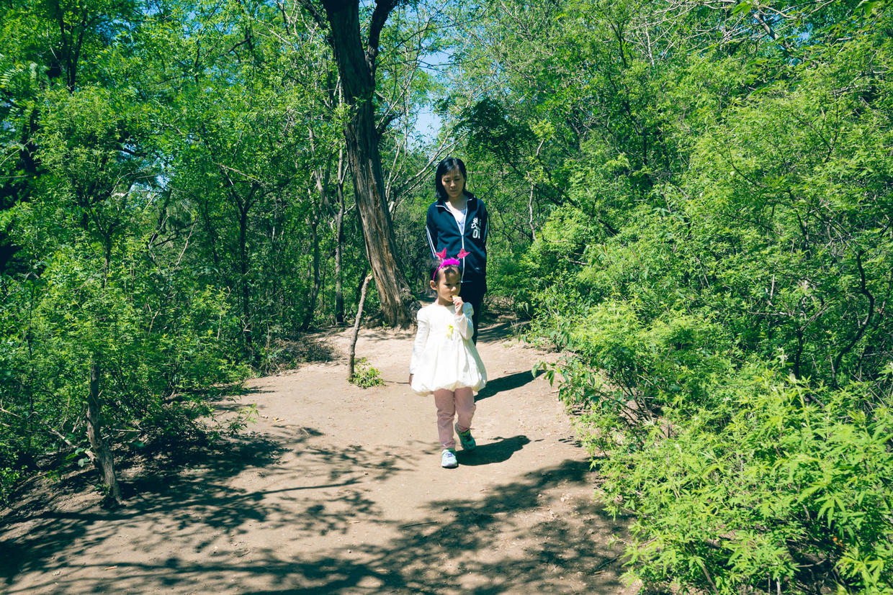

          
            
**2018.03.26**

**拍摄时间：2016.05.15**

**拍摄地点：北土城**

这张照片时2016年夏天拍的。

周末的时候，一起去北土城的小公园散步。

北土城和西土城连起来是元大都遗址公园，但是因为历史原因，很多小段都是各自为政。

像北土城这一小段，印象以前叫做“旭芳园”。

里面大树参天，还有土城的遗迹，象座小山一样。

于是我们沿着小路，走上了这古老的土城墙，遥想当年，这是金朝的城墙，如今却隐匿在树木杂草之间。

虽然阳光很毒，但是在树叶的掩映之下，一点也不会觉得炎热。

翻过小山，走下城墙之后，又是一番天地。

大树之下有石板小路，老人休闲，儿童嬉戏期间。

夏天虽然越来越热，但是能用这样一方幽静的阴凉场所，真是仿佛进入了武陵桃花源一般。

**个人微信公众号，请搜索：摹喵居士（momiaojushi）**

          
        