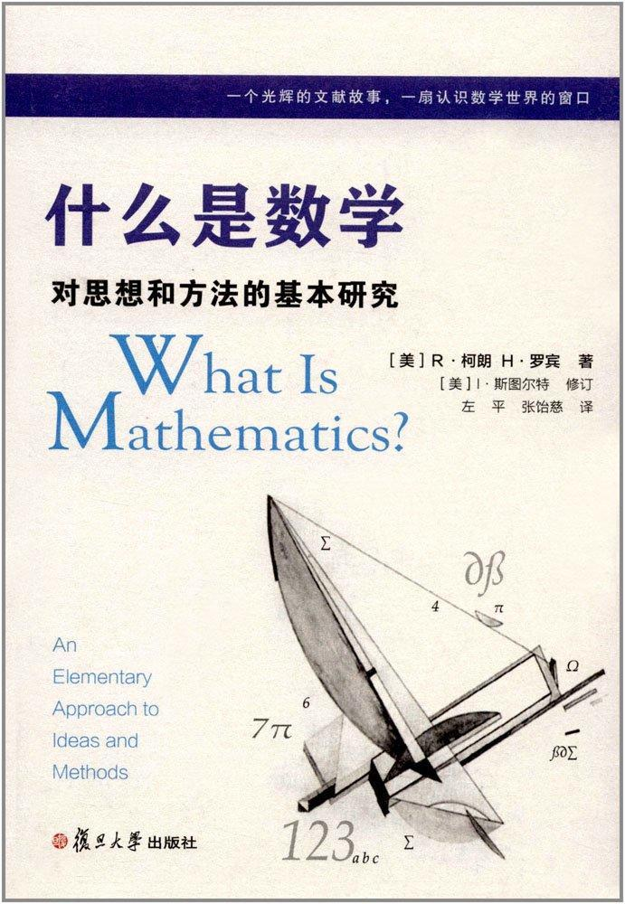

          
            
**2018.03.28**

公式太多，过于晦涩。
>什么是数学

数学，作为人类思维的表达形式，反映了人们积极进取的意志、缜密周详的推理以及对完美境界的追求．它的基本要素是：逻辑和直观、分析和构作、一般性和个别性

数学是思维表达
>有记载的数学起源于东方．大约在公元前两千年，巴比伦人就搜集了极其丰富的资料，这些资料今天看来应属于初等代数的范围．至于数学作为现代意义的一门科学，则是迟至公元前5至公元前4世纪才在希腊出现的

祈起源自东方
>第1章自然数

虽然希腊人曾经把点和线等几何概念作为他们的数学基础，但是，所有的数学命题最终应归结为关于自然数〔1〕1，2，3，…的命题，这一点已变成了现代的指导原则．“上帝创造了自然数，其余的是人的工作．”

自然数是数学终极问题
>第1章补充数论

高斯（Gauss）（1777～1855），是近代第一流的数学家，在数学的许多不同分支都有他的贡献；据说他用下面的话表示他对数论的看法：“数学是科学的皇后，而数论是数学的皇后．”

数学王子
>一个大于1的正整数p，它除了1和它本身外没有因子，就称它是素数

素数
>每一个整数都能表示为素数的乘积．

整数
>关于素数有无穷多个的证明（它是由欧几里得给出的）至今仍然是数学推理的一个典范．这是用“反证法”来进行的．

反证法
>虽然素数平均分布的问题已被满意地解决了，但还有其他许多被试验证实的猜想，迄今还不能证明它们是正确的

其中有一个是有名的哥德巴赫猜想，由试验观察到，任何一个偶数（除了2，它本身是一素数）都能表示为两个素数的和．

哥德巴赫问欧拉：能不能证明这对于所有偶数都是对的，或者至少找出一个反例来否定它．欧拉没能给出回答，而且从那时以来没有一个人给出过回答．

哥德巴赫猜想，任何一个偶数都能表示为两个素数的和
>另一个甚至比哥德巴赫问题更引人注目的问题，却还没有一点解决的途径．人们早就注意到，素数经常以p和p＋2的形式成对出现，例如，3和5，11和13，29和31，等等．人们相信“存在无穷多个这样的素数对”的命题是对的，但至今在解决这个问题的方向上，还根本谈不上有什么办法．

素数以p和p+2成对出现
>关于毕达哥拉斯数的结果，自然地会引起这样一个问题：究竟有没有自然数a，b，c能满足a3＋b3＝c3或a4＋b4＝c4，或更一般地，对一给定的正整数指数n＞2

关于毕达哥拉斯数的评注，费马写道，对任意的n＞2，方程（3）在自然数中是不可解的．但他写道，纸的空白边缘太少，不能把他所发现的这个美妙证明写下来了．

费马大定理
>自然数是从计算有限集合的元素个数的过程中抽象出来的．但在日常生活中，我们不仅要数单个的对象，而且也需要度量像长度、面积、重量和时间这样的量引进有理数，除了有其“实际”原因以外，还有一个更内在的，从某些方面来看甚至是更为迫切的理由

在通常的自然数的算术中，我们总能进行两个基本运算：加法和乘法．但是“逆运算”减法和除法并不总是可行的

为什么引入有理数
>在有理数的范围内，所谓有理运算——加、减、乘、除——可以无限制地进行，而决不会超出这个范围之外．这样一个封闭的数的范围称为一个域．

有理数是个域
>正整数序列1，2，3，4…是最早和最重要的无限集．这个序列没有末尾，没有“终结”，这事实并不神秘，因为不论整数n有多大，总有下一个整数n＋1

一个形如a＋bi的符号，其中a和b是任意两个实数，称为带有实部a和虚部b的复数．在这些符号的加法和乘法运算中，除了i2总是用1来代替以外，将把i看成和一个普通实数一样．

复数
>1900年，在巴黎的国际数学会上，希尔伯特在一个著名的演讲中，提出了23个数学问题，它们都是易于叙述的，有些用初等和普通的语言就可以叙述，但是都还没有得到解决

希尔伯特的23个问题已经解决
>第4章射影几何公理体系非欧几里得几何

一条直线的理想点称为这直线的无穷远点．

直线
>数学中的公理方法至少要追溯到欧几里得时代．

用通常的话来说，公理体系的观点可以描述如下：在一个演绎系统中，证明一个定理就是表明这个定理是某些先前业已证明过的命题的必然逻辑结果；而这些命题的证明又要利用另一些已证明的命题，这样一直逆推上去．所以数学证明的过程是一个无限逆推的不可能完成的任务，除非允许在某一点停下来．因此，必须有一些称为公设或公理的命题，把它们当作真的事实接受下来，而无须加以证明．

公里无需证明是必须的
>这些公理必须是相容的，就是说，从它们出发推导出来的任意两个定理都不会相互矛盾；而且这些公理必须是完备的，就是说，这个系统中的每一个定理都能由它们导出．为了经济起见，也希望这些公理是独立的，就是说，其中没有一个公理是其他公理的逻辑推论

公理的特型
>在欧几里得几何中，有一条对应于拉紧的琴弦或一束光线的公理，其“真实性”，并非显然．这就是有名的平行线唯一性公设．它断言：通过不在给定直线上的任一点，能画一条且只能画一条直线平行于该给定直线．这个公理引人注目的特点是，想象一条直线向两边无限延伸，然后作出关于这条直线整个范围的论断．因为，说两条直线平行，就是说不论它们延伸多么远，它们绝不相交．不用说，在任何固定的有限距离内，不论多么大，过一点都有许多直线不与一给定直线相交．

然而欧几里得几何的所有其他公理都具有有限性．在那里，它们处理的是直线的有限部分和有限范围内的

平行公理在欧几里得几何里很不和谐
>平面图形．平行公理不能通过经验加以验证，这个事实引起了这样的问题：它究竟是不是独立于其他公理．如果它是其他公理的必然逻辑推论，那就可以不把它作为公理，而用其他欧几里得公理加以证明．

我们只须造这样一个简单的几何“模型”，使它满足除了平行公设外的所有欧几里得公理．

在这模型中，过给定直线外一点可以画出无穷多条“直线”“平行于”这直线．这样的几何称为波约伊－罗巴契夫斯基几何或“双曲几何”（后一个名称的起因见此处）．

非欧几何，除了平行都满足
>虽然实验没有作出结论，但它表明了欧几里得几何和双曲几何只有在大范围内才有所不同，而对相对小的

图形来说是如此紧密地吻合，以至于是和实验一致的．因此，只要所考虑的纯粹是空间的局部性质，那么在这两个几何之间进行选择完全视其简单和方便而定

非欧几里得几何的发现，其革命性意义在于它摧毁了这样的观念：欧几里得公理是我们关于物理现实的实验知识必须适应的始终不变的数学模式

这个想法首先是黎曼在1851年被授予哥廷根大学名誉讲师时，他在就职演讲中提出的．具有封闭的有限直线的几何能以一种完全相容的方式给出

黎曼几何
>第5章拓扑学

在给一个地图着色时，习惯上是，对任意两个有一段共同边界的国家使用两种不同的颜色．经验表明，任何地图不论它包括多少国家，也不论它们的位置如何，要这样给它上色，只用四种不同的颜色就够了．

四色问题
>第一个是切线问题：确定已知曲线的切线，这是微分学的基本问题．

第二个是求积问题：确定已知曲线内部的面积，这是积分学的基本问题．牛顿和莱布尼茨的伟大功绩在于他们明确地认识到了这两个问题之间的密切联系

微积分的2个基本问题
>为了计算平面图形的面积，我们选择边长为单位长度的正方形作为面积的单位．

面积
>微积分的第一个基本概念是积分．这一节我们将把积分理解为用极限方法求得的曲线下的面积

积分是求面积
>微积分的另一个基本概念——导数，则是在17世纪才由费马及其他人建立起来的

导数
>莱布尼茨和牛顿的巨大功绩，就在于他们首先明确地认识到并应用了这个微积分基本定理

这两人的伟大在于认识并应用了微积分基本原理

**个人微信公众号，请搜索：摹喵居士（momiaojushi）**

          
        