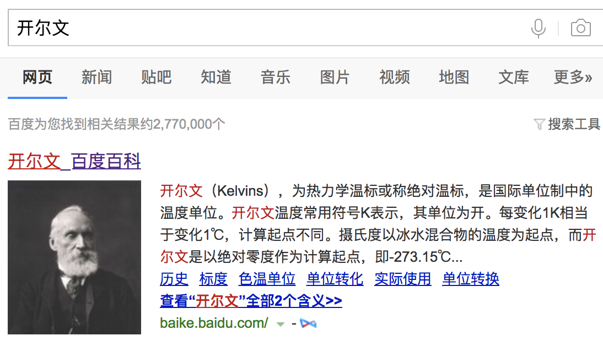

          
            
**2018.03.29**

>威廉·汤姆逊生于1824年爱尔兰，父亲占姆士是贝尔法斯特皇家学院的数学教授。汤姆逊一家在威廉八岁时迁往苏格兰的格拉斯哥，而占姆士则任教格拉斯哥大学。汤姆逊十岁便入读格拉斯哥大学 （你不必惊讶，在那个时代，苏格兰的大学会取录最有才华的小学生），约在十四岁开始学习大学程度的课程。十五岁时凭一篇题为「地球形状」的文章获得大学的金奖章。文章论及的一些重要概念，汤姆逊在往后还常常用到。汤姆逊后来到了剑桥大学升学，以全级第二名的成绩毕业。他毕业后到了巴黎，在勒尼奥的指导下进行了一年实验研究。

开尔文是他爵位的名字，其实他叫汤姆逊。

提出了热力学第二定律，彻底否定了永动机的拥趸们，热力学单位被定位开尔文。

他还发掘了啤酒厂老板焦耳，一起做出了更伟大的成就。

同时还参与了大西洋海底电缆铺设工作，即是科学家，也参与了具体的世界性工程项目。

**个人微信公众号，请搜索：摹喵居士（momiaojushi）**

          
        