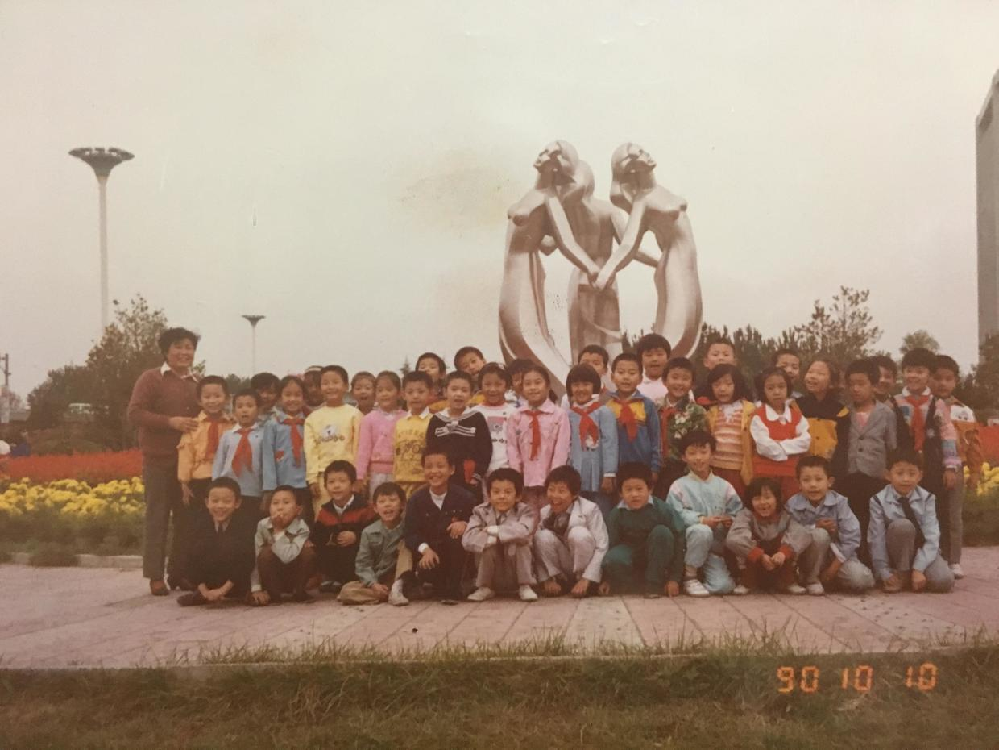

          
            
**2018.04.13**

有的小朋友对我说不想上小学，因为减法太难了，其实小学里有趣的事可多了，包括减法在内。

这篇说一下我小学的第一位老师。

那就是我的许老师，这个许是三声，老也是三声，连起来念的时候很绕嘴，所以许要改成二声。

这样听起来就像是“徐老师”了，而当时正好学校里还有一个徐老师，经常会弄混，所以我就坚持每次认真发三声去叫我的许老师。

当时许老师已经上了年纪，人是非常和蔼的。

她即是我的班主任，也是语文老师。

班里的各种事情都要管，她在课上说的话，我已经不记得了。

但是，她带我们去公园玩儿，却一直留在了相片上。

现在想起来，真是辛苦。

下了课，带着一班几十个同学，从小花园一直往东走，一边走一边拍照。

最后，就这样走到了三元桥前，大家在三个手拉手的大姐姐雕塑那里拍了合影。

那时，三元桥边最高建筑只有电话局大楼。

**个人微信公众号，请搜索：摹喵居士（momiaojushi）**

          
        