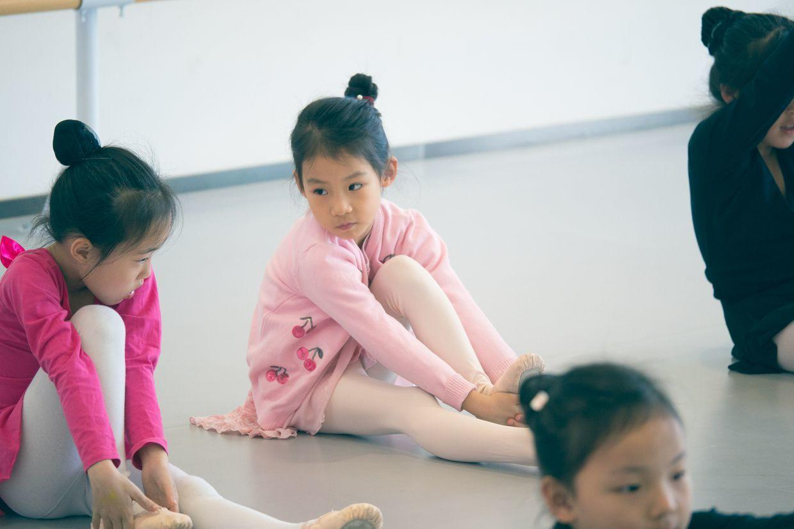

          
            
**2018.04.14**

周六啦，一早起床，准备去上芭蕾课。

一出门，风真大啊，人都要吹飞了。

到了教室，开始准备热身。

和旁边的同学交换眼神。

中午回家，跟姥姥姥爷视频聊天。

然后吃过饭后，睡个大觉。

早早起床，榨了点果汁。

然后出门去上钢琴课。

钢琴课上错误百出啊，各种指法和认音的问题。

下了课，风太大，没法户外活动。

只好去看电影，《彼得兔》要下线了，正好看一下。

到了商场，先吃个饭，然后入场。

瞪着大眼睛。

门口有钢铁侠的反浩克装甲模型。

还有漫威十周年海报，从钢铁侠1开始，一转眼已经十年了，下了一盘大旗。

和暴风战士们在一起。

回到家，一路上就在聊彼得兔的男主人公为什么骗女主人公，真是个感情细腻的小东西。

**个人微信公众号，请搜索：摹喵居士（momiaojushi）**

          
        