          
            
**2018.04.15**

周日啦，大风终于过去了。

吃过早饭，去晒太阳。

一路的阳光，公园里花已经开好等我们了。

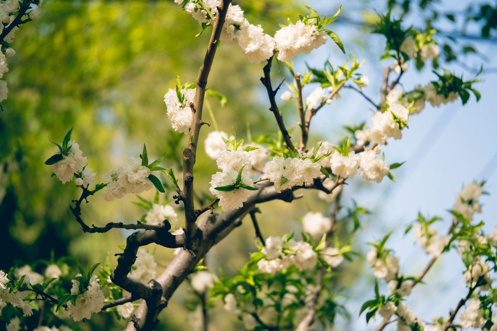

抿着小嘴笑，大酒窝。

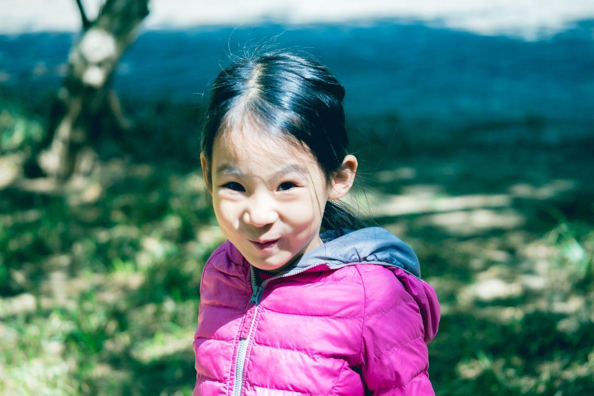

吃着果冻，奔跑起来。

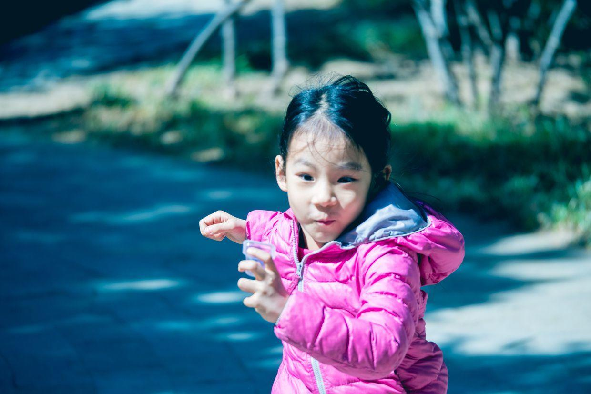

公园里树影婆娑。

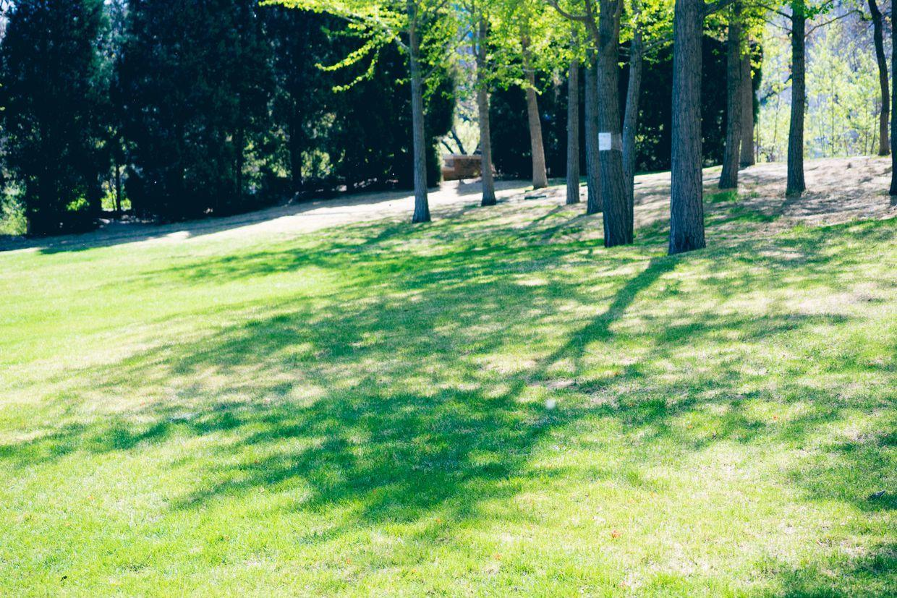

披头散发地就跑出来了。

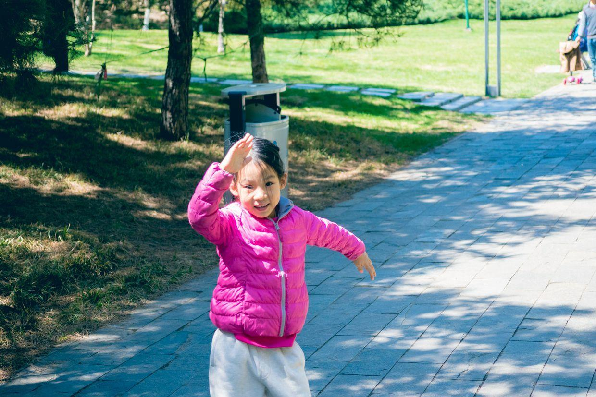

不知道谁，给忽必烈找了一个好朋友。

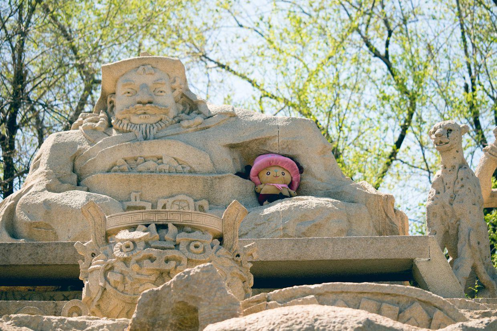

兜里还带了一盒橡皮泥。

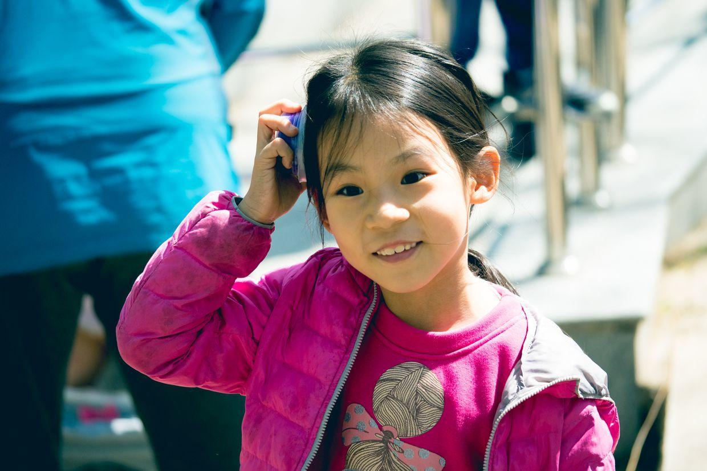

跑起来真是有劲。

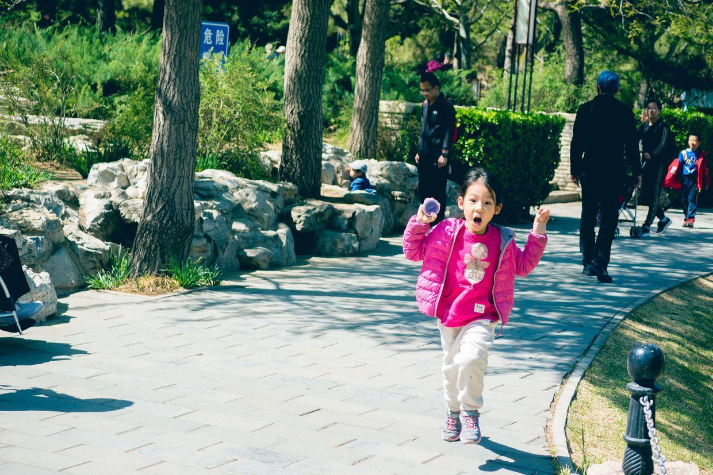

对面的亭子边有人在跳舞。

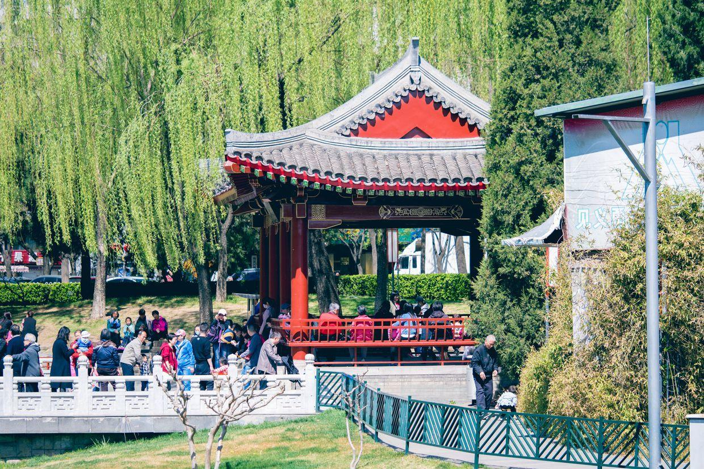

颜色真是鲜艳。

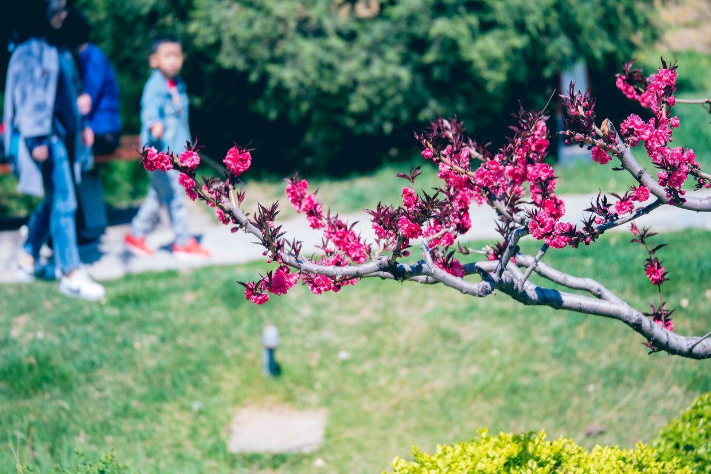

去亭子里野餐，吃点喵妈准备的三明治。

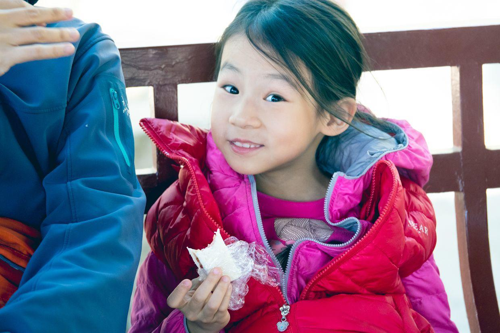

过天桥，桥下的绿树。

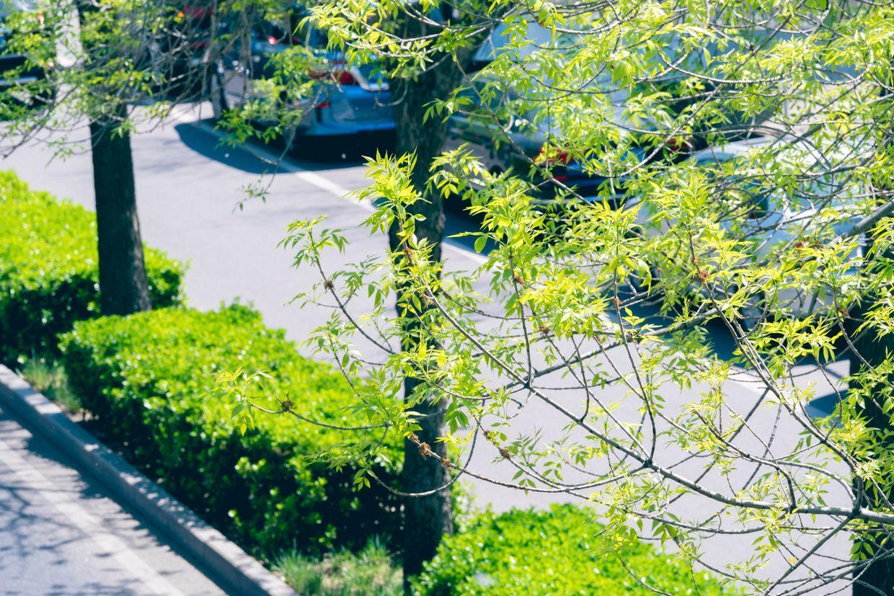

封面

向西望去，依稀能看到两重山。

中午去吃饭，开始了你画我晕倒的游戏。

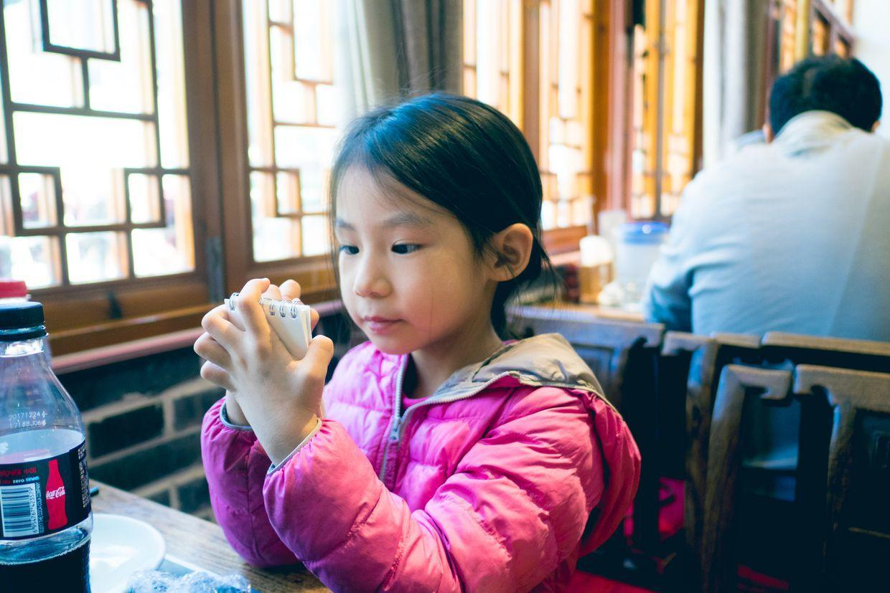

入春之后，终于等到了一个适合出行的好天气。

虽然就在家门口，但是简单晒晒太阳已经足够了。

中午回家，睡个大觉，下午起来准备练琴。

狂风之后，是一个温暖的周日。

这个周末真是两天分明啊。

**个人微信公众号，请搜索：摹喵居士（momiaojushi）**

          
        