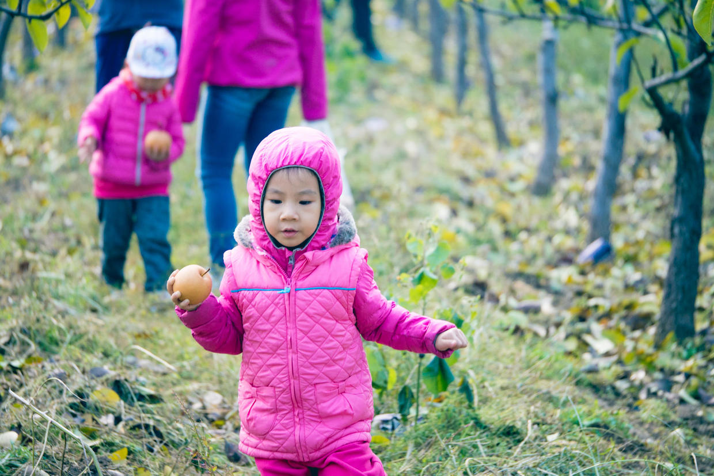

          
            
**2018.04.16**

**拍摄时间：2016.10.30**

**拍摄地点：小汤山百果园**

这张照片是2016年10月底拍的。

当时全家一起去小汤山百果园去摘苹果和梨。

爷爷奶奶发现了这个好地方，丰水梨巨大巨大地缀满了树枝。

天气已经转冷了，喵穿着薄羽绒服，外面还套了一个羽绒背心，粉色的羽绒服帽子，罩在小脑袋上。

长头发从整个脸上不见了之后，整个人突然特别像我小时候了。

刚从树上摘了一个丰水梨下来，从泥泞的田埂上，小心翼翼地往回走。

后面还有兜妹跟着，两个人收获真是不小。

接下来悦妹也到了，大家就往里走，去苹果树聚齐。

一边摘，小家伙们也一边吃着，红红的苹果通常都挂在很高的地方。

老同志们熟练的削皮切块，小家伙们就大快朵颐起来。

到了门口，上称结账，还真是不贵啊。

冬天里，看着红红的苹果，还有她们红扑扑的小脸，真是幸福啊。

**个人微信公众号，请搜索：摹喵居士（momiaojushi）**

          
        