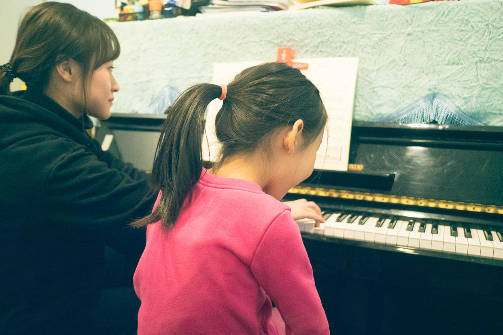

          
            
**2018.04.17**

还是练琴的话题，最近练琴的状态又开始有了新的变化。

通常周中的时候，大概能练到40分钟，不过实际上真正有效时间，也就只有20分钟。

中间要出去休息休息，还要喝水，上厕所。

真是一练琴，什么事都能想起来。

周日在家会练得时间比较长，有时候能到1个多小时。

中间在有小进步的时候，就要放她去喝个水，放松一下。

而关键的时刻通常在最后完整合练的时候。

每个小节没问题之后，在整体衔接的时候，还是会遇到不少问题。

比如，手指上黑键时，要提前准备等等。

通常，几遍都不成功，就很容易进入高压锅状态，整个人开始哆嗦，脑子开始混乱，鼻子呼哧呼哧的。

这种情况一定要及早发现，让她赶紧下去放松一下。

否则一旦进入状态，轰都轰不下去，开始跟自己较劲，一定要弹下来。

所以练琴要多久，真是不好说。

要根据这一周曲目的难度、练习进度、身体状况等等均衡考虑。

第一轮攻克难点，解决知道怎么弹的问题。

第二轮攻克难点间衔接，个别指法错误，解决整体串联的问题。

第三轮就是自己反复熟练。

每天练多久呢？尽量在焦躁前完成就好。

**个人微信公众号，请搜索：摹喵居士（momiaojushi）**

          
        