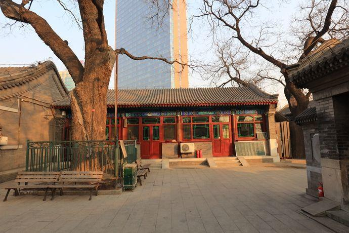

          
            
**2018.04.19**

马甸这里有个著名的马甸清真寺，出名的主要原因是旁边有个卖清真羊肉的店，品质非常高，童叟无欺。

前段时间提到马甸，和朱妹一起回忆了小时候从那里坐车去昌平的往事。

那时朱妹的姥姥姥爷住在昌平，有时候周六坐车回昌平住一晚上，周日再回来。

正好那次把我也带上了。

印象里早上先是坐公交一路颠簸到了马甸桥，那时朱妹的舅舅在马甸开小公共汽车，于是我们就正好搭车去昌平。

小公共汽车也是一路颠簸，一路的上下客人，等到了昌平，已经很晚了。

周日回来的时候，我们去坐长途车，拎着大包一路跑，终于上了大客车。

路标上写着，前方“北京”，那时昌平还是县。

再往后，有了八达岭高速，再改成京藏高速，去昌平，只要不堵车，已经是分分钟的事了。

**个人微信公众号，请搜索：摹喵居士（momiaojushi）**

          
        