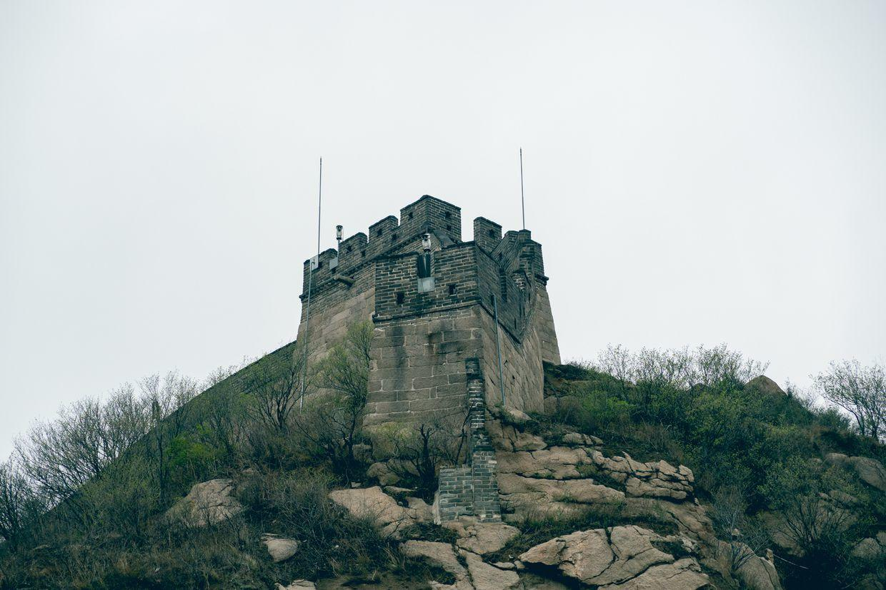
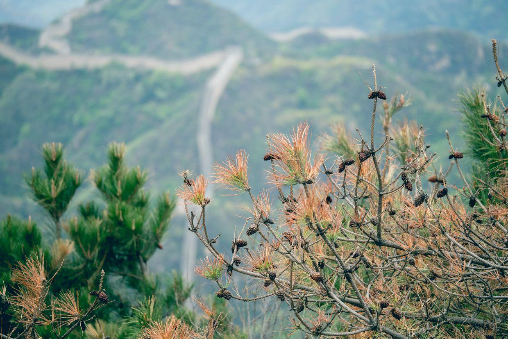
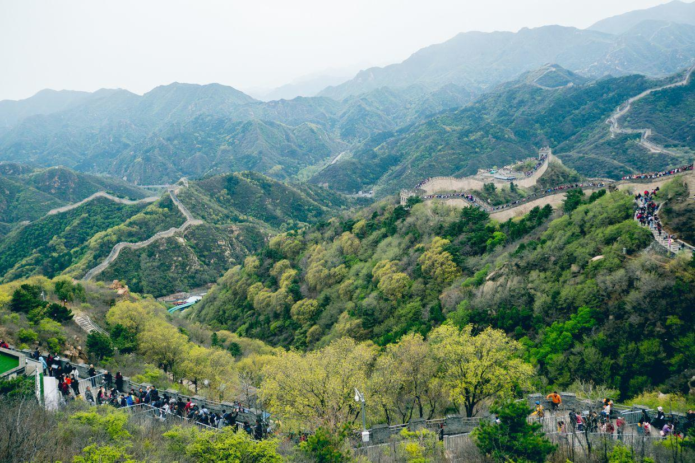
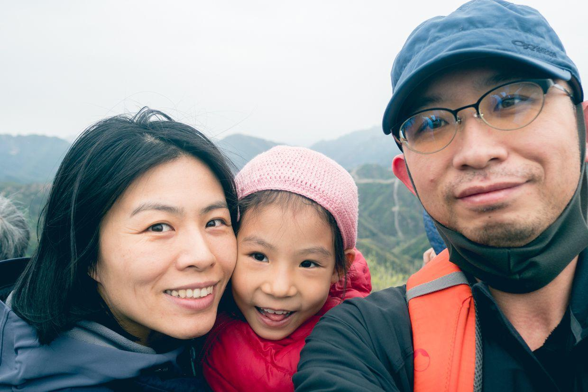

          
            
**2018.04.22**

周日啦，一早起床，去吃早饭。

自助餐厅非常有格调，提供培根和香肠的英式早餐。

吃饱了，三个小姐妹开始玩儿起来。

一起合影。

发现外面有只狗。

出发去八达岭长城，坐缆车直上北七楼。

开心得不得了。

中间颠了一下，还挺吓人。

看到了蜿蜒的长城。

废弃的烽火台。

赶紧合影。

人山人海，队伍半天也不动。

远处的长城。

依着山势，曲曲折折，或者陡然而下。

难以想象当时是怎么修建起来的。

三个人行走的长城。

看起来有点冷清。

各种颜色的冲锋衣把长城点缀得多姿多彩。

布满了监视器的敌楼。

绿意盎然。

封面

移步换景，走了几步就认不出刚才看到的那段了。

自拍啦。

找个人少的地方赶紧合影。

和城墙合影。

回头往下看。

看向远方。

终于可以做好汉了。

一起合影。

到了北八楼。

还买了刻名字的金牌。

合影。

回北七楼坐缆车回去，正好开始下雨，赶紧上车。

中午吃过饭，开车分头回家，车上睡得跟死猪一样。

三个小姐妹第一次长城之行。

**个人微信公众号，请搜索：摹喵居士（momiaojushi）**

          
        