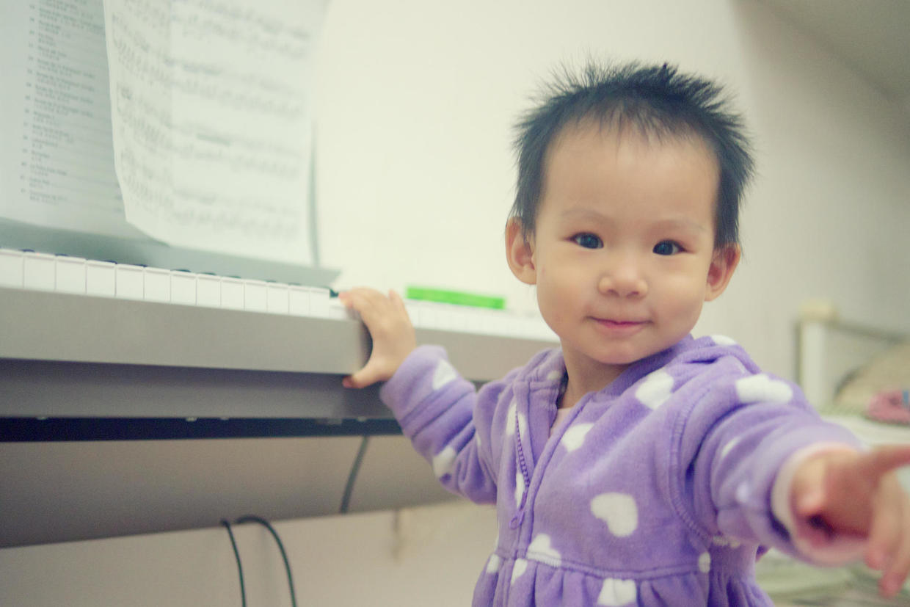

          
            
**2018.04.27**

***有的小朋友对我说不想上小学，因为减法太难了，其实小学里有趣的事可多了，包括减法在内。***

说到小学，首先我想说一下音乐课。

6岁的时候，父母买了钢琴，我也开始学琴生涯。

入学后，音乐老师是一位年的舟老师，听说我学钢琴后，非常高兴。

那时有条件学钢琴的孩子非常至少，周广仁教授也刚开始创业，我也被她老人家面试过。

于是，音乐课上，舟老师在教的各种音符对我来说都不是问题。

渐渐地，舟老师会让我到教室的钢琴上给全班同学伴奏，大家一起唱歌。

印象最深的就是《快乐的粉刷匠》这首歌。
>哎呀我的小鼻子，变呀变了样。

这首歌的歌词，即使到今天，也还是能一字不差地唱出来。

学习一门乐器的优势就在这里，带给一个人非常不同的人生经历。

**个人微信公众号，请搜索：摹喵居士（momiaojushi）**

          
        