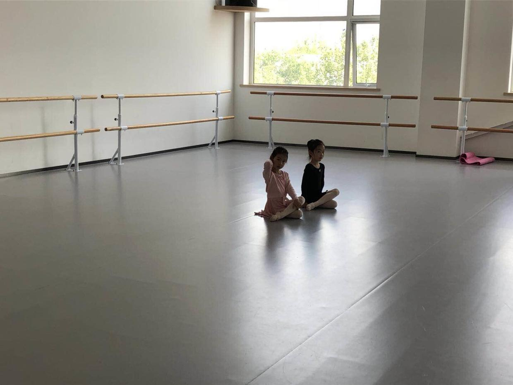
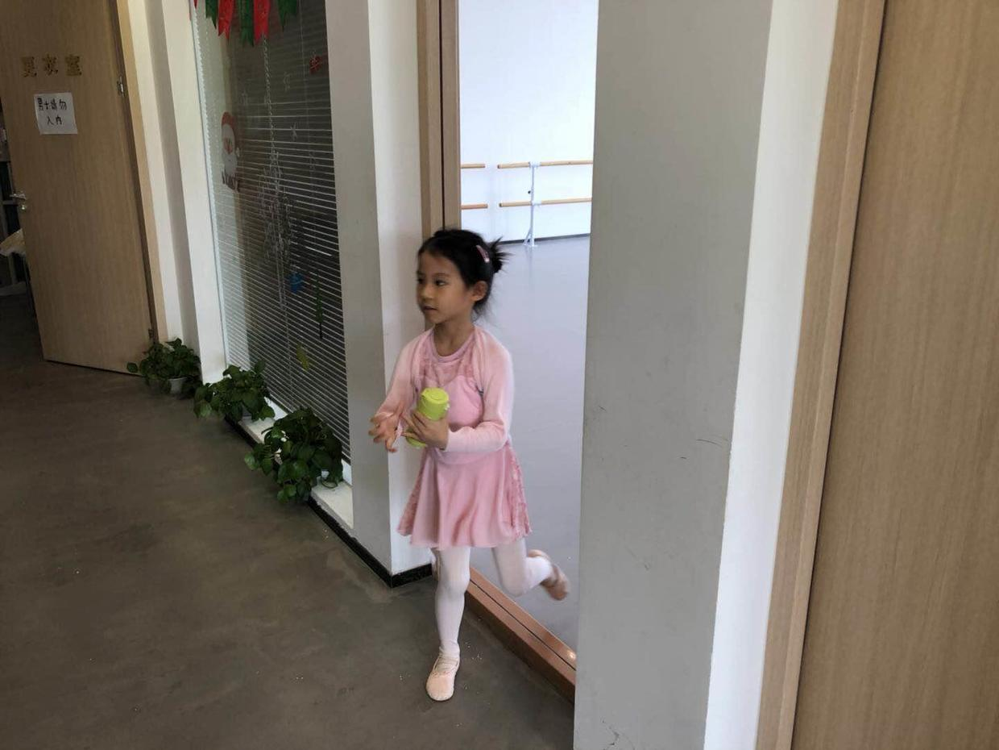
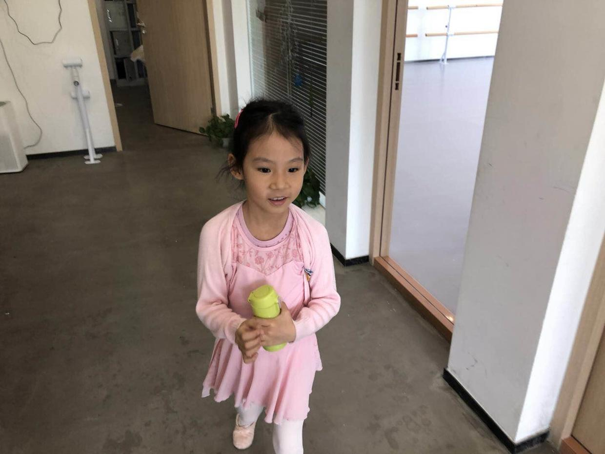
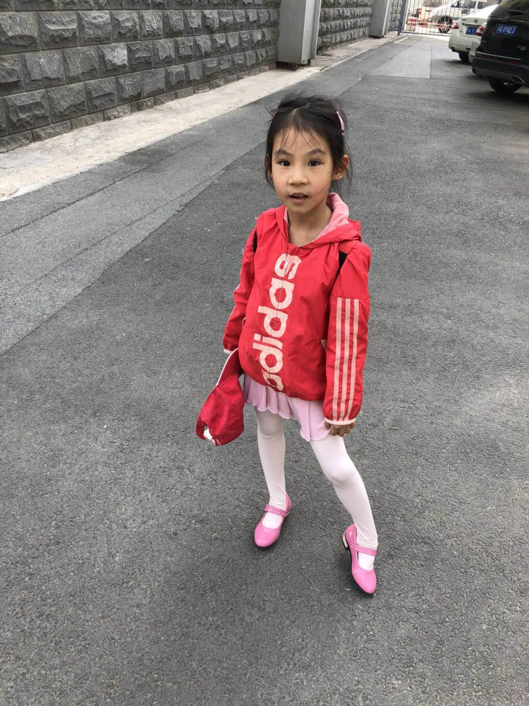
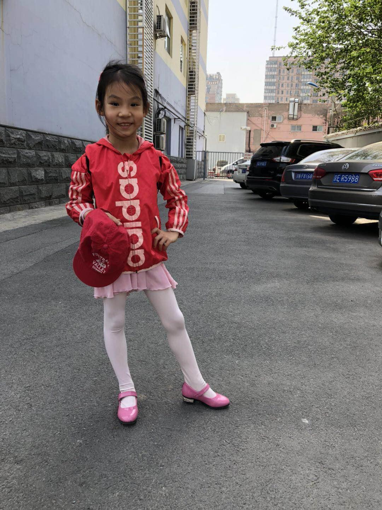
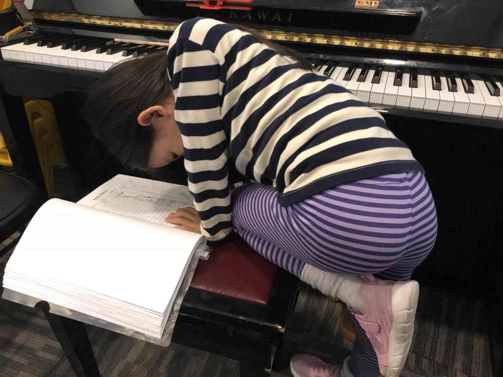

          
            
**2018.04.28**

周六啦，不过是五一倒休，要上班。

喵妈带喵去上芭蕾课。

芭蕾课大部分同学都上小学了，今天要上课，结果班上就只来了这2位同学。

这回可是真正的小班教学啦。

上完课啦，拿着水杯出来啦。

喝点水，准备回家吃午饭。

中午吃个饭，跟姥姥姥爷视频聊聊天。

下午睡个大觉。

起床去上钢琴课。

特意穿着自己的小粉皮鞋，溜达到停车场。

封面

穿着漂亮鞋，真是高兴极了。

钢琴课下课啦，去签自己的名字，照例是要画个小兔子吧。

虽然是五一临近，但还是过了一个规律的周六。

可惜要上班，没法跟着一起去。

明天就要放假了，安排了丰富的行程。

根据专家聊天气介绍，明天天气还不错，夜里可能有雨，后天虽然会冷，但是空气质量会有所提高。

很多同学都去赶火车啦，真有过节气氛啊。

**个人微信公众号，请搜索：摹喵居士（momiaojushi）**

          
        