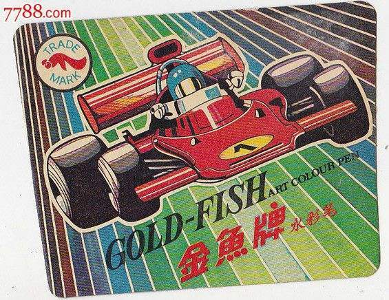

          
            
**2018.05.04**

***有的小朋友对我说不想上小学，因为减法太难了，其实小学里有趣的事可多了，包括减法在内。***

这次我们来说说美术课吧。

记得美术书是一本杂志大小，很薄的册子，封面上很抽象地泼洒着各种颜色，同时有大大的“美术”两个字。

书上会介绍各种名家的作品，大部分都看不懂。

美术课和其他课最大的区别就是，别的课带着脑子就行，美术课还要带用具。

最经常要用到的就是这个赛车牌子的水彩笔。

一旦忘带，就要去借，或者回家取，没有就只能罚站。

所以每次美术课前后，班里都是最热闹的。

课前一堆人跑出去借水彩笔，下了课又一堆别的班的人跑来找我们借笔。

有时，老师还会组织同学们去户外写生，在和平里的小公园里，我画过和平鸽，也画过稻香春。

倘若那时的作品还能留下来，也可以让你看看那时新华书店门前百草繁茂的样子。

**个人微信公众号，请搜索：摹喵居士（momiaojushi）**

          
        