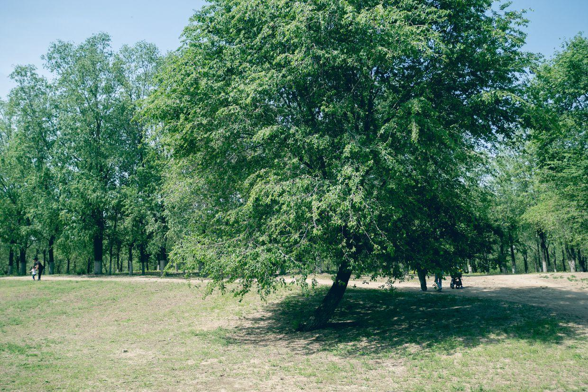

          
            
**2018.05.06**

周日啦，天气终于转好，去奥森晒太阳。

还是这个奥森大草原。

在野花中合影。

哈哈大笑。

封面

跑跑步，走走路。

森林深处很幽静。

喷水的皮管子。

这一片大草原，养几头鹿就是奈良了。

给我一块石头，想办法把风筝打下来。

不只是谁的风筝困在树上了。

一起动手练投掷。

去玩儿苔藓了。

吹蒲公英的少女。

遍地的野菊花。

高耸的白杨树。

银杏叶。

撒花啦。

树林深深深几许。

一上午很快就过去了，晒了很久的太阳，在树很久林里溜达了很久，打了半天的风筝，玩儿了很久小花。

中午回家吃饭，吃过饭，准备睡个觉。

下午继续准备练琴，还要洗个澡，一身的臭汗了。

炎热的夏天就这样，突然地扑面而来了。

虽然还没有听到蝉鸣，也没有吃到冰镇西瓜。

**个人微信公众号，请搜索：摹喵居士（momiaojushi）**

          
        