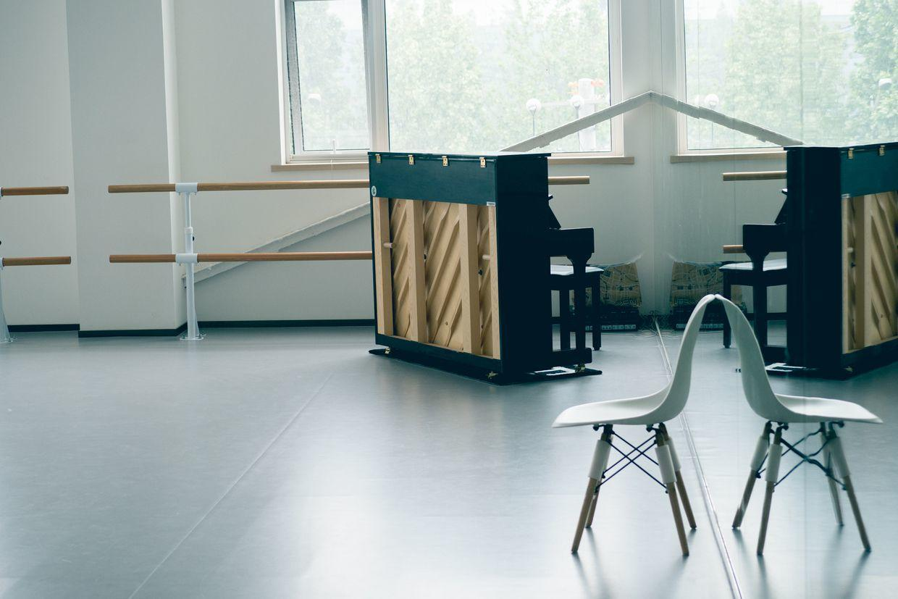
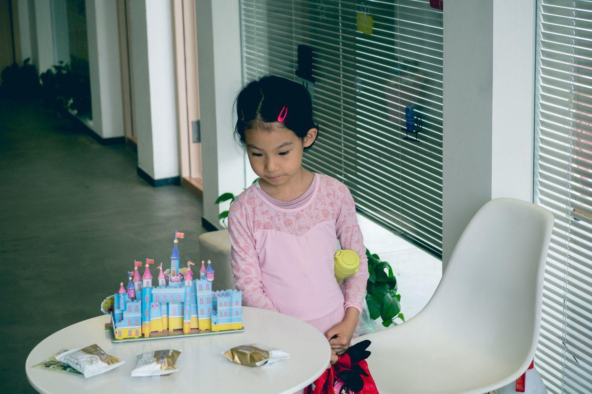
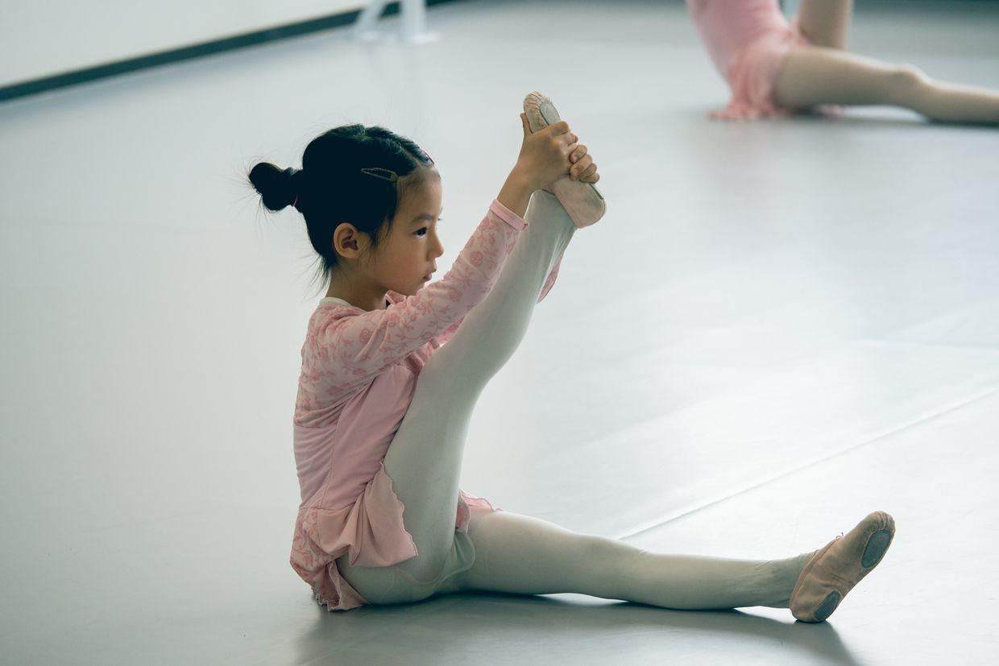
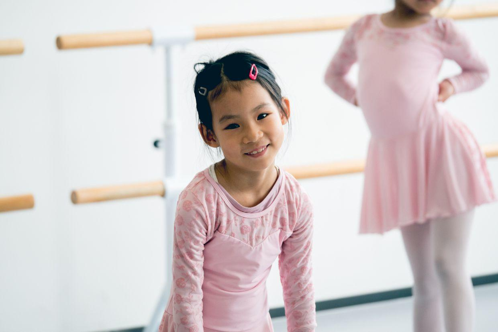
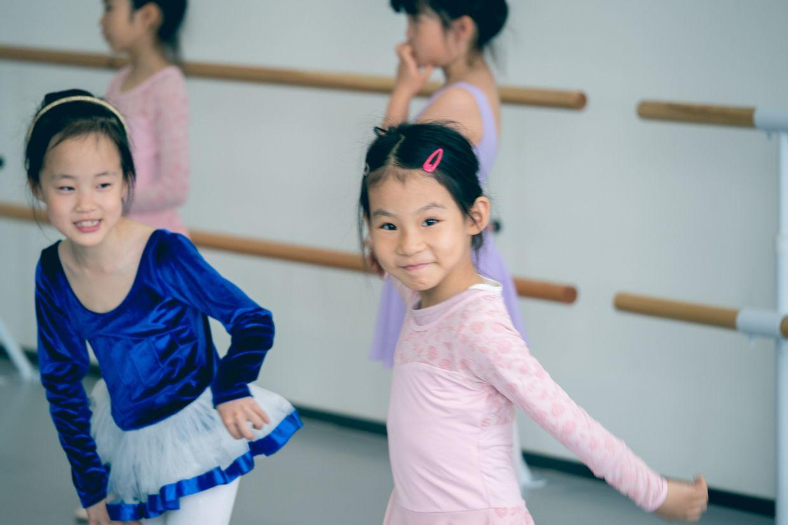
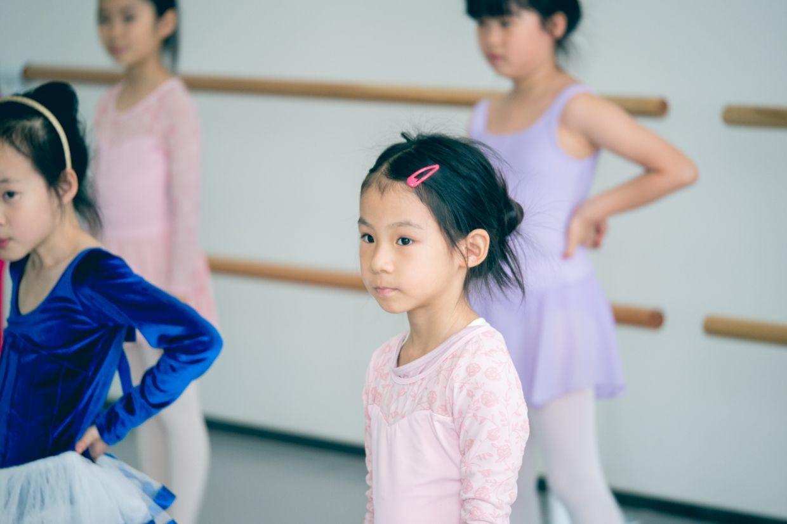
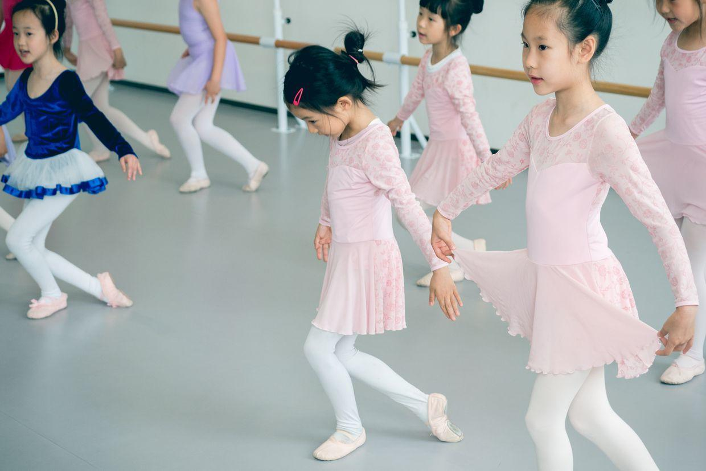
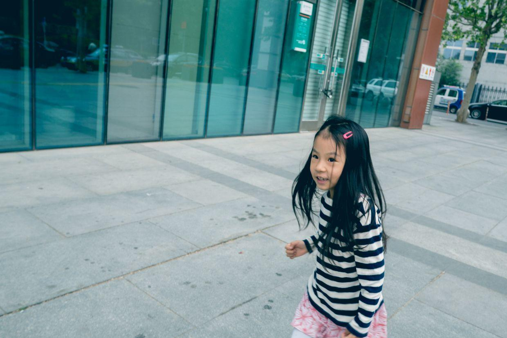
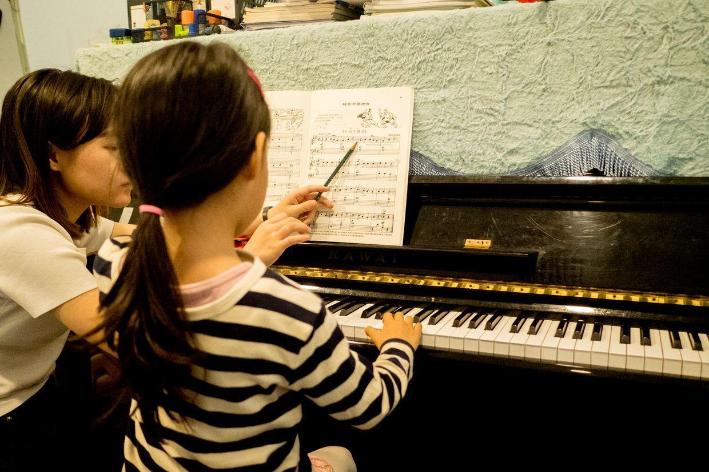

          
            
**2018.05.12**

周六啦，大雾霾天来啦，据说还要下大雨。

一早起床，出发去芭蕾课，教室里还没有人。

外面的桌子上摆了个城堡模型。

去做准备活动啦。

下课了，老师请家长进教室，一起看为母亲节排练的小舞蹈。

小人儿还开心啊，还有点不好意思。

舞跳得很不错，还表演了小天鹅。

封面

听老师讲评，笑得很腼腆。

最后要很优雅地和老师再见。

中午回家和姥姥姥爷视频，然后吃午饭。

下午睡个觉，去上钢琴课。

披头散发地跑出去了，像个小疯子。

《威廉退尔》练得不错了，准备要演出啦。

下了课，去买早饭，然后去吃大M，自己去结账拿食物，很多事都能自己做了。

明天晚上就是钢琴沙龙的演出啦，保持好状态，选身漂亮的演出服，好好表演。

**个人微信公众号，请搜索：摹喵居士（momiaojushi）**

          
        