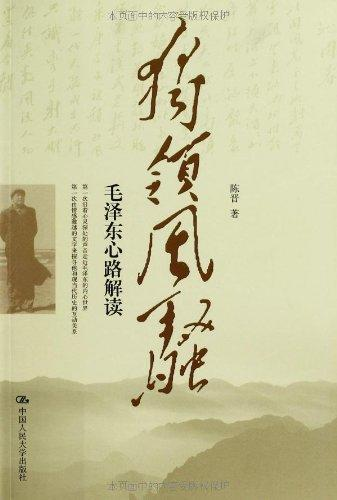

          
            
**2018.05.16**

详细介绍了主席的诗词，以及写作历史背景和轶事。
<h2>2018.02.08（周四）</h2>
<h3>《独领风骚：毛泽东心路解读》 - 01</h3>
>第一章心路风景

1973年，刚刚大病一场的毛泽东，已经整整80岁了。这年夏天，他用已经有些枯涩的情思，写了平生最后一首诗。这年冬天，他还劳费情思地做了一件词墨韵事。他让身边的工作人员把自己一生的全部诗词作品重新抄写了一遍。抄完后，他一一核对，对其中的一些词句作些修改。然后让工作人员又抄写一遍。抄清后，又再次核对。

主席晚年重新校对诗词
>第二章“奇士”的青春

1915年9月，湖南第一师范学校二年级学生毛泽东，做了一件很特别的事情。他根据“毛泽东”三个字的繁体笔画数，用“二十八画生”的名字，在长沙一些学校贴了个好几百字的“征友启事”。

主席最早的笔名
>好吟诗作对，有点自命不凡的劝学所所长夏默庵，要试试来访的青年学生学问深浅，出了一个上联：“绿杨枝上鸟声声，春到也，春去也。”毛泽东即书属对，写出下联：“清水池中蛙句句，为公乎？为私乎？”

好对子
>毛泽东阅读了恺撒、拿破仑、彼得大帝、俾斯麦这些外国杰出人物的传奇故事，生命深处似乎洋溢起无比的兴奋和震颤。他说：中国也需要这样的人物。

主席阅读国外伟人传记
>青年毛泽东之志是远大的，奇特的。“与天斗，其乐无穷；与地斗，其乐无穷；与人斗，其乐无穷。”——这是他当时在日记里写下的人生箴言！

也是这样实践的
>第三章月亮吟

看到了北方的早春。当北海仍然结着冰的时候，我看到白梅花盛开。我看到北海的垂柳，枝头悬挂着晶莹的冰柱，因而想起唐朝诗人岑参咏雪后披上冬装的树木的诗句：‘千树万树梨花开。’北京数不尽的树木引起了我的惊叹和赞美。”和毛泽东一道享受这些美景的，是一位18岁的姑娘。她是毛泽东的老师杨昌济的女儿杨开慧。

和杨开慧恋爱
>堆来枕上愁何状，江海翻波浪。夜长天色总难明，寂寞披衣起坐数寒星。晓来百念都灰尽，剩有离人影。一钩残月向西流，对此不抛眼泪也无由。

这首缠绵悱恻、柔情爱意的《虞美人·枕上》，是1921年因为一次短暂别离写给杨开慧的。这是毛泽东诗词中唯一的一首纯粹写爱情的作品，唯一的一首属于婉约格调的作品。

真是婉约啊
>第四章问乾坤沉浮

“谁是我们的敌人？谁是我们的朋友？这个问题是革命的首要问题。”这个问话，后来被收入《毛泽东选集》，是四卷雄文中开篇的第一句话。

最重要的
>1927年3月，通过对湖南农民运动的考察，毛泽东在武汉做出了关于当时中国革命的经典描述——“革命不是请客吃饭，不是做文章，不是绘画绣花，不能那样雅致，那样从容不迫，文质彬彬，那样温良恭俭让，革命是暴动，是一个阶级推翻一个阶级的暴烈的行动。”

革命不是请客吃饭
>传说一户姓辛的人家在蛇山上卖酒，接待了一位道士。这个道士喝得高兴，随手用橘皮在墙壁上画了一只黄鹤。从此，每有客至，黄鹤便翩然而下，临风起舞，这户酒家很快便兴旺起来。十年后，道士重返故地，见辛氏已成巨富，便吹起玉笛，骑着这只仙鹤远去了。从此，便有了这座黄鹤楼。

黄鹤楼的来历
>第五章用兵纪实

1931年2月，何应钦指挥20万人马，布成700里的弧形阵线，严密包围，步步为营，向中央苏区推进，其势汹汹。毛泽东便有了《渔家傲·反第一次大“围剿”》的下阕——二十万军重入赣，风烟滚滚来天半。唤起工农千百万，同心干，不周山下红旗乱。

七百里驱十五日，赣水苍茫闽山碧，横扫千军如卷席。

反围剿战场上写词
>第七章战场看人生

民国元老、词坛领袖柳亚子写了这样一首诗——“神烈峰头墓草青，湖南赤帜正纵横。人间毁誉原休问，并世支那两列宁。”柳先生特意在诗末注明：“两列宁，孙中山先生和毛泽东同志”。这是毛泽东第一次被别人写进诗里。

柳亚子人还真好
<h2>2018.02.09（周五）</h2>
<h3>《独领风骚：毛泽东心路解读》 - 02</h3>
>广昌之败，毛泽东无可奈何。此前他曾接连三次向中央献退敌之策，但遭遇却像辛弃疾说的那样：“却将万字平虏策，换得东家种树书。”

无可奈何
>1934年夏天的毛泽东，便是在等待。等待的方式，就是去登山。

东方欲晓，莫道君行早。踏遍青山人未老，风景这边独好。

会昌城外高峰，颠连直接东溟。战士指看南粤，更加郁郁葱葱。

这首《清平乐·会昌》，既是对人生进取精神的高扬感慨，也是对革命根据地的热情礼赞。

等待的时候去登山
>复出的毛泽东，开始真正地抓起大事，写出了他军事生涯中最为得意的一笔。这一笔，写在流经云、贵、川三省汇入长江的赤水河畔。

刚刚开过遵义会议的3万红军渡赤水北上，被蒋介石调集的大军阻挡。

毛泽东避实就虚，先南下后东进，二渡赤水，再占遵义，一下子打乱了蒋介石的军事部署。

随后，为调开挡路的滇军孙渡，红军又三渡赤水，做出北渡长江态势。

蒋介石急忙调主力追击，红军却虚晃一枪，从川南折回贵州，四渡赤水，军锋直逼蒋介石坐镇的贵阳，使他不得不急调滇军前来救驾。

四渡赤水，红军官兵不知跑了多少路，以至在前线领兵的红一军团的军团长林彪，这位毛泽东的爱将，也受不住了，向中央发电埋怨，要求撤换毛泽东的指挥。毛泽东后来只说了一句：你还是个娃娃，懂得什么。

四渡赤水，敌人不理解，自己人也不理解
>正是在二渡赤水、再占遵义的途中，毛泽东同时还写下他诗词创作中“颇为得意”的一首作品。这就是《忆秦娥·娄山关》。

西风烈，长空雁叫霜晨月。霜晨月，马蹄声碎，喇叭声咽。雄关漫道真如铁，而今迈步从头越。从头越，苍山如海，残阳如血。

四渡赤水，有了《娄山关》
>第九章青山作证

山，几乎成了红军官兵生活的一部分，成了红军官兵最亲密的朋友和最实在的敌人，成了中国革命事业的一部分，也成了诗人毛泽东的灵感源泉——

山，快马加鞭未下鞍。惊回首，离天三尺三。

山，倒海翻江卷巨澜。奔腾急，万马战犹酣。

山，刺破青天锷未残。天欲堕，赖以拄其间。

气魄真是绝顶
>第十章和大地谈心

天高云淡，望断南飞雁。不到长城非好汉，屈指行程二万。六盘山上高峰，红旗漫卷西风。今日长缨在手，何时缚住苍龙？

毛泽东手书《清平乐·六盘山》

六盘山的主峰在宁夏固原县。新中国成立后，董必武曾受宁夏有关部门委托，请毛泽东亲笔书写这首词，毛泽东欣然同意，写完后还在诗末特意注明：“1961年9月应宁夏同志嘱书。”派人把手迹送给董必武时又附信说：“必武同志：遵嘱写六盘山一词，如以为可用，请转付宁夏同志。如不可用，可以再写。”

写不好还可以再写
>毛泽东以如此的语言来阐发长征的意义——“长征是历史纪录上的第一次，长征是宣言书，长征是宣传队，长征是播种机。自从盘古开天地，三皇五帝到于今，历史上曾经有过我们这样的长征吗？……它散布了许多种子在十一个省内，发芽、长叶、开花、结果，将来是会有收获的。”

长征是什么
<h2>2018.02.12（周一）</h2>
<h3>《独领风骚：毛泽东心路解读》 - 03</h3>
>杜甫在“闻官军收河南河北”时，欣喜之状是“白日放歌须纵酒，青春作伴好还乡”，甚至畅快设想，“即从巴峡穿巫峡，便下襄阳向洛阳”。诗人毛泽东在捷报传来时的感受，却是“满宇频翘望，凯歌奏边城”。儿女之情陡然转向风云之气，回到了政治家和军事家的本色。

捷报频传，安史之乱怎么能比
>第十三章开国气象

这首《七律·人民解放军占领南京》，是毛泽东写的最后一首战争诗。

战争结束
>有一个叫库尔班的老人，四处打听，“毛主席是一个地方，还是一尊神，还是一个人？”人们告诉他，毛主席是中国的领袖。他就问：“我从巴依（地主）那里分到了14亩地，这件事毛主席知不知道？”此后，他几次三番要带着土特产，骑着毛驴上北京“见毛主席”。库尔班老人真的来到了北京，受到毛泽东的接见。

库尔班大叔的故事是这样啊
>第十四章大海边的坐标

大雨落幽燕，白浪滔天，秦皇岛外打鱼船。一片汪洋都不见，知向谁边？往事越千年，魏武挥鞭，东临碣石有遗篇。萧瑟秋风今又是，换了人间。

这首《浪淘沙·北戴河》，是毛泽东在新中国成立后写得最好的一首词。

最好的词
>第十五章击水新唱

让毛泽东遗憾的还有，他畅想到国外去游大江大河的愿望也没有实现。他曾渴望到孕育东方古老文明的其他河流中去体会一番。1960年，他对来访的尼泊尔首相柯伊拉腊提出了到尼泊尔游泳的想法。柯伊拉腊回答，去尼泊尔要经过印度。毛泽东说：那更好，我也想到恒河去游一游，只要让我游，我一定去。

恒河
>斯诺：“1936年在保安，你曾说过想到美国一游，不知现在还有没有这个兴趣？”毛泽东：“我希望在不太老之前，能够到密西西比河去游游泳。但这是一厢情愿，华盛顿政府会反对。”

密西西比河
>游泳里面有哲学。毛泽东说：水是个好东西，它有力量把人浮起来。这叫抵抗力。但人在通过它时，能够把水压下去，结果人就浮在上面了。我研究了水的脾气，水怕人，不是人怕水。

游泳和哲学
>游泳里面有军事。毛泽东多次提出，“部队要学游泳。单靠游泳池不行。要学会在江海里游。不经过大风大浪不行”。“学游泳有个规律，摸着了规律就容易学会。整营、整团都要学会全副武装泅渡。”

不能光读书，还要实践
>第十七章故乡感怀

6月20日这天，他们先是在水涨流急的湘江里游泳，到达对岸后，又寻访了岳麓书院、爱晚亭、白鹤泉。在岳麓书院传说为朱熹讲学的赫曦台前盘桓一阵，便沿着生满苍苔的石子小路，登上矗立岳麓峰巅的云麓宫和望湘亭。

岳麓书院，好怀念啊，什么时候再去吃那边的红烧牛肉粉
>第十八章仙凡巡游曲

1958年的“大跃进”，掉入了“陷阱”——用群众运动搞经济建设，消泯了经济建设和诗意想象之间的那道天然壕沟。

大跃进犯了错误
<h2>2018.02.13（周二）</h2>
<h3>《独领风骚：毛泽东心路解读》 - 04</h3>
>在1958年3月的成都中央工作会议上，他一口气讲了29个古今中外青年才俊的事迹。

这当中，有29岁创立佛教的释迦牟尼。

有14岁参加隋末农民起义的白袍小将罗成。

有率劣势之兵抗击曹操几十万人马，在赤壁之战中大获全胜的周瑜和诸葛亮。

还有30出头便获得诺贝尔物理学奖的杨振宁和李政道。

更有在16岁就发明棉纺细纱先进工作法的挡车工、全国劳动模范郝建秀。

青年人中为什么容易出现这些“英俊天才”？毛泽东说：“因为他们贫贱低微，生命力旺盛，迷信较少，顾虑少，天不怕，地不怕，敢想敢说敢干。如果党再对他们加以鼓励，不怕失败，不泼冷水，承认世界主要是他们的，那就会有很多的发明创造。”

对青年人的看法
>或许是有感于当时国内经济困难和国际紧张局势，毛泽东的题照诗写得有些沉重，但基调仍是明朗的进取和对胜景的赞美——暮色苍茫看劲松，乱云飞渡仍从容。

天生一个仙人洞，无限风光在险峰。

无限风光在险峰
>第二十二章业未竟，鬓已秋

他说：七十三，八十四，阎王不请自己去。我不在的时候，你们要开庆祝会，穿鲜艳的花衣服，还应该放鞭炮。

君今不幸离人世，国有疑难可问谁？

罗荣桓
>目前可以肯定的是，毛泽东这时在构想他的新作，一首题为《水调歌头·重上井冈山》的词——久有凌云志，重上井冈山。千里来寻故地，旧貌变新颜。到处莺歌燕舞，更有潺潺流水，高路入云端。过了黄洋界，险处不须看。风雷动，旌旗奋，是人寰。三十八年过去，弹指一挥间。可上九天揽月，可下五洋捉鳖，谈笑凯歌还。世上无难事，只要肯登攀。

重上井冈山
>第二十三章风骚行

当他的身边工作人员要同爱人约会时，他可以停下工作，为她抄写《诗经·静女》中的几句话——“静女其姝，俟我于城隅，爱而不见，搔首踟蹰。”

主席还是很浪漫
>第二十四章诗人谢幕

投桃报李，毛泽东一生只写过六首唱和之作，其中三首是步柳韵之作。两位豪放诗人，似乎很容易实现心灵的沟通。毛泽东在1949年进北京之初写的《七律·和柳亚子先生》，就是一个例证——饮茶粤海未能忘，索句渝州叶正黄。三十一年还旧国，落花时节读华章。牢骚太盛防肠断，风物长宜放眼量。莫道昆明池水浅，观鱼胜过富春江。

和柳亚子唱和

**个人微信公众号，请搜索：摹喵居士（momiaojushi）**

41-svi99icL.jpg

          
        