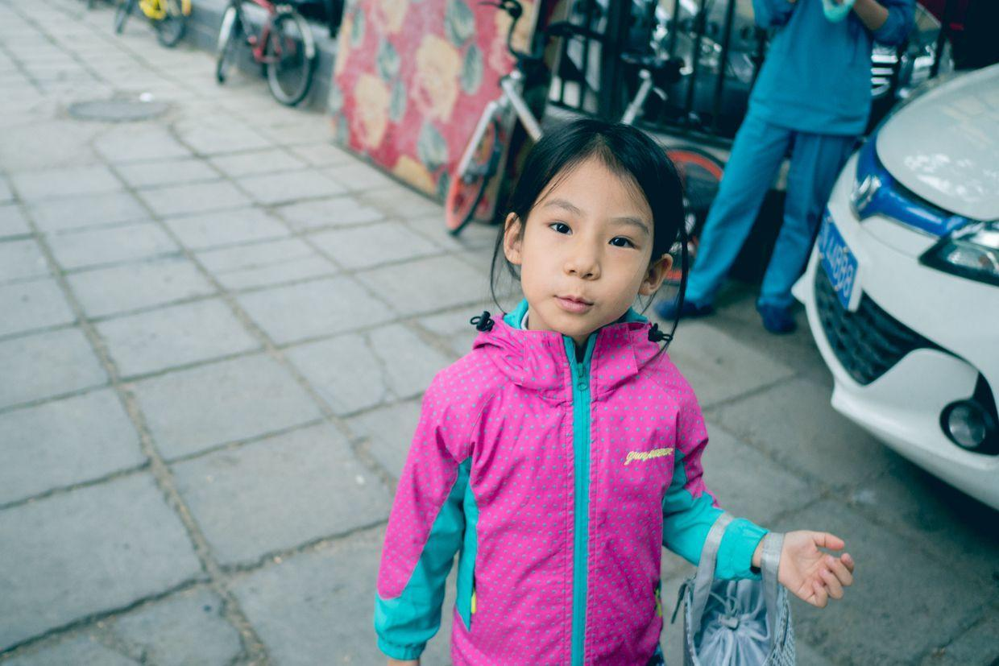
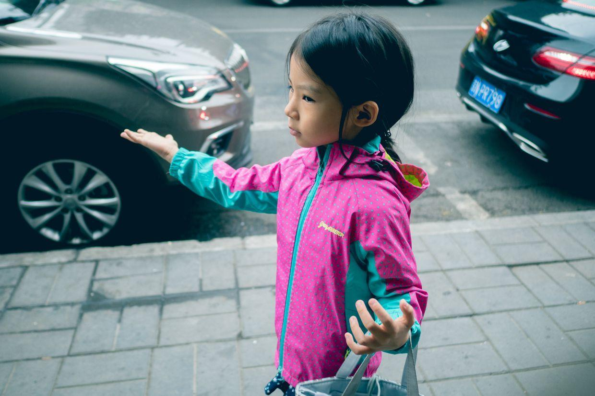
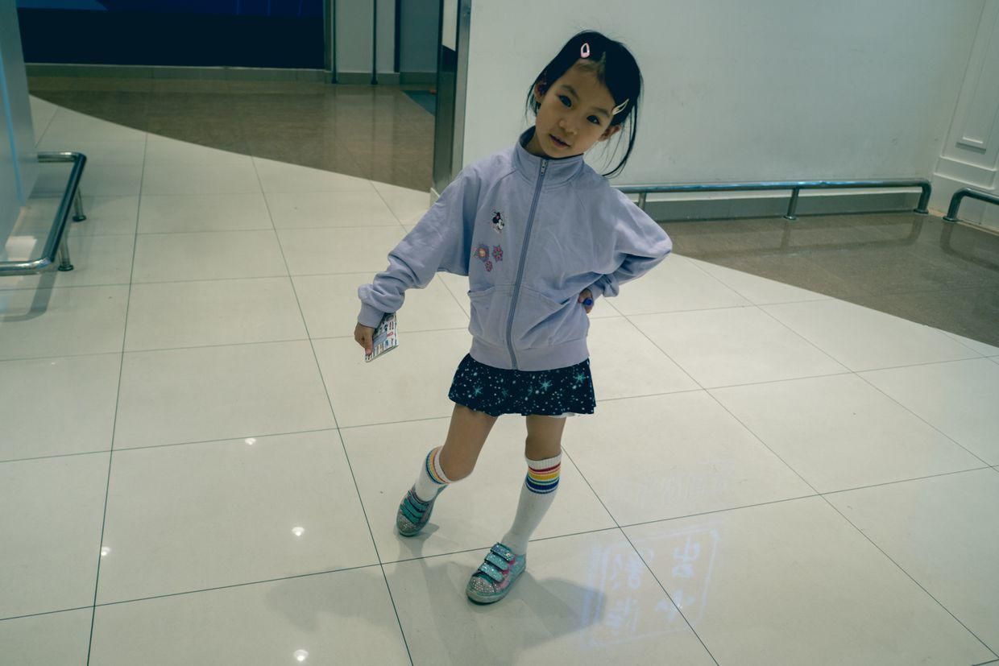
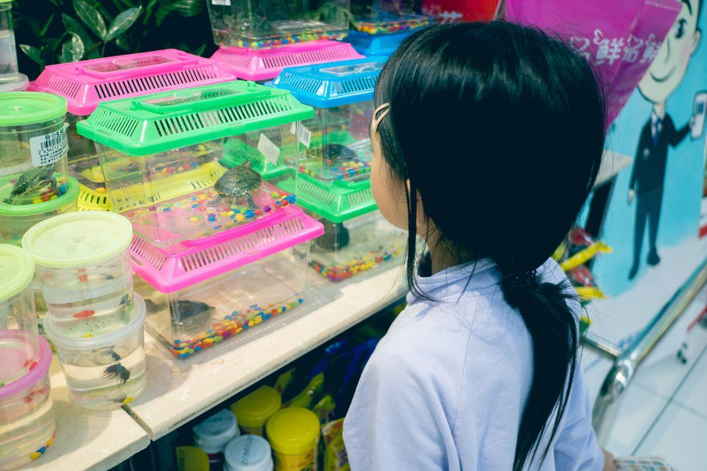
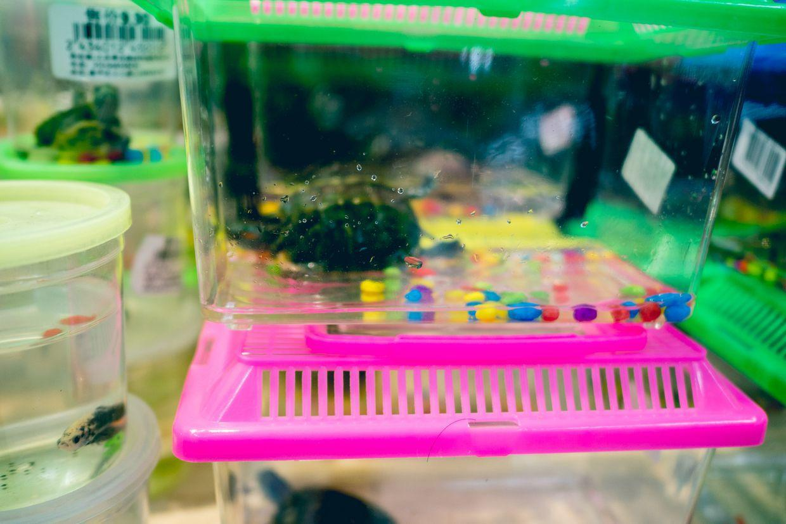
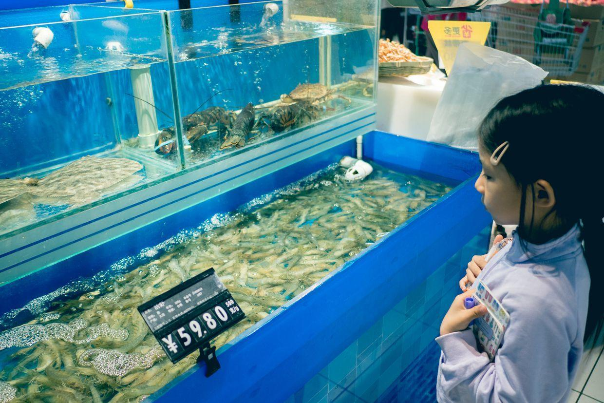
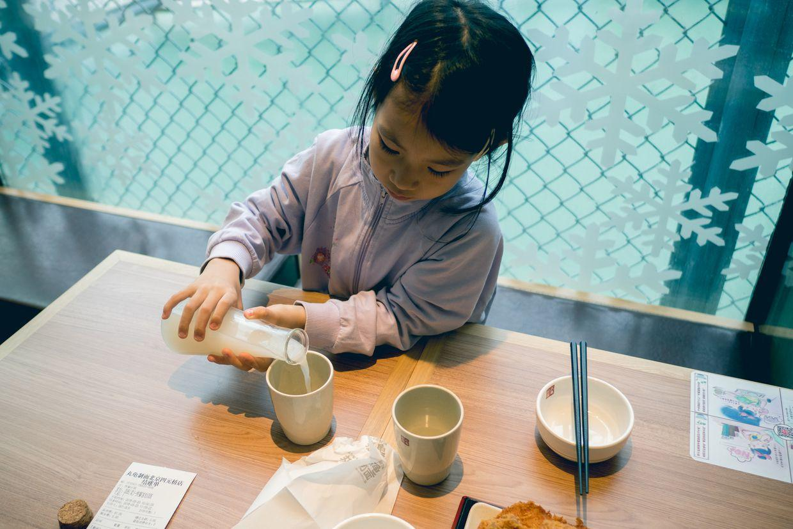
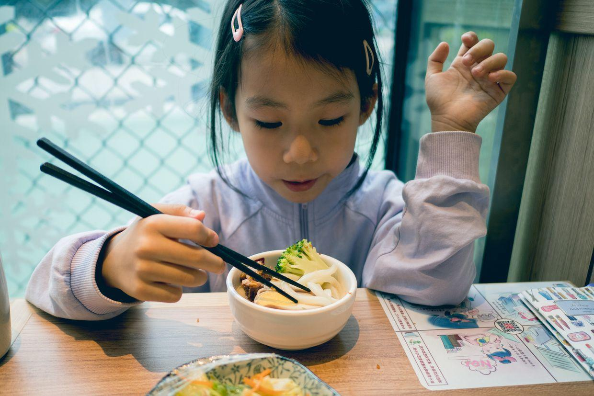
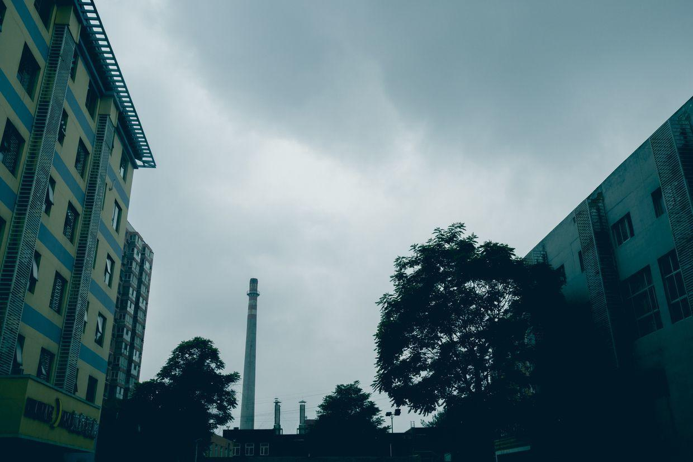

          
            
**2018.05.20**

周日啦，下了一夜的雨，天气还是很冷。

早上起床，吃饭，洗衣服。

开始练琴，《黄昏的歌》，每行都能正确弹下来了，还要继续熟练。

穿好厚衣服出门，自己拎着一个小包。

有一点毛毛细雨下来了。

到了商场，轻装上阵。

看见了卖小乌龟的。

乌龟们都很活跃，爬来爬去的。

看着人家熟练地做麻花，惊叹不已。

看看水族馆，虾游起泳来真是很快。

出来以后又要去miniso里看化妆品，一个人翻过来倒过去地看了好久。

中午吃饭，倒上一点酸奶。

封面

面条还有西兰花。

回家了，还是乌云压城。

前段时间的闷热终于被终结，凉爽的小雨已经下了好久了。

马上要入夏了，这份凉爽就更显得弥足珍贵。

我问喵这个雨是什么感觉？是渣渣的吗？

答曰：
>是毛毛的。

**个人微信公众号，请搜索：摹喵居士（momiaojushi）**

          
        