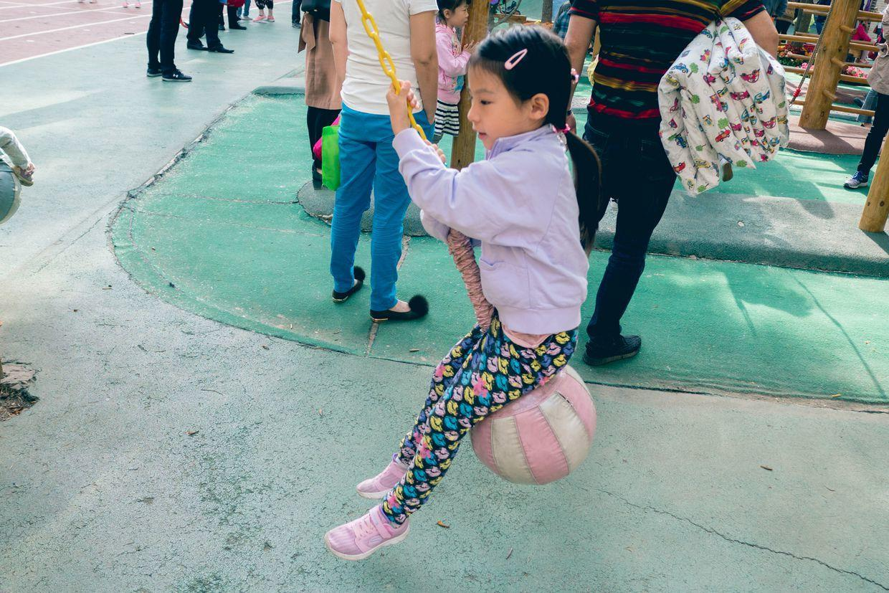
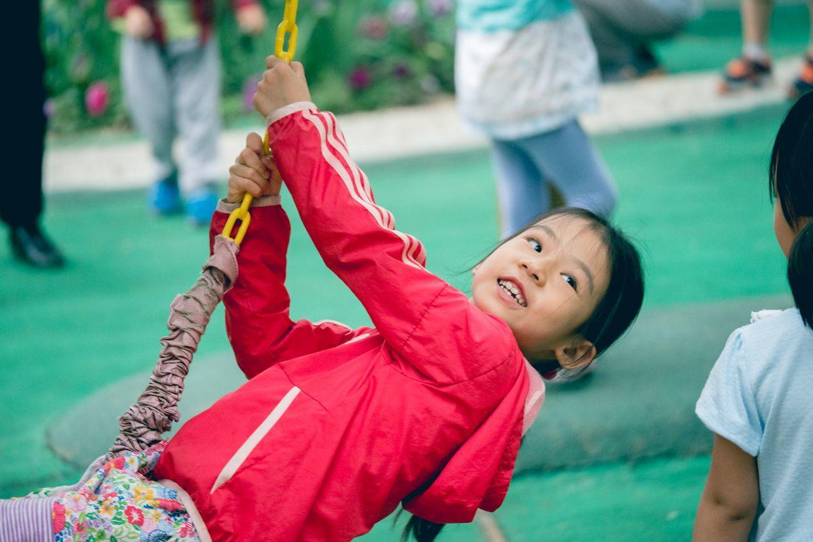
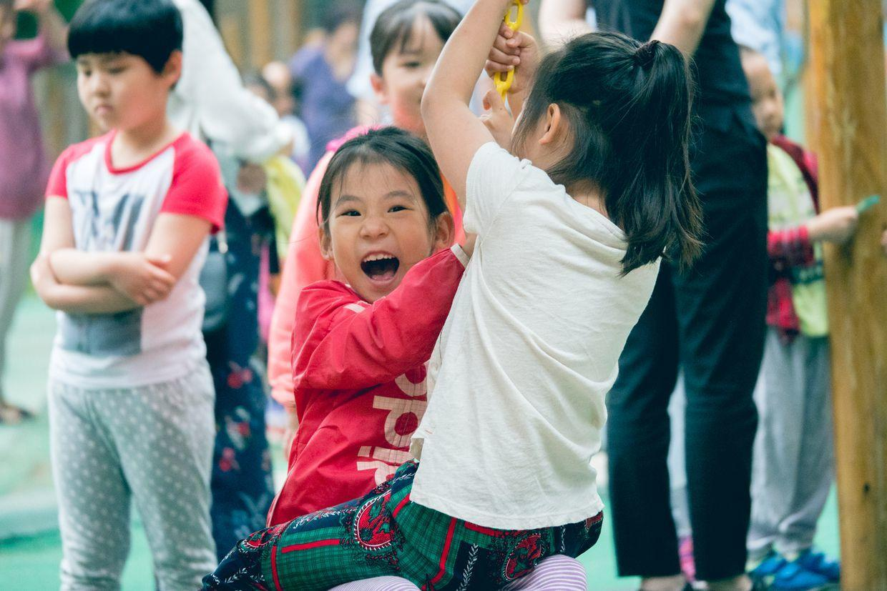

          
            
**2018.05.22**

幼儿园有一个摇摆球的架子，架子上有脚蹬，踩在脚蹬上，跳出去，双手抓住摇摆球的链子，分开双腿，坐在球上。

这个过程还是挺刺激的，喵在小班和中班的时候，还都不敢尝试。

到了大班，终于开始勇敢地迈出这一大步。

像这种简单的摇晃，已经不能满足她们这些小姑娘们的野心了。

大家各自开始给自己加花样动作，花式地后仰。

还有这种双人合作，两个人嘎嘎嘎地大笑。

不过玩儿双人摇摆球的时候，喵还是不敢作跳的那个人，伸手抓绳子，双腿盘住荡过来的人，她还是有点紧张。

小朋友们，早上10分钟，在操场上开心地玩儿，有三轮车、秋千、摇摆球、木马、攀登架、平衡木、梅花桩、滑梯。

每个项目都曾经是他们的一个巨大挑战，而今迈步从头越。

**个人微信公众号，请搜索：摹喵居士（momiaojushi）**

          
        