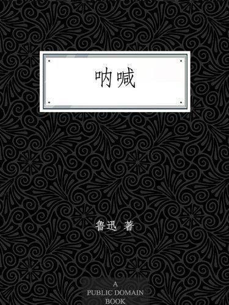

          
            
**2018.05.23**

温馨大过讽刺，每次读《从百草园到三味书屋》，仿佛又闻到了当年上语文课时，教室里的气味。
<h2>2018.02.14（周三）</h2>
<h3>《朝花夕拾》 - 01</h3>
>狗·猫·鼠

虫蛆也许是不干净的，但它们并没有自鸣清高；鸷禽猛兽以较弱的动物为饵，不妨说是凶残的罢，但它们从来就没有竖过“公理”“正义”的旗子，使牺牲者直到被吃的时候为止，还是一味佩服赞叹它们。

余沧海一样，做坏人也要坦荡
>现在说起我仇猫的原因来，自己觉得是理由充足，而且光明正大的。

一，它的性情就和别的猛兽不同，凡捕食雀鼠，总不肯一口咬死，定要尽情玩弄，放走，又捉住，捉住，又放走，直待自己玩厌了，这才吃下去，颇与人们的幸灾乐祸，慢慢地折磨弱者的坏脾气相同。

二，它不是和狮虎同族的么？可是又这么一副媚态！但这也许是限于天分之故罢，假使它的身材比现在大十倍，那就真不知道它所取的是怎么一种态度。

真实的写照
>所以，目下的办法，是凡遇猫们捣乱，至于有人讨厌时，我便站出去，在门口大声叱曰：“嘘！滚！”小小平静，即回书房，这样，就长保着御侮保家的资格。其实这方法，中国的官兵就常在实做的，他们总不肯扫清土匪或扑灭敌人，因为这么一来，就要不被重视，甚至于因失其用处而被裁汰。我想，如果能将这方法推广应用，我大概也总可望成为所谓“指导青年”的“前辈”的罢，但现下也还未决心实践，正在研究而且推敲。

总有人觉得自己必须指导青年
>阿长与《山海经》

记得她也曾告诉过我这个名称的来历：先前的先前，我家有一个女工，身材生得很高大，这就是真阿长。后来她回去了，我那什么姑娘才来补她的缺，然而大家因为叫惯了，没有再改口，于是她从此也就成为长妈妈了。

没有自己的名字
>梦里也记得元旦的，第二天醒得特别早，一醒，就要坐起来。她却立刻伸出臂膊，一把将我按住。我惊异地看她时，只见她惶急地看着我。她又有所要求似的，摇着我的肩。我忽而记得了——“阿妈，恭喜……。”“恭喜恭喜！大家恭喜！真聪明！恭喜恭喜！”她于是十分喜欢似的，笑将起来，同时将一点冰冷的东西，塞在我的嘴里。我大吃一惊之后，也就忽而记得，这就是所谓福橘

执着的要自己带的孩子给自己拜年
>大概是太过于念念不忘了，连阿长也来问《山海经》是怎么一回事。这是我向来没有和她说过的，我知道她并非学者，说了也无益；但既然来问，也就都对她说了。过了十多天，或者一个月罢，我还很记得，是她告假回家以后的四五天，她穿着新的蓝布衫回来了，一见面，就将一包书递给我，高兴地说道：

“哥儿，有画儿的‘三哼经’，我给你买来了！”我似乎遇着了一个霹雳，全体都震悚起来；赶紧去接过来，打开纸包，是四本小小的书，略略一翻，人面的兽，九头的蛇，……果然都在内。

买来了自己带的孩子最喜欢的书
>我的保姆，长妈妈即阿长，辞了这人世，大概也有了三十年了罢。我终于不知道她的姓名，她的经历；仅知道有一个过继的儿子，她大约是青年守寡的孤孀。

原来是守寡的人，一直没有儿子
>《二十四孝图》

哭竹生笋”就可疑，怕我的精诚未必会这样感动天地。但是哭不出笋来，还不过抛脸而已，一到“卧冰求鲤”，可就有性命之虞了。我乡的天气是温和的，严冬中，水面也只结一层薄冰，即使孩子的重量怎样小，躺上去，也一定哗喇一声，冰破落水，鲤鱼还不及游过来。自然，必须不顾性命，这才孝感神明，会有出乎意料之外的奇迹，但那时我还小，实在不明白这些。

过于玄幻
>我最初实在替这孩子捏一把汗，待到掘出黄金一釜，这才觉得轻松。然而我已经不但自己不敢再想做孝子，并且怕我父亲去做孝子了。家景正在坏下去，常听到父母愁柴米；祖母又老了，倘使我的父亲竟学了郭巨，那么，该埋的不正是我么？

如果一丝不走样，也掘出一釜黄金来，那自然是如天之福，但是，那时我虽然年纪小，似乎也明白天下未必有这样的巧事。

实在是残酷
>五猖会

母亲，工人，长妈妈即阿长，都无法营救，只默默地静候着我读熟，而且背出来。在百静中，我似乎头里要伸出许多铁钳，将什么“生于太荒”之流夹住；也听到自己急急诵读的声音发着抖，仿佛深秋的蟋蟀，在夜中鸣叫似的。

过节前父亲监督背书，背不出来不能过节，压力真大
>从百草园到三味书屋

闰土的父亲是小半天便能捕获几十只，装在叉袋里叫着撞着的。我曾经问他得失的缘由，他只静静地笑道：你太性急，来不及等它走到中间去。

闰土也有这个能力
>有一个前辈同学在，比我们早一年毕业，曾经游历过日本，应该知道些情形。跑去请教之后，他郑重地说：“日本的袜是万不能穿的，要多带些中国袜。我看纸票也不好，你们带去的钱不如都换了他们的现银。”

被师兄骗了
>藤野先生

可惜我那时太不用功，有时也很任性。还记得有一回藤野先生将我叫到他的研究室里去，翻出我那讲义上的一个图来，是下臂的血管，指着，向我和蔼的说道：

“你看，你将这条血管移了一点位置了。——自然，这样一移，的确比较的好看些，然而解剖图不是美术，实物是那么样的，我们没法改换它。现在我给你改好了，以后你要全照着黑板上那样的画。”

真是严谨
>只有他的照相至今还挂在我北京寓居的东墙上，书桌对面。每当夜间疲倦，正想偷懒时，仰面在灯光中瞥见他黑瘦的面貌，似乎正要说出抑扬顿挫的话来，便使我忽又良心发现，而且增加勇气了，于是点上一枝烟，再继续写些为“正人君子”之流所深恶痛疾的文字。

又回到了“正人君子”
<h2>2018.02.15（周四）</h2>
<h3>《朝花夕拾》 - 02</h3>
>报纸上骂了几天之后，王金发便叫人送去了五百元。于是乎我们的少年们便开起会议来，

第一个问题是：收不收？决议曰：收。

第二个问题是：收了之后骂不骂？决议曰：骂。

理由是：收钱之后，他是股东；股东不好，自然要骂。

青年们办报纸，收钱后也要骂人
>后记

我幼小时候，在故乡曾经听到老年人这样讲：“……死了的曹娥，和她父亲的尸体，最初是面对面抱着浮上来的。然而过往行人看见的都发笑了，说：哈哈！这么一个年青姑娘抱着这么一个老头子！于是那两个死尸又沉下去了；停了一刻又浮起来，这回是背对背的负着。”好！在礼义之邦里，连一个年幼—一呜呼，“娥年十四”而已——的死孝女要和死父亲一同浮出，也有这么艰难！

封建礼教吃人

**个人微信公众号，请搜索：摹喵居士（momiaojushi）**

          
        