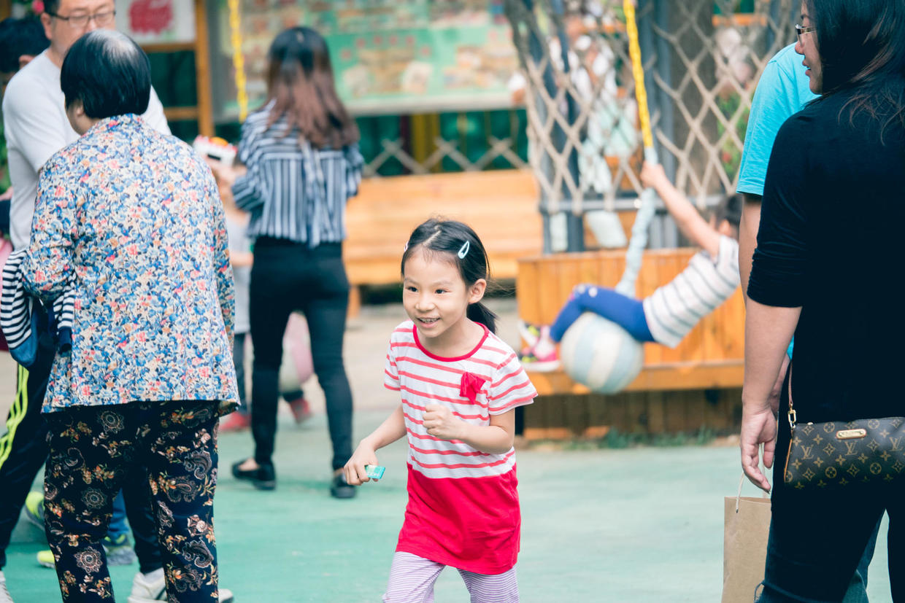

          
            
**2018.05.25**

***有的小朋友对我说不想上小学，因为减法太难了，其实小学里有趣的事可多了，包括减法在内。***

今天我来说一下小学放学的情景吧。

我那时放学，所有小朋友是要按照住的远近，拍成队伍一起走。

每队会有一个路队长，大家排着对走，路队长送每个同学到家后才会回家。

所有同学带着小黄帽，一路整齐地回家。

后来随着高年级，大家也就可以自己回家了。

这时，一到放学时间，大家跑出校门，会先去玩具摊看玩具，我那时校门口会有一辆三轮车，上面有个玻璃箱子，里面有各种玩具、变形金刚。

然后是去买吃的，一个老奶奶推着白色的冰棍车，大家会买小豆冰棍。

旁边还有卖糖葫芦的，我那时比较爱吃黑枣的。

接下来就是在楼下一起玩儿踢球、三个字儿、真假地雷这种捉人游戏。

随着天色擦黑，才准备回家吃饭。

当然，作业是越快写完才能玩儿得越痛快。

**个人微信公众号，请搜索：摹喵居士（momiaojushi）**

          
        