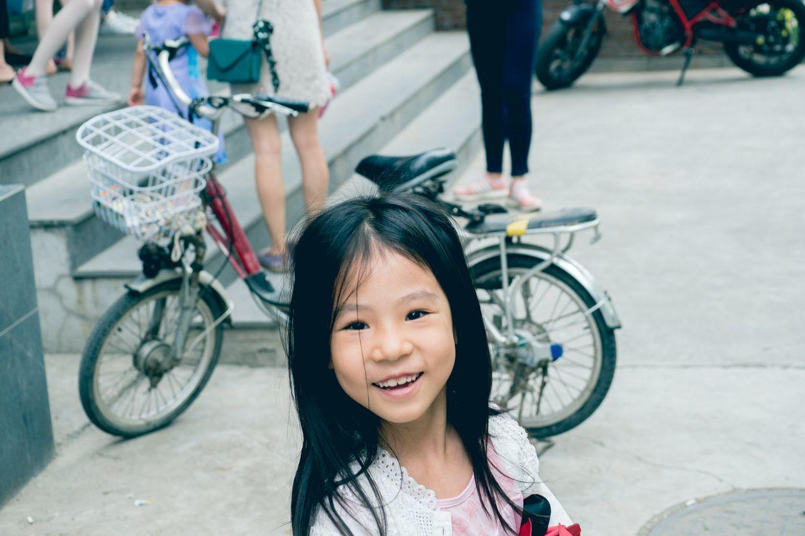
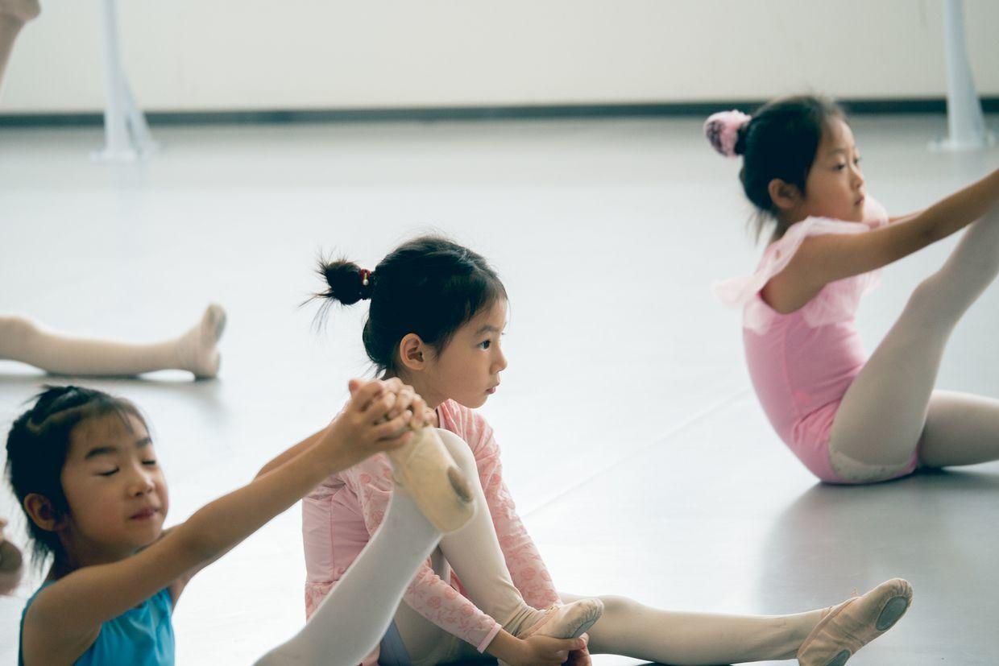
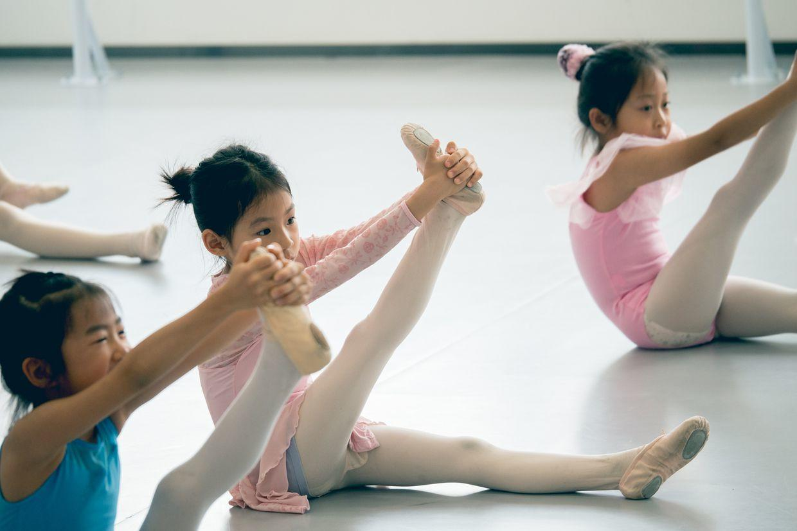
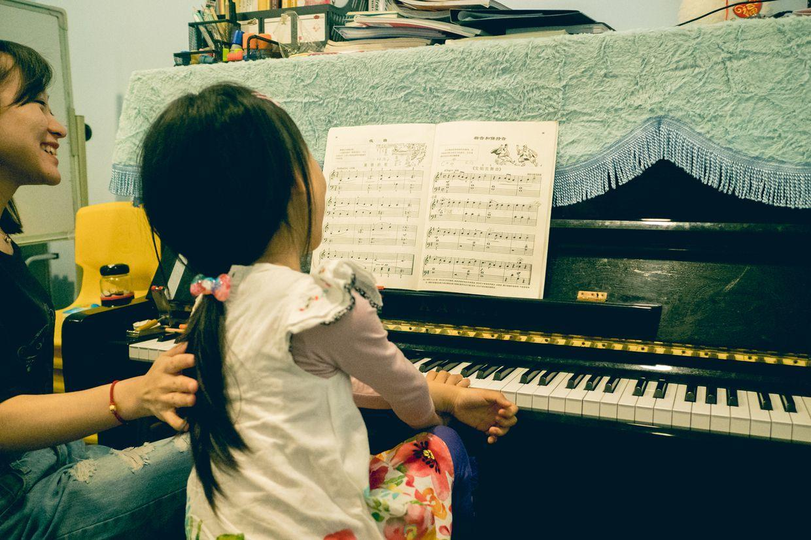
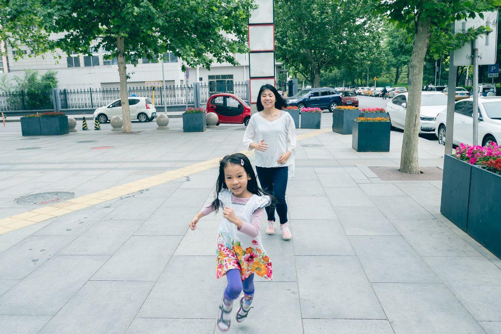

          
            
**2018.05.26**

周六啦，一早起床，吃个大饭团，出发去芭蕾舞课。

到了门口，披头散发地哈哈大笑。

街头是绿意盎然，天气很闷热，大家都盼着下午的雷阵雨了。

开始准备活动，大家都找好位置。

好好拉一拉筋，轻松就能伸直。

上完舞蹈课，回家吃饭，然后跟姥姥姥爷视频聊天。

讲几个故事，睡个大觉，去上钢琴课。

课堂表现还不错，《黄昏的歌》在老师带领下加入轻重感情色彩，效果非常好。

后面继续要攻克《蓝色多瑙河》。

出了门和妈妈一起疯跑。

封面

吃过晚饭，一起去超市买东西，然后回家看会电视，休息休息。

明天一早，准备去奶奶家和悦妹、兜妹、敦敦弟弟一起玩儿啦。

好久不见，敦敦弟弟又长大了不少。

马上就是六一儿童节了，给小朋友们都准备了礼物。

**个人微信公众号，请搜索：摹喵居士（momiaojushi）**

          
        