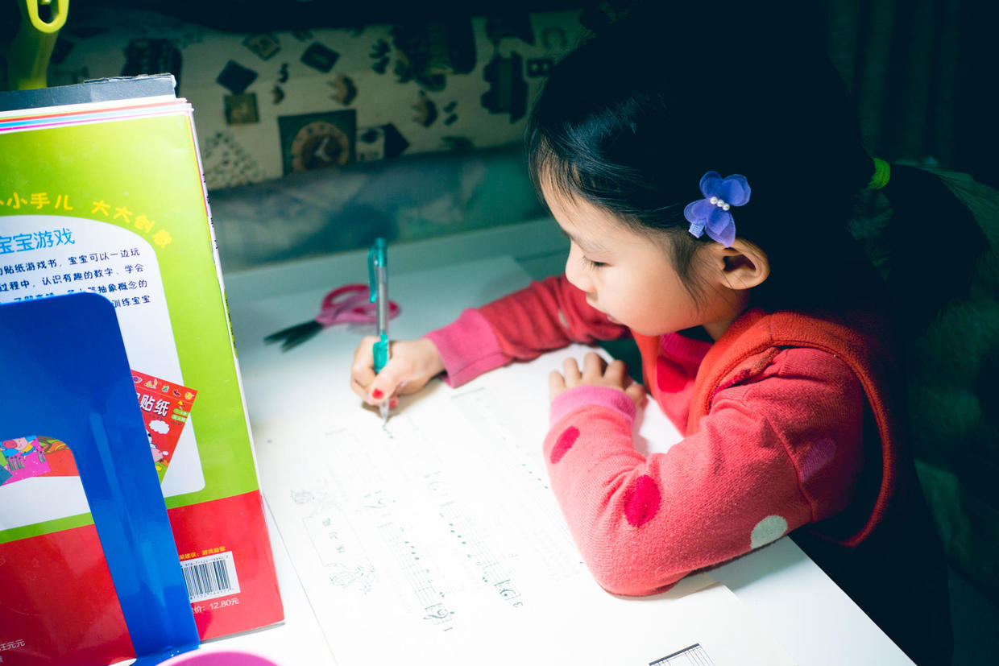

          
            
**2018.05.28**

**拍摄时间：2017.03.05**

**拍摄地点：家里**

这张照片是2017年3于月份拍的，那时刚刚开始学琴。

从小汤1开始学起，认音符，认拍子。

除了要练习入门的小曲子之外，还要学会认五线谱。

所以，要在小汤1上写作业，根据要求自己画上音符、节拍。

最开始分不清楚间和线，有的音符画得巨大，有的又特别小。

再往后就是自己认清楚几分音符，要有几拍。

自己算好拍子，然后根据拍子划分小节。

出现了四分音符之后，长长的尾巴画起来又有点难了，什么时候朝上，什么时候朝下，什么时候在左，什么时候在右，都要好好想一想。

再往后就有休止符，还有附点出场啦。

当然，如果曲子弹不好，就要回家自己抄上一遍，这倒是个练习识谱的好方法。

所以说，积跬步至千里。

**个人微信公众号，请搜索：摹喵居士（momiaojushi）**

          
        