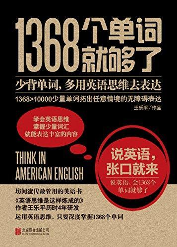

          
            
**2018.05.30**

想法很有趣，算是一种凑合的好方法。
<h2>2018.02.16（周五）</h2>
<h3>《1368个单词就够了》 - 01</h3>
>前言

1368个单词搞定英语口语，开玩笑吧？

以前的传说还真不是盖的啊！有人说美国西部农民一辈子只用700多个单词，而我的词汇表只比加州farmer用的多出几百个。
上篇为什么只需要1368个单词？

1368个基础单词，能表达足够的意思
>这四句话恰恰代表了我下面要教给大家的四个表达技巧，四个让你能用1368个单词说一口流利英语的技巧：

SkillOne挑个大的

SkillTwo拣实心的

SkillThree捏软乎的

SkillFour自产自用

四个技巧
>以前面那个例子来说，get就是inherit的上义词，inherit就是get的下义词，get是大词，inherit是小词。它们的区别就在于，大词可以代替小词使用，而小词却不可以逆向代替大词。

get可以代替inherit
>和get并肩齐名的大词还有have,give,take,make。

有感觉的都是feeling

用基础词去代替抽象意义的词
>在这个例子中，important就叫“空心词”，而big就是“实心词”。因为后者是我们可以直接体验到的，生活中有很多big的东西，什么bighouse,bigcar,bigcity，我们通过肉眼就可以感知到什么是big。而important这个词则是头脑中的概念，看不见，摸不着。

所以，专业地说，“实心词”其实就是指具体的概念，而空心词则是指抽象的概念。

important看不见，big是生活中看得到的
>再举个类似的例子。你想跟老外说，“这个土豆是生的”。“生”（raw）这个词不会说，不会说就不要勉强嘛！“生”不会，“熟”我还不会吗？我说它没煮过不就可以了吗？所以，这话就可以说成：This potato is not cooked.这就是我们要讲的转换角度第一招：“正着不会反着说”。还有其他两招分别是：“我不会说你来说”和“人不会说东西说”。

Her youngest son got all her property.

She gave all the property to her youngest son.这两句话就是“我不会说你来说”的体现。

转换角度第三招，“人不会说东西说”。

All her property goes to her youngest son.在这句话中，主语既不是“小儿子”也不是“她”，而是变成了“财产”这个第三者。

转换角度，用会的词表达意思
<h2>2018.02.19（周一）</h2>
<h3>《1368个单词就够了》 - 02</h3>
>好的，这句我认为最能体现英语思维的表达方式是：It takes two to make a baby.

英语思维
>英语与汉语的差别：

一、汉语习惯以人做主语，英语经常会用物做主语；

二、汉语强调动作，英语强调方位；

三、汉语中的动词在英语中经常被介词来代替；

四、英语的语序是先说主谓后说其他成分，汉语经常把其他成分放在谓语前面；

五、英语口语中形象词汇用得比较多。

英语和汉语的区别

**个人微信公众号，请搜索：摹喵居士（momiaojushi）**

          
        