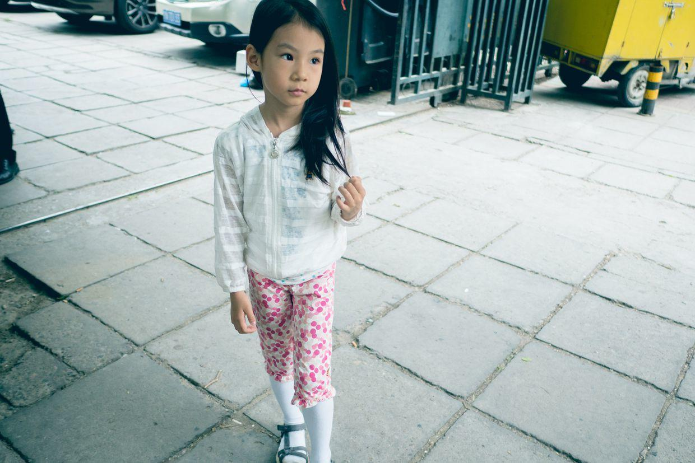
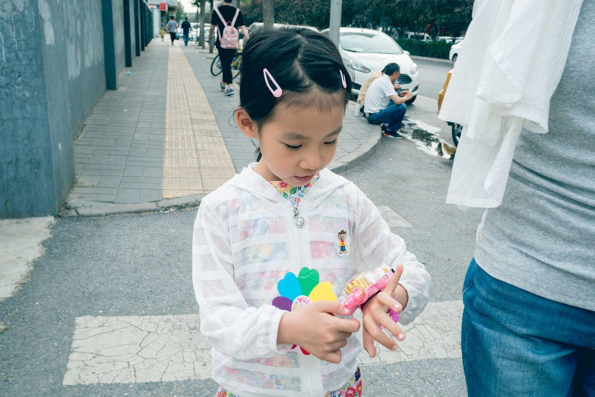

          
            
**2018.06.03**

周日啦，阴天了，天一下凉快下来。

一早起床开始练琴，朝鲜小夜曲，费了很大劲，才有了一点点进展，各种各样的降号要找准了还真是费了不小的力气。

出门去商场买东西。

中午就在外面吃米线。

来一小块鸡排，看起来就不太好吃。

吃米线，还挺香的，吃了一大碗。

去迪卡侬转转，买几条浴巾，发现了最小号的呼啦圈。

选了一个自己喜欢的，给我们演示舞蹈动作。

幼儿园舞蹈里用到了呼啦圈，动作还挺精致。

封面

回家后，睡个大觉，傍晚出门散步。

带着自己的巴啦啦色彩魔法玩具，吸收各种颜色能量。

一边走一边笑，真是开心。

拿着小碗画圆圈。

回家洗澡，吃水果。

短暂的凉快过去，下周又要迎接炎热的天气了。

真正的夏天就要到来啦。

**个人微信公众号，请搜索：摹喵居士（momiaojushi）**

          
        