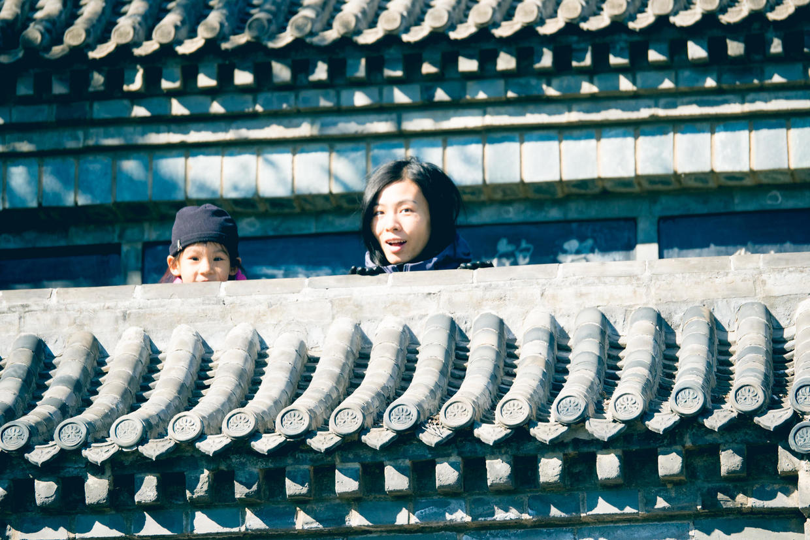

          
            
**2018.06.04**

**拍摄时间：2017.10.29**

**拍摄地点：百望山碑林**

这张照片是2017年10月底的一个周末，去百望山时拍的。

那时树叶已经见红了，于是觉得抓紧时间去山里赏一下红叶。

香山和八达岭就不考虑了，人实在太多，于是自作聪明地选了百望山。

一早开车过来，依然狠堵，好容易找了个路边停好车。

进门门票6元，一进去就是水泥的上山路，人也是越来越多。

爬了一个小小的拐弯，哪里还没到呢，喵就开始喊累。

吃了点东西，继续走，没走两步还是喊累，于是只好往下走。

还没到山下，发现了这个碑林，于是喵兴致勃勃地跑进碑林里玩儿了。

碑林依着山势，一层层向上，两个人伸出脑袋看我。

气得半死的我，只好在下面拍照。

好容易下了山，开车又等了好久才冲出拥堵圈。

赏红叶，一定要慎重。

**个人微信公众号，请搜索：摹喵居士（momiaojushi）**

          
        