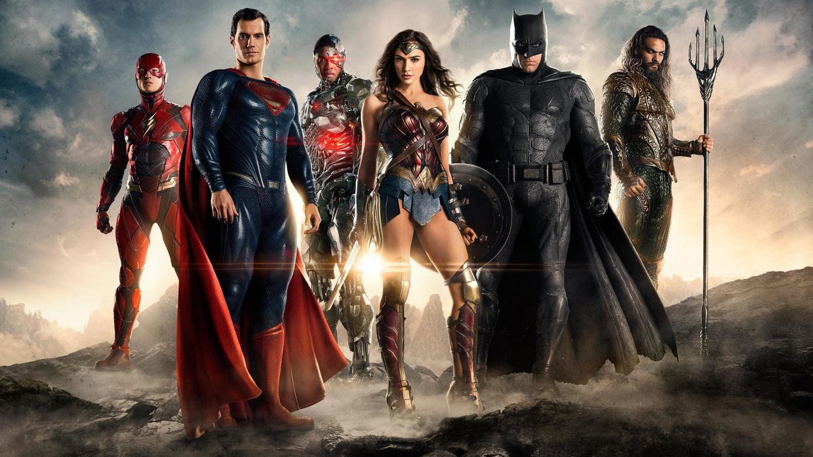

          
            
**2018.06.05**

自从看了《神奇女侠》之后，喵又跟着我断断续续看了最新的正义联盟。

正义联盟电影里的英雄们有：超人、蝙蝠侠、神奇女侠、闪电侠、海王和钢骨。

现在，基本对这些英雄的名字和能力都已经能够如数家珍了。

超人力大无穷、会飞、透视眼、激光眼、吹冷气。

蝙蝠侠领导能力强、有各种高科技装备、武功好。

神奇女侠力大无穷、吸收和发射能量、格斗大师、真言套索。

闪电侠光速跑步。

海王力大无穷，水里飞行。

钢骨机器人、能飞、激光炮、控制机器。

这么一看，其实就海王比较弱，在陆地上没什么可发挥的，就是比较抗打。

这么多的信息，于是喵经常跟我假设各种场景，问我这些英雄之间谁更厉害。

有时候甚至开始跨越故事比较，比如孙悟空、一拳超人、绿巨人等等。

上一次写类似的文章好像还是《迪斯尼历代公主考》。

**个人微信公众号，请搜索：摹喵居士（momiaojushi）**

          
        