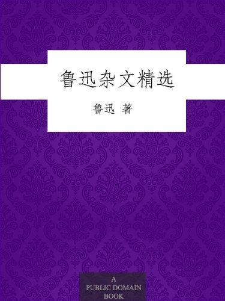

          
            
**2018.06.06**

真的是太有战斗力了。梁实秋多次上榜。
<h2>2018.02.20（周二）</h2>
<h3>《鲁迅杂文精选》 - 01</h3>
>第一章娜拉走后怎样

娜拉当初是满足地生活在所谓幸福的家庭里的，但是她竟觉悟了：自己是丈夫的傀儡，孩子们又是她的傀儡。她于是走了，只听得关门声，接着就是闭幕。这想来大家都知道，不必细说了。

傀儡之家的结局，娜拉出走
>从事理上推想起来，娜拉或者也实在只有两条路：不是堕落，就是回来。因为如果是一匹小鸟，则笼子里固然不自由，而一出笼门，外面便又有鹰，有猫，以及别的什么东西之类；倘使已经关得麻痹了翅子，忘却了飞翔，也诚然是无路可以走。还有一条，就是饿死了，但饿死已经离开了生活，更无所谓问题，所以也不是什么路。

出走怎么办？要么堕落，要么回来
>人生最苦痛的是梦醒了无路可以走。做梦的人是幸福的；倘没有看出可走的路，最要紧的是不要去惊醒他。

睡梦中死去
>唐朝的诗人李贺（今河南官阳人，唐朝诗人。与李白、李商隐三人并称唐代“三李”。著《李长吉歌诗》），不是困顿了一世的么？而他临死的时候，却对他的母亲说，“阿妈，上帝造成了白玉楼，叫我做文章落成去了。”

给母亲的梦
>梦是好的；否则，钱是要紧的。自由固不是钱所能买到的，但能够为钱而卖掉。

钱是重要的
>世间有一种无赖精神，那要义就是韧性。

天津的青皮，就是所谓无赖者很跋扈，譬如给人搬一件行李，他就要两元，对他说这行李小，他说要两元，对他说道路近，他说要两元，对他说不要搬了，他说也仍然要两元。青皮固然是不足为法的，而那韧性却大可以佩服。要求经济权也一样，有人说这事情太陈腐了，就答道要经济权；说是太卑鄙了，就答道要经济权；说是经济制度就要改变了，用不着再操心，也仍然答道要经济权。

韧性
>可惜中国太难改变了，即使搬动一张桌子，改装一个火炉，几乎也要血；而且即使有了血，也未必一定能搬动，能改装。不是很大的鞭子打在背上，中国自己是不肯动弹的。我想这鞭子总要来，好坏是别一问题，然而总要打到的。但是从那里来，怎么地来，我也是不能确切地知道。

中国人一定要折衷
<h2>2018.02.23（周五）</h2>
<h3>《鲁迅杂文精选》 - 02</h3>
>无论从那里来的，只要是食物，壮健者大抵就无需思索，承认是吃的东西。惟有衰病的，却总常想到害胃，伤身，特有许多禁条，许多避忌；还有一大套比较利害而终于不得要领的理由，例如吃固无妨，而不吃尤稳，食之或当有益，然究以不吃为宜云云之类。但这一类人物总要日见其衰弱的，因为他终日战战兢兢，自己先已失了活气了。

总是战战兢兢，失去活力
>我曾在古物陈列所所陈列的占画上看见一颗印文，是几个罗马字母。但那是所谓“我圣祖仁皇帝”的印，是征服了汉族的主人，所以他敢；汉族的奴才是不敢的。便是现在，便是艺术家，可有敢用洋文的印的么？

圣祖皇帝敢用洋文，现在不敢
>第七章随感录四十八

中国人对于异族，历来只有两样称呼：一样是禽兽，一样是圣上。从没有称他朋友，说他也同我们一样的。

不会平等相处
>第十一章夏三虫

跳蚤的来吮血，虽然可恶，而一声不响地就是一口，何等直截爽快。蚊子便不然了，一针叮进皮肤，自然还可以算得有点彻底的，但当未叮之前，要哼哼地发一篇大议论，却使人觉得讨厌。

蚊子咬人前哼哼，像长篇大论
>第十五章记念刘和珍君

真的猛士，敢于直面惨淡的人生，敢于正视淋漓的鲜血。

我向来是不惮以最坏的恶意，来推测中国人的，然而我还不料，也不信竟会下劣凶残到这地步。

惨象，已使我目不忍视了；流言，尤使我耳不忍闻。我还有什么话可说呢？我懂得衰亡民族之所以默无声息的缘由了。沉默呵，沉默呵！不在沉默中爆发，就在沉默中灭亡。

经典中的经典
>第十九章读书杂谈

我看现在的青年，为兴味的读书的是有的，我也常常遇到各样的询问。此刻就将我所想到的说一点，但是只限于文学方面，因为我不明白其他的。

第一，是往往分不清文学和文章．甚至于已经来动手做批评文章的，也免不了这毛病。

然而中国社会上还很误解，你做几篇小说，便以为你一定懂得小说概论，做几句新诗，就要你讲诗之原理。我也尝见想做小说的青年，先买小说法程和文学史来看。据我看来，是即使将这些书看烂了，和创作也没有什么关系的。

所以我想，研究文学是一件事，做文章又是一件事。

第二，我常被询问：要弄文学，应该看什么书？

倘要看看文艺作品呢，则先看几种名家的选本，从中觉得谁的作品自己最爱看，然后再看这一个作者的专集，然后再从文学史上看看他在史上的位置；倘要知道得更详细，就看一两本这人的传记，那便可以大略了解了。如果专是请教别人，则各人的嗜好不同，总是格不相入的。

第三，说几句关于批评的事。现在因为出版物太多了，——其实有什么呢，而读者因为不胜其纷纭，便渴望批评，于是批评家也便应运而起。

总之，我的意思是很简单的：我们自动的读书，即嗜好的读书，请教别人是大抵无用，只好先行泛览，然后决择而人于自己所爱的较专的一门或几门；但专读书也有弊病，所以必须和现实社会接触，使所读的书活起来。

如何做文章，还是要靠自己，多读书，多接触社会，使读的书活起来
>第二十一章文学与出汗

上海的教授（指梁实秋）对人讲文学，以为文学当描写永远不变的人性，否则便不久长。

这真是所谓“你不说我倒还明白，你越说我越胡涂”了。

梁实秋又被数落了
>第二十二章无声的中国

文明人和野蛮人的分别，其一，是文明人有文字，能够把他们的思想，感情，藉此传给大众，传给将来。中国虽然有文字，现在却已经和大家不相干，用的是难懂的古文，讲的是陈旧的古意思，所有的声音，都是过去的，都就是只等于零的。

古文难懂，难以传播新思想
>中国人的性情是总喜欢调和，折中的。譬如你说，这屋子太暗，须在这里开一个窗，大家一定不允许的。但如果你主张拆掉屋顶，他们就会来调和，愿意开窗了。没有更激烈的主张，他们总连平和的改革也不肯行。那时白话文之得以通行，就因为有废掉中国字而用罗马字母的议论的缘故。

不废掉古文，就无法推动白话文
>我们要说现代的，自己的话；用活着的白话，将自己的思想，感情直白地说出来。

至于幼稚，尤其没有什么可羞，正如孩子对于老人，毫没有什么可羞一样。幼稚是会生长，会成熟的，只不要衰老，腐败，就好。倘说待到纯熟了才可以动手，那是虽是村妇也不至于这样蠢。她的孩子学走路，即使跌倒了，她决不至于叫孩子从此躺在床上，待到学会了走法再下地面来的。

白话文自然有一个成长的阶段
>第二十五章新的“女将”（本篇最初发表于1931年11月20日《北斗》第一卷第三期，署名冬华）

还有事实可以证明。

一，谁也没有看见过日本的“惩膺中国军”的看护队的照片；

二，日本军里是没有女将的。然而确已动手了。这是因为日本人是做事是做事，做戏是做戏，决不混合起来的缘故。

做事和做戏
>第二十七章为了忘却的记念

这怕难罢，譬如使惯了刀的，这回要他耍棍，怎么能行呢？他简洁的答道：只要学起来！

不是年青的为年老的写记念，而在这三十年中，却使我目睹许多青年的血，层层淤积起来，将我埋得不能呼吸，我只能用这样的笔墨，写几句文章，算是从泥土中挖一个小孔，自己延口残喘，这是怎样的世界呢。

经典中的经典
>第二十九章谚语

南海圣人康有为，佼佼者也，他周游十一国，一直到得巴尔丰，这才悟出外国之所以常有“弑君”之故来了，曰：因为宫墙太矮的缘故。

思想僵化的人，出去看看，也跳不出自己的思维定式
>第三十章沙

人们又常常说：“升官发财”。其实这两件事是不并列的，其所以要升官，只因为要发财，升官不过是一种发财的门径。所以官僚虽然依靠朝廷，却并不忠于朝廷，吏役虽然依靠衙署，却并不爱护衙署，头领下一个清廉的命令，小喽罗是决不听的，对付的方法有“蒙蔽”。他们都是自私自利的沙，可以肥己时就肥己，而且每一粒都是皇帝，可以称尊处就称尊。

这些沙，是社会的蛀虫
<h2>2018.02.26（周一）</h2>
<h3>《鲁迅杂文精选》 - 03</h3>
>其实是，焦大的骂；并非要打倒贾府，倒是要贾府好，不过说主奴如此，贾府就要弄不下去罢了。然而得到的报酬是马粪。所以这焦大，实在是贾府的屈原，假使他能做文章，我想，恐怕也会有一篇《离骚》之类。

焦大确实很像屈原
>第五十七章在现代中国的孔夫子

这是有一天的事情。学监大久保先生集合起大家来，说：因为你们都是孔子之徒，今天到御茶之水（日本东京的地名。汤岛圣堂即在御茶之水车站附近）的孔庙里去行礼罢！我大吃了一惊。现在还记得那时心里想，正因为绝望于孔夫子和他的之徒，所以到日本来的，然而又是拜么？一时觉得很奇怪。

躲了半天，去了日本还要拜孔子

**个人微信公众号，请搜索：摹喵居士（momiaojushi）**

          
        