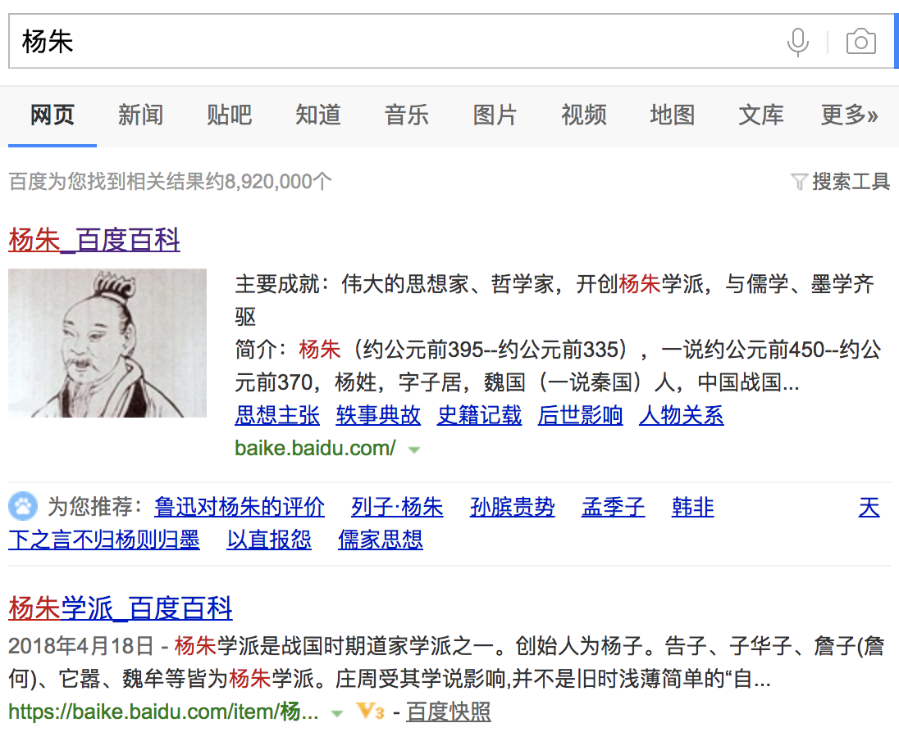

          
            
**2018.06.07**

>杨朱（约公元前395--约公元前335 [1]  ），一说约公元前450--约公元前370 [2]  ，杨姓，字子居，魏国（一说秦国）人，中国战国初期伟大的思想家、哲学家。
杨朱主张“贵己” “重生” “人人不损一毫”的思想。是道家杨朱学派的创始人。他的见解散见于《列子》，《庄子》，《孟子》，《韩非子》，《吕氏春秋》等。在战国时期，有“天下之言不归杨则归墨的现象 [3]  ”，可见其学说影响之大。

>（一）、论生死：有生便有死，人人皆如是。生有贤愚、贫贱之异，而死皆归为腐骨，芜舜与桀纣没有不同。
（二）、贵己：己身之最贵重者莫过生命，生难遇而死易及，这短促的一生，应当万分贵重，要乐生，一切以存我为贵，不要使他受到损害，去则不复再来。
（三）、全性保真：所谓全性，即顺应自然之性，生既有之便当全生，物既养生便当享用之，但不可逆命而羡寿，聚物而累形，只要有“丰屋美服，厚味姣色”满足生命就够了，不要贪得无厌，不要为外物伤生。
　　所谓保真，就是保持自然所赋予我身之真性，自纵一时，勿失当年之乐；纵心而动，不违自然所好；纵心而游，不逆万物所好；勿矜一时之毁誉，不要死后之馀荣；不羡寿、不羡名、不羡位、不羡货，乃可以不畏鬼、不畏人、不畏威、不畏利，保持和顺应自然之性，自己主宰自己的命运。

杨朱的人人不损一毫的思想，有一个前提是也不损别人，这是很难得的。

乍一看，好像是很自私自利，但是不损他人的前提下，这不是很有道理吗？

**个人微信公众号，请搜索：摹喵居士（momiaojushi）**

          
        