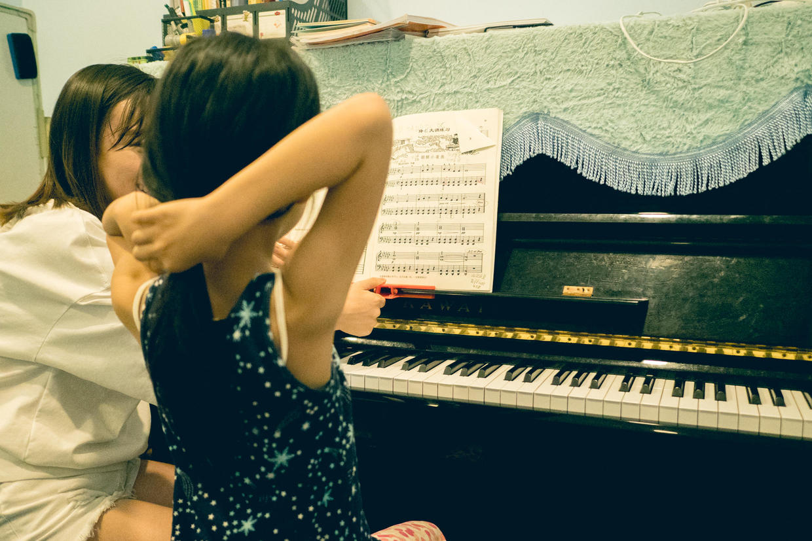

          
            
**2018.06.10**

周日啦，凉快的天气转眼就走了。

大太阳一早就出来上班了。

早上起床开始练琴，《天空之城》难度非常高。

先练右手，磕磕绊绊地练完了第一篇。

然后我来配左手，我的左手一加上，右手立刻不会了，还要重新再每小节分解来一遍。

花了好久时间，在我的左手配合下，右手终于顺利了。

接下来是练习左手，左手完成之后，开始进行第一行的左右手配合。

左右手开始配合，所有音都不认识了，还要回来每个小节再来一个音一个音认一遍。

比较难的小节双手配合起来，要反复10遍以上才能熟悉，但是一加上上一个小节，就又不行了，于是加上衔接部分继续练。

然后就开始不想练，发脾气。

然后要求自己练，不让我们捣乱。

真是厉害了，音都认不利索，还要自己练。

**个人微信公众号，请搜索：摹喵居士（momiaojushi）**

          
        