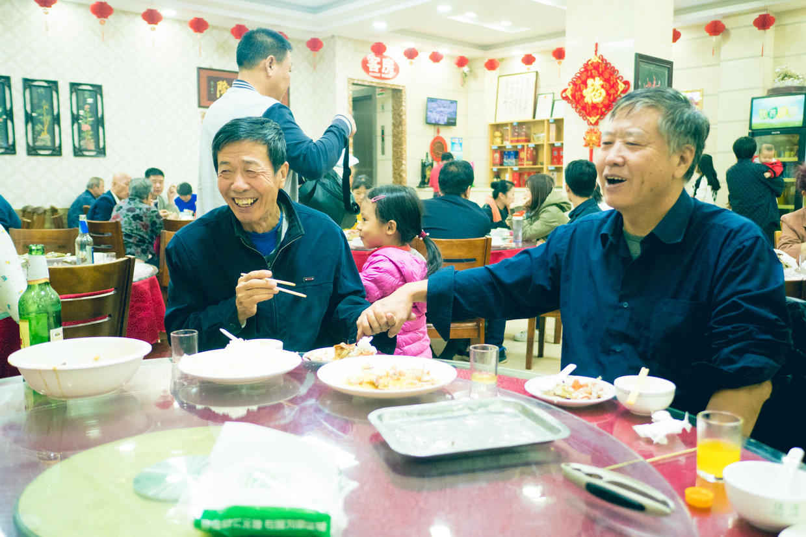

          
            
**2018.06.11**

**拍摄时间：2017.10.02**

**拍摄地点：南戴河**

这张照片是2017年国庆节，全家一起去南戴河吃螃蟹时拍的。

这是螃蟹肥的时候，我们去南戴河，姥姥姥爷也一起来了。

不过天公不做美，一直刮大风，于是我们就只好吃吃吃了。

从照片上看，喵好像是在作小服务员，其实不然。

她是在做摄影师，拍照片前给大家摆造型，让爷爷和姥爷拉起手，然后再拍。

爷爷和姥爷也是开心得不得了。

除了爷爷和姥爷，还给奶奶、姥姥，我们两个人分别设计了造型。

然后自己拿着相机，绕场一周，给每个人拍照。

在等菜的漫长过程中，这确实是一个非常有趣的活动。

喵从小就开始接触相机，也很爱给别人拍照，希望能坚持下去，多多发现身边的美丽景色和事务。

**个人微信公众号，请搜索：摹喵居士（momiaojushi）**

          
        