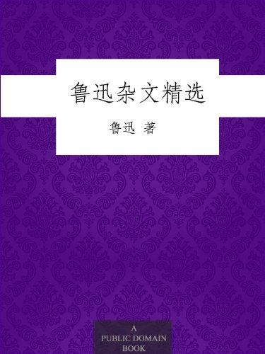

          
            
**2018.06.13**

生命不息，战斗不止。
<h2>2018.02.27（周二）</h2>
<h3>《鲁迅杂文精选 附录》 - 04</h3>
>附录

附录鲁迅先生生平大事年表（注：以下月份均系阴历）

1881年1岁 八月初三，生于浙江省绍兴府城内东昌坊口新台北京日报周宅。姓周，名树人，字豫才，小名樟寿，至38岁开始用笔名：鲁迅。

1886年6岁入私塾读书，师从玉田先生，开始诵读《鉴略》。1892年12岁正月，入私塾三味书屋，师从寿镜吾先生。

1898年18岁 闰三月，前往南京，考入江南水师学堂。

1899年19岁 正月，改入江南陆师学堂下属的矿路学堂。课余喜欢读小说或外出骑马。

1901年21岁 12月，在矿路学堂毕业。1902年22岁去日本留学，入东京弘文学

院学习日语，结业后到仙台医学专门学校学医。

1904年24岁 8月，离开仙台医学专门学校回到东京从事文学活动，希望用文学改变国民精神。

1906年26岁 6月回家，与朱安结婚。同月，再赴日本，在东京学习研究文艺。

1908年28岁师从章太炎先生，加人“光复会”，并与二弟周作人译国外小说。

1909年29岁 6月回国，在浙江两级师范学堂任生理化学教师。

1910年30岁 8月，在绍兴中学担任教师和监学两个职位。

1911年31岁 9月，任绍兴师范学校校长。冬天，写成第一篇试作小说《怀旧》，发表于《小说月报》第四卷第一号。

1912年32岁 1月1日，临时政府成立于南京，应教育总长蔡元培之邀，任教育部部员。5月，到达北京，任教育部社会教育司第一科科长。八月任命为教育部佥事。

1914年34岁研究佛经。

1915年35岁写成《会稽郡故书杂集》，刻《百喻经》，并搜集研究金石拓本。

1917年37岁 7月初，因张勋复辟，愤而离职。

1918年38岁首次用“鲁迅”为笔名，发表中国现代文学史上第一篇白话小说《狂人日记》，对人吃人的制度进行猛烈地揭露和抨击，奠定了新文学运动的基石。9月15日，发表《随感录二十五——从子女的教育问题谈起》，批判封建家族制度。文中强调“师范”“父范”的重要性。收入《热风》。

1919年39岁 4月15日，发表小说《孔乙己》，塑造了一个科举制度毒害下没落的封建知识分子的典型。收入《呐喊》。发表《我们现在怎样做父亲》，批判封建的“父权”思想，号召觉醒的父辈解放自己的孩子，收入《坟》。

1920年40岁 10月，译俄国阿尔志跋绥夫的小说《工人绥惠略夫》。秋季，北大中国文学系主任马裕藻代表学校聘请鲁迅担任兼课讲师。

1922年42岁 5月译成俄国爱罗先珂的童话剧《桃色的云》。兼任北京大学，北京高等师范学校讲师。发表小说《白光》，描写因追求功名而发疯致死的塾师陈士成，再次揭露科举制度的罪恶。收入《呐喊》。

1923年43岁 9月，小说第一集《呐喊》印成。同月，《中国小说史略》上卷印成。秋起，兼任北京大学，北京师范大学，北京女子高等师范学校及世界语专门学校讲师。

1924年44岁 6月，《中国小说史略》下卷印成。同月又校《嵇康集》，并编撰校正《嵇康集》序。10月译成日本厨川白村所著的论文《苦闷的象征》。冬起为《语丝》周刊撰稿。

1925年45岁 2月10日，作《青年必读书》，抨击当时的尊孔复古思潮。收入《华盖集》。11月杂感第一集《热风》印成。12月译成日本厨川白村所著的《出了象牙之塔》并且编辑《国民新报》副刊及《莽原》杂志。1926年46岁7月起，与齐宗颐同译《小约翰》。8月底，离开北京，前往厦门，任厦门大学文科教授。9月《彷徨》印成。

1927年47岁 2月前往香港演说，题为：《无声的中国》，次日演讲，题为：《老调子已经唱完！》。3月黄花节，往岭南大学讲演。7月在知用中学演讲，题目为《读书杂谈》，《魏晋风度及文章与药及酒之关系》。8月开始编纂《唐宋传奇集》。10月与许广平女士同居。同月《野草》印成。12月应大学院院长蔡元培之聘，任特约著作员。

1928年48岁 2月《小约翰》印成。同月为《北新》半月刊译《近代美术史潮论》，同时《唐宋传奇集》下册印成。5月前往江湾实验中学讲演，题曰：《老而不死论》。6月《思想·山水·人物》译作完成、《奔流》创刊出版。11月短评《而已集》印刷出版。

1929年49岁 1月与王方仁，崔真吾，柔石等合资创办印刷文艺书籍及木刻《艺苑朝花》，简称朝花社。5月《壁下译丛》印刷出版。6月《艺术论》译成出版。

1930年50岁 1月与友人合编《萌芽》月刊并且开始翻译《毁灭》。2月“自由大同盟”会成立。3月2日参加“左翼作家联盟”文学组织。9月校订《静静的顿河》完毕，过度劳累身体不适。11月修正《中国小说史略》。

1931年51岁 3月，先生主持“左联”机关杂志《前哨》出版。4月前往文书院讲演，题为：《流氓与文学》。11月《毁灭》翻译完成。

1932年52岁 4月，整理出版1928至1929年短评，名曰《三闲集》。整理出版1930年至1931年杂文，名曰《二心集》。

1933年52岁短评集《伪自由书》印成。

1934年54岁 3月校对杂文《南腔北调集》，同月印成。12月短评集《准风月谈》出版。

1935年55岁 2月开始译果戈里小说《死魂灵》。4月《十竹斋笺谱》第一册印成。10月编瞿秋白遗著《海上述林》上卷。11月续写《故事新编》。12月整理《死魂灵百图》木刻本，并作序。

1936年56岁 1月20日与朋友合办半月刊《海燕》。《故事新编》同月出版。2月开始译《死魂灵》第二部。6月，《花边文学》印成。8月，痰中见血。10月19日上午因肺病逝世。

**个人微信公众号，请搜索：摹喵居士（momiaojushi）**

          
        