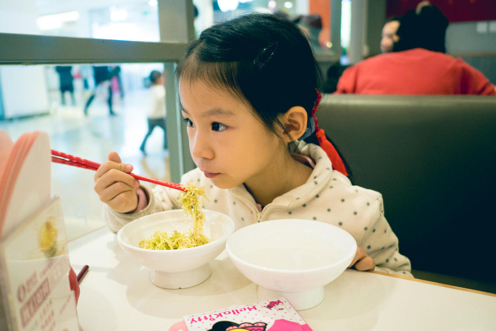

          
            
**2018.06.15**

***有的小朋友对我说不想上小学，因为减法太难了，其实小学里有趣的事可多了，包括减法在内。***

这次我们来聊聊小学里吃午饭吧。

现在我们每天路过和平里九小，都会看到小学生们手里拎着午餐包。

我那时也是这样的，一个塑料袋，装着一个黄色塑料饭盒。

爸爸妈妈把前一天的剩饭和剩菜结结实实地压进饭盒。

中午，学校会给大家把饭盒蒸一下来加热。

等我拿到饭盒，打开以后，会有一股弄弄的塑料味，不过还是会很香地吃完午饭。

但是悲剧地是，塑料饭盒上的油太难洗下去了。

后来就换成不锈钢饭盒，问题就是有些烫手。

等我到了和平里一小，就是去食堂打饭了，黑洞洞的食堂里都看不清菜是什么。

当时有的同学父母在和平商业大厦上班，就是现在南城香的那个大楼。

于是我们就跟着混进和平商业大厦食堂吃饭，我在那里第一次吃到了酱爆鸡丁，真的是又香又甜。

希望你在小学吃午饭时能有个好胃口。

**个人微信公众号，请搜索：摹喵居士（momiaojushi）**

          
        