          
            
**2018.06.23**

周六啦，一早起床去上芭蕾课。

到了教室开始热身活动。

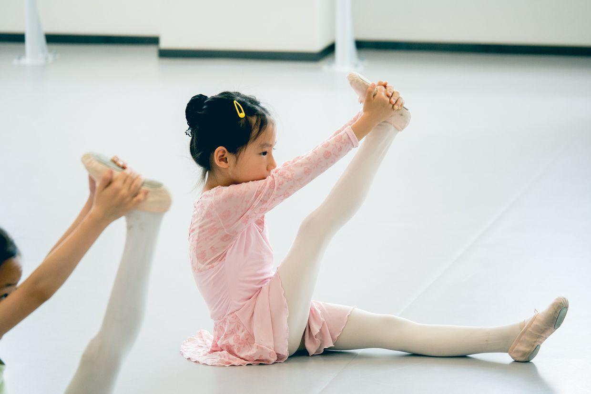

中午睡了个大觉，差点迟到了。

赶紧去上钢琴课。

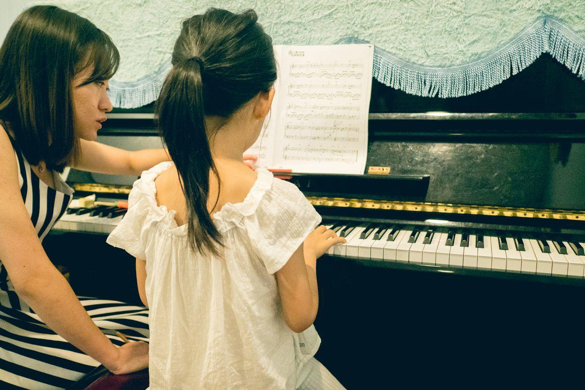

下了课去五道口玩儿水。

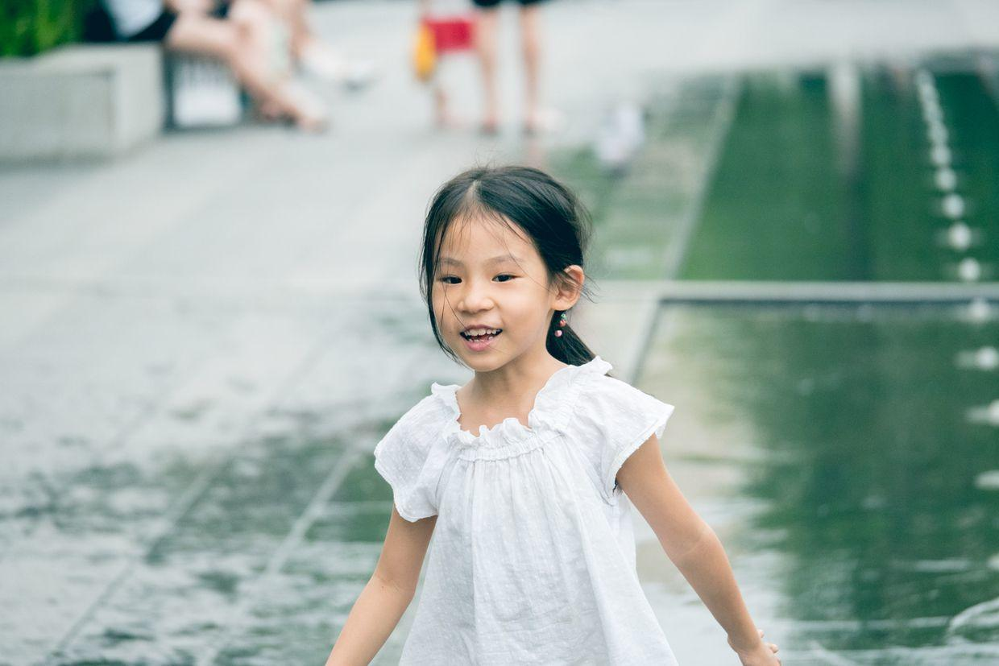

一开始还很矜持，不敢踩水。

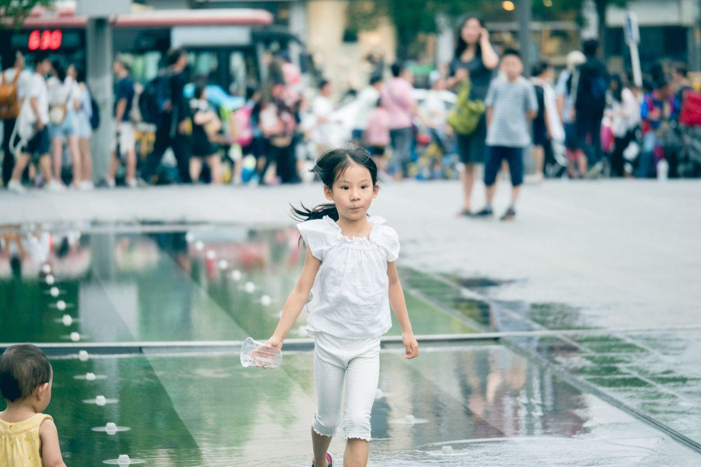

几个小姑娘，迅速聚在一起玩儿。

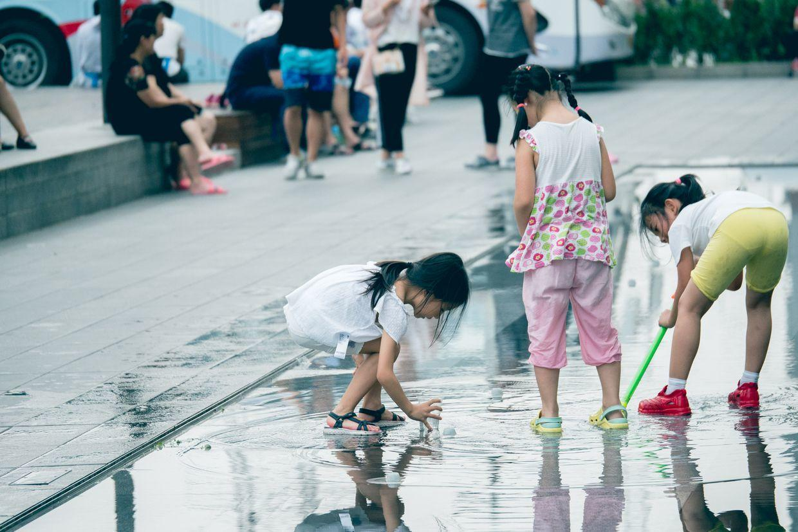

跑起来真是矫健啊。

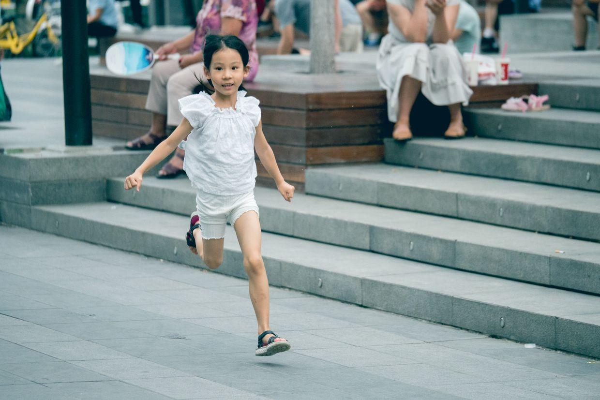

做着鬼脸在水里奔跑。

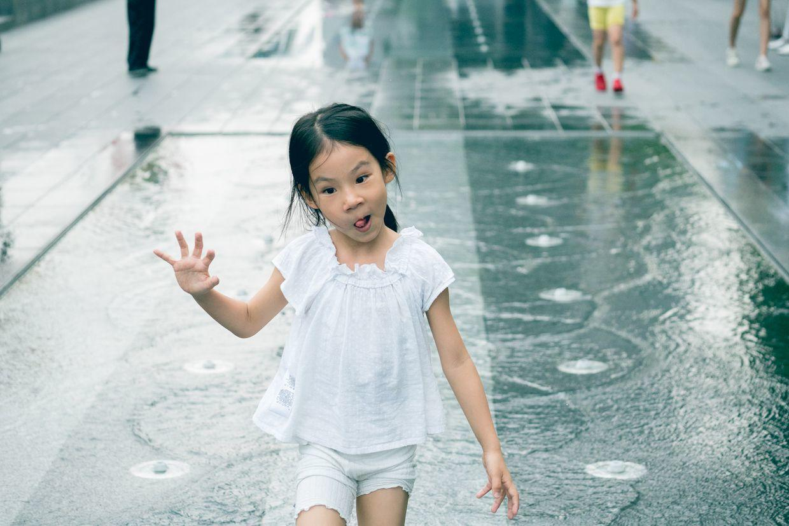

健康的十字韧带就是不一样啊。

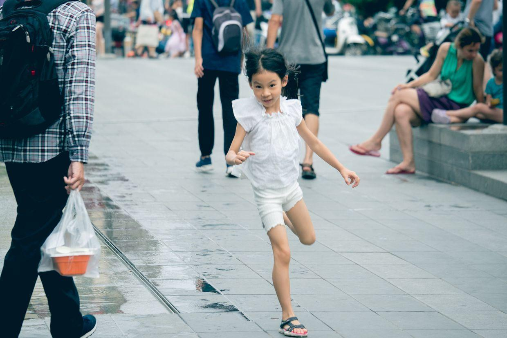

放开啦，不在乎水了。

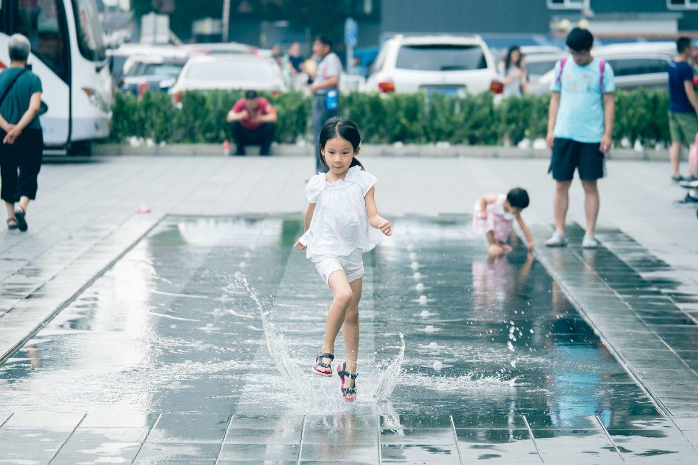

在水里蹦，就像小猪佩奇跳泥坑。

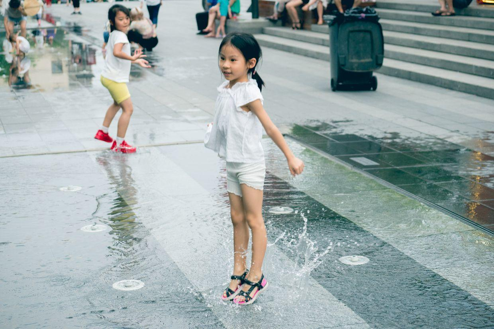

三个小朋友并排前进。

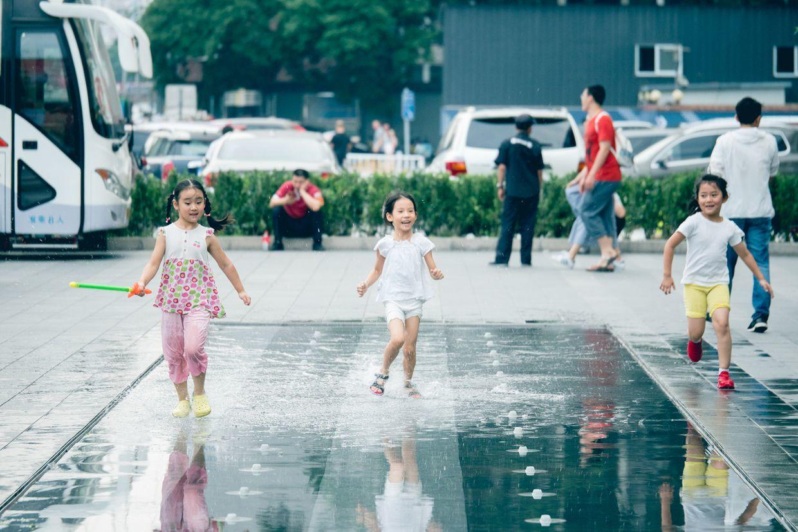

笑容灿烂啊。

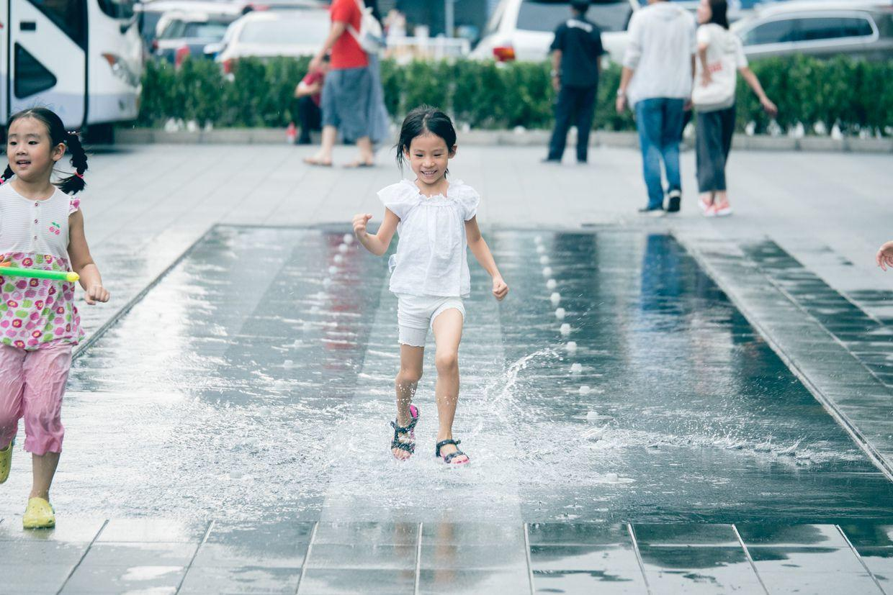

封面

高高跃起。

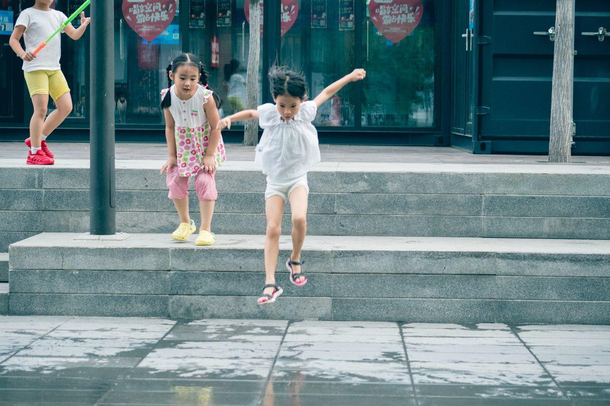

发现了一片红叶。

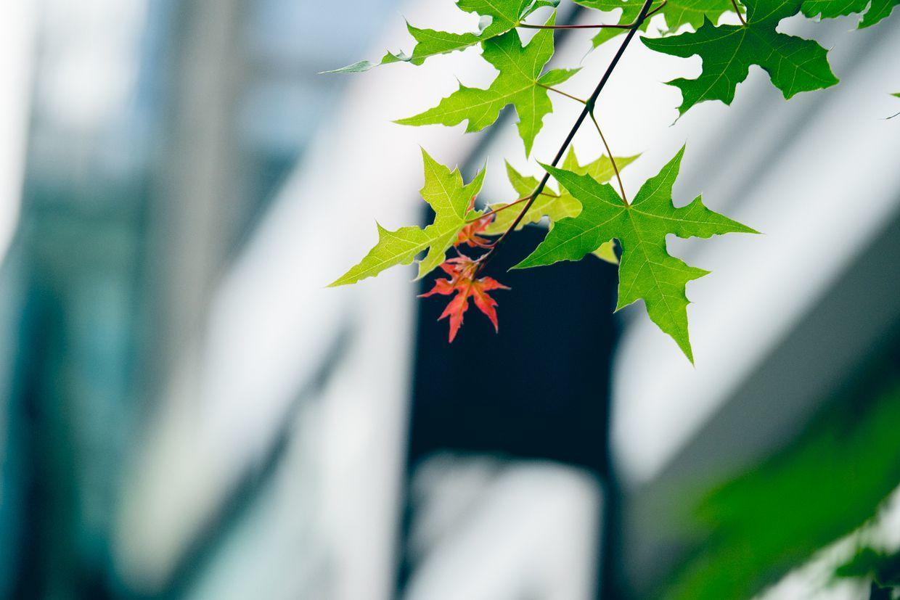

和一个小妹妹一起玩儿。

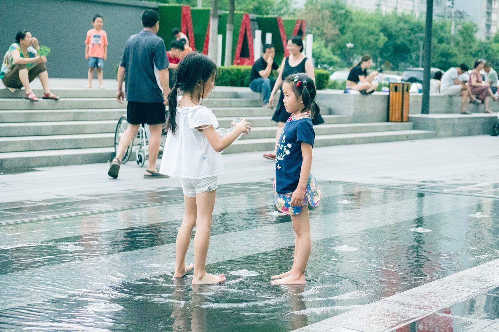

可惜的是，到了最后喷泉也没有开。

不过已经玩儿得很开心了，回家去洗澡啦。

到家，比利时和突尼斯的比赛已经开始了，双方都不防守，迅速就踢成了2:1。

有世界杯的夏天，真是幸福啊。

边吃西瓜，边看世界杯，惬意啊。

**个人微信公众号，请搜索：摹喵居士（momiaojushi）**

          
        