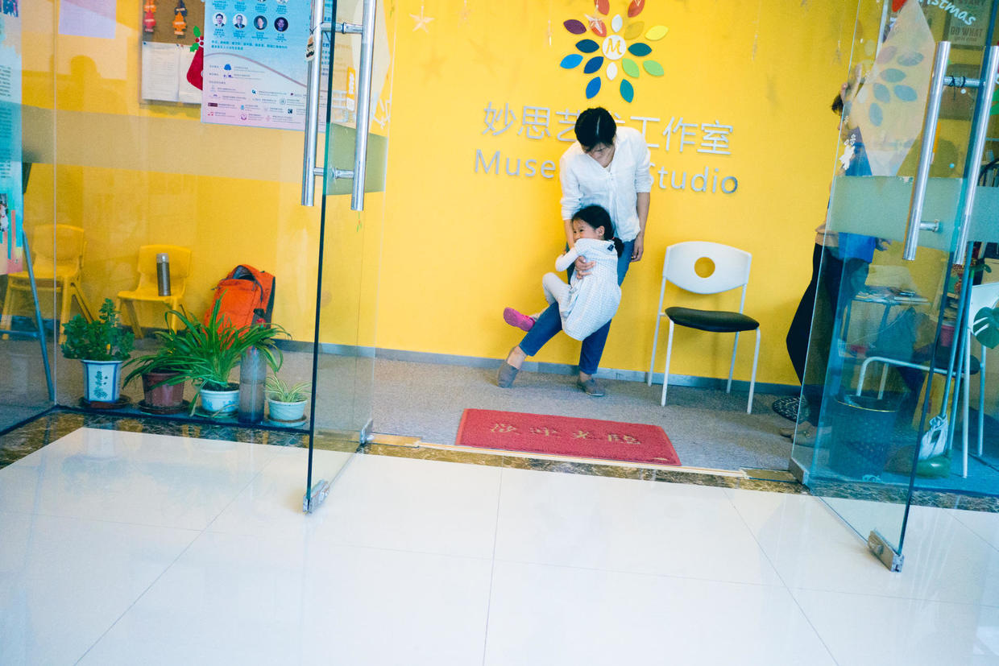

          
            
**2018.06.25**

**拍摄时间：2017.04.29**

**拍摄地点：钢琴教室**

这张照片是2017年去钢琴教室上课前拍的。

每次都会提前10分钟到钢琴教师，老师已经在门口等候了。

还会有其他接孩子的家长在里面坐着。

整个大厅空荡荡的，于是喵就会要求跑一会儿。

从门口跑到走廊去，然后再跑回来，哈哈大笑的声音在楼里面回荡。

一会儿跑回来，突然蹿到妈妈大腿上，像个小猴子一样。

不过也不能没完没了地跑，跑了一身大汗，上课的时候就浑身痒痒。

而且，笑得声音过大了，影响正在上课的同学。

总之，每次钢琴课前，都会伴随着一节体育课。

和我以前上钢琴课一样，先要在楼下打一会儿乒乓球。

不过，和我不一样的是，钢琴课上，还是很开心的。

真是有趣的人生啊。

**个人微信公众号，请搜索：摹喵居士（momiaojushi）**

          
        