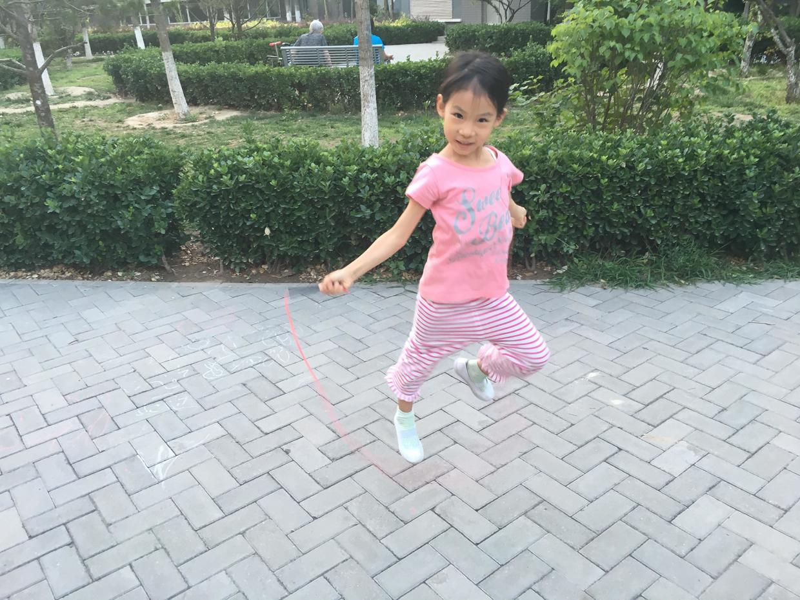

          
            
**2018.06.26**

最近，喵在奶奶的鼓励和教导下，开始练习跳绳。

回想起幼儿园小班的时候，给她买了一根跳绳，但那时无论怎么教，都完全无法掌握，摸不到门。

随着逐渐长大，手脚协调性越来越好，练习跳绳的时机也到了。

奶奶买了好多种跳绳，终于选到了一条合适的绳子。

绳子不能太轻，会发飘。

也不能太重，所以选了一条短一点的塑料跳绳。

绳子把手也很轻。

在奶奶的指导下，一开始是一次跳一个，很缓慢。

后来开始能简单的蹬三轮了，有模有样的。

在继续下来，能够很快地蹬三轮。

现在开始进入一边跑一边跳的阶段了。

拿着跳绳，边跑边跳地跑来跑去，如履平地。

接下来就是编花、双摇还有双摇编花啦。

说起来，跳绳还真是一项有趣的运动。

**个人微信公众号，请搜索：摹喵居士（momiaojushi）**

          
        