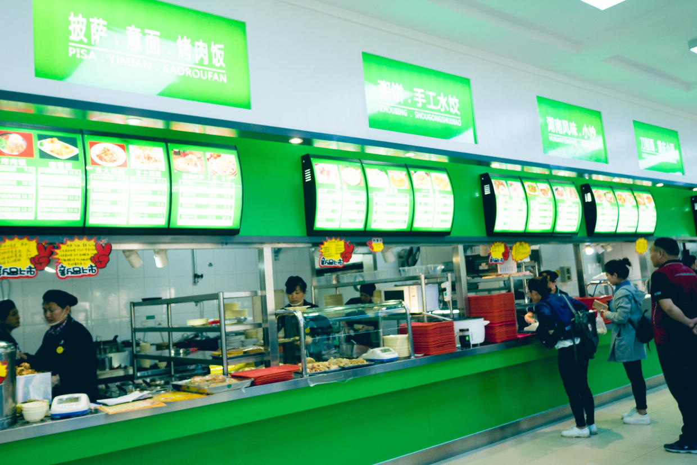

          
            
**2018.07.02**

**拍摄时间：2017.04.23**

**拍摄地点：北邮教工食堂**

这张照片是2017年春天，去北邮吃饭是拍的。

当时带着喵去动物园玩儿，从西直门骑车回家的路上，正好接机穿越了北邮校园。

中午也饿了，于是去教工食堂吃饭。

当年那幢低矮昏暗的小平房，如今摇身一变，不可同日而语了。

好几层的食堂，随便挑了一层，和一般的大时代很像，每个窗口都可以打菜。

各种各样的小份菜，让人眼花缭乱，价格也是非常实在。

大了两大盘子菜和饭，找了位子，三个人一起吃起来。

甜甜的西红柿炒鸡蛋，喵一口气就吃了大半盘。

肉菜里的肉量非常足，吃起来也很香。

不过菜还是偏咸，而且油也比较大，于是要了一杯可乐。

可乐里兑水的量，依稀有当年食堂的风采。

终于找到了些当年的影子。

**个人微信公众号，请搜索：摹喵居士（momiaojushi）**

          
        