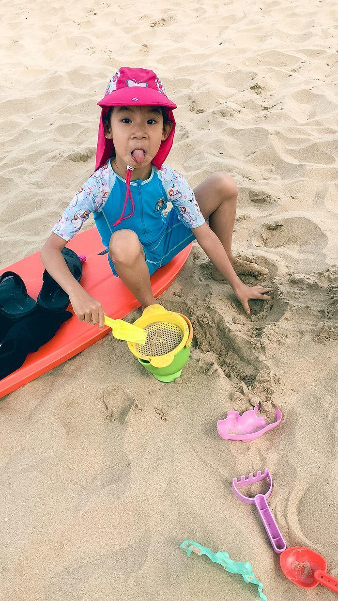
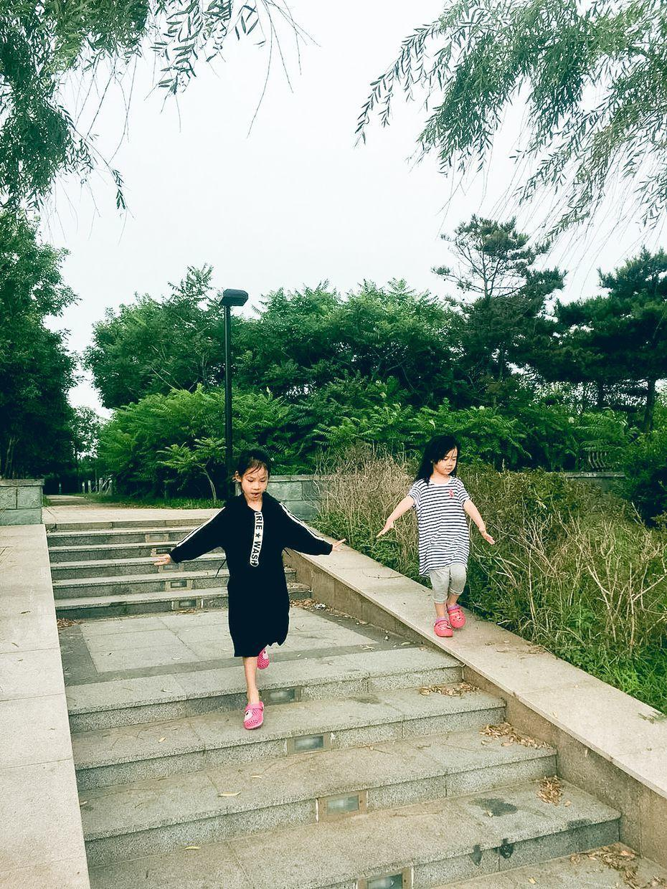

          
            
**2018.07.07**

小学入学的事终于搞定了，录取通知也下来了。

抽时间去了一趟未来的小学。

门口的小路很窄。

喵和爷爷奶奶一起去南戴河玩儿啦。

路上在休息区吃最喜欢的泡面。

阴天很凉快，去沙滩玩儿沙子。

在凉台上拍球。

每天还练习写字和算术。

玩儿沙子，开心啊。

兜妹来啦，有伙伴啦。

封面

和爷爷们一起去钓鱼。

练琴，给妹妹听听天空之城。

俩人一起去玩儿篮球。

和爷爷好好较量一下。

在栈道上奔跑。

好帅气，挥手致意。

一起下台阶。

跳得可真是高啊。

丰盛的早餐，肉蛋菜都有。

晚上进行文艺汇演，朗诵。

开心地又蹦又跳。

两个小姐妹，开心地聚在大海边，有吃有玩儿。

想起了我小的想时候，和姐姐妹妹们在北戴河的日子，真是无比怀念啊。

**个人微信公众号，请搜索：摹喵居士（momiaojushi）**

          
        