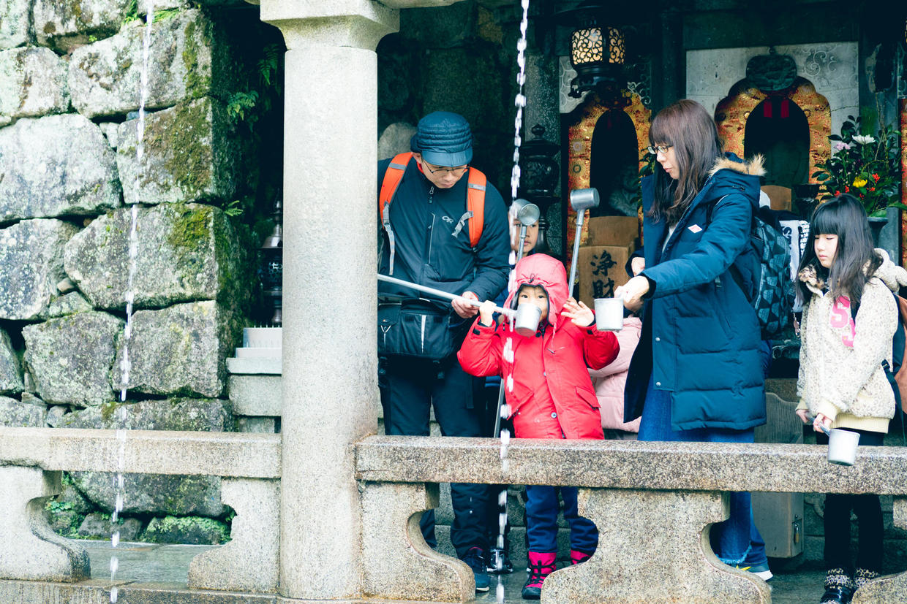

          
            
**2018.07.09**

**拍摄时间：2017.12.31**

**拍摄地点：清水寺**

这张照片是2017年最后一天，去京都的清水寺玩儿的时候拍的。

天气非常舒适，完全不像北京那么冷。

在清水寺里，从大舞台出来，沿着山路往下走一会儿，就到了音羽瀑布。

这里排着长长的队伍，大家都是在等着去喝瀑布水。

说是瀑布，其实是引出来的山泉，整个京都就是一个大水盆。

瀑布溅落的声音，就像是美丽的音乐，于是有了音羽的美名。

最前面一共有3条瀑布，准备了一个长柄的金属碗，喝完的人把碗放到桌子上，从另一侧下去。

轮到我们了，喵也是很兴奋，和我一起抓着长柄去接水，然后你一口我一口喝完。

大冬天里，喝着这么凉的山泉水，真是清爽至极啊。

下山的路上，再吃上一个抹茶冰激凌，更是人间仙境。

**个人微信公众号，请搜索：摹喵居士（momiaojushi）**

          
        