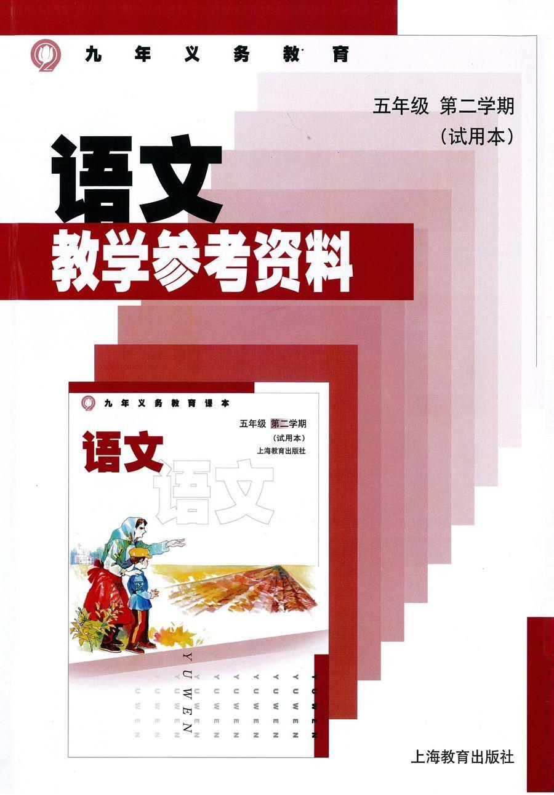

          
            
**2018.07.12**

上初中时，语文课有预习课文的要求，但是课文的背景知识完全不了解，也不像现在可以上网查。

于是，每次干巴巴的写上几个字，总是被老师批评。

后来，听说有一种叫做教参的神器，上面有所有你需要的东西。

于是，大冬天，骑上自行车，拿着一张地图，去向遥远的东便门，寻找那个传说中的教辅书店。

好容易找到书店，人家一看见我就知道我是买教参的学生，已经没货了，什么时候来货不知道，下次再来。

于是我下周再来，终于等到了，我只买了一本，发现很多人都是买十几本，就好像是现在的日本代购。

寒夜里，带着教参回到家，打开之后，发现文章背景资料并不多，课后答案也不全。

于是，我的预习作业得分还是很低。

如果那时有搜索引擎就好了，大家都能够在知识层面上直立行走。

**个人微信公众号，请搜索：摹喵居士（momiaojushi）**

          
        