          
            
**2018.07.14**

又到周六啦，去上芭蕾课啦。

一早赶到舞蹈教室，放暑假了，人很少。

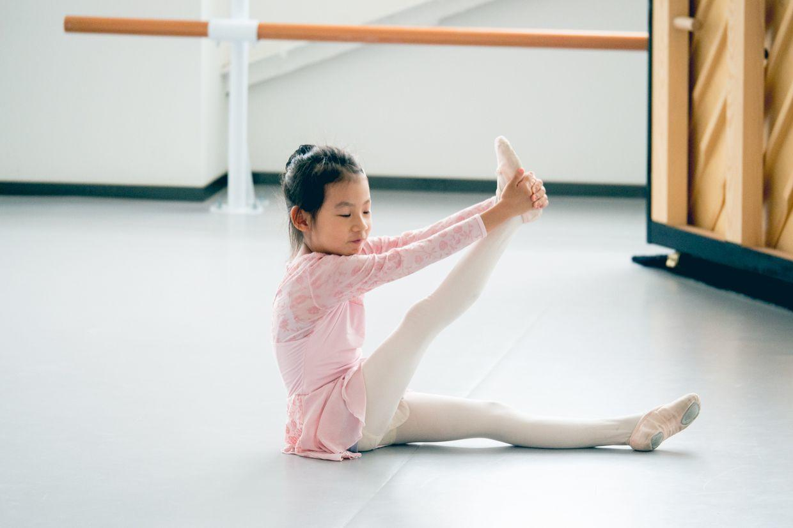

自己开始做准备活动啦。

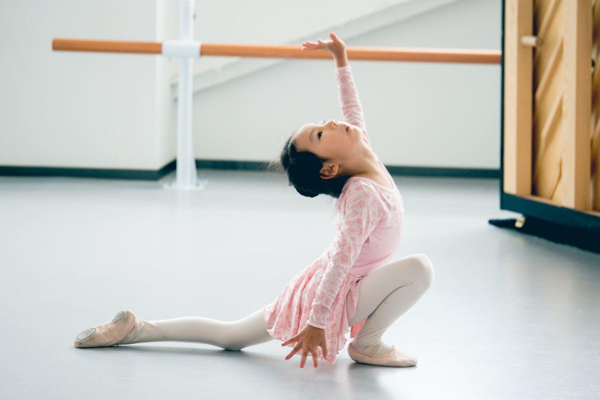

趴在地上还挺神气。

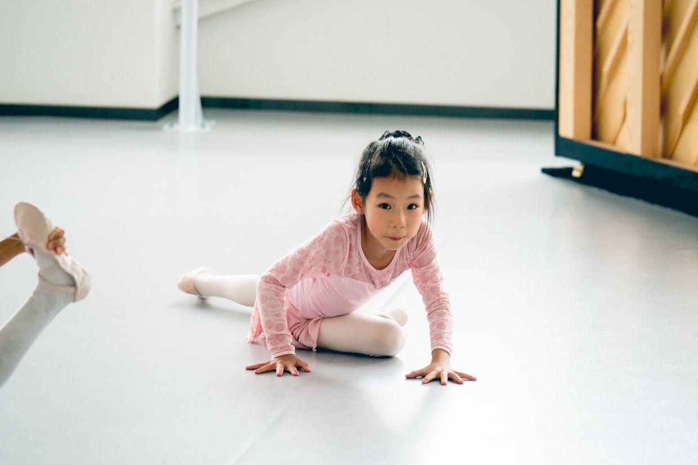

笑起来少了两颗大尖牙。

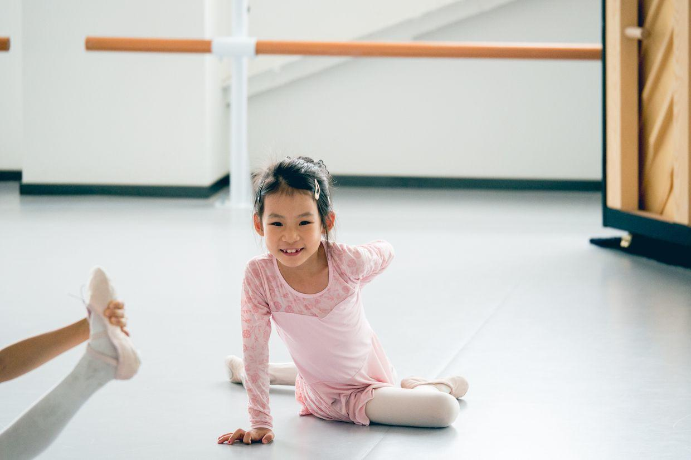

转起身来，还挺难控制。

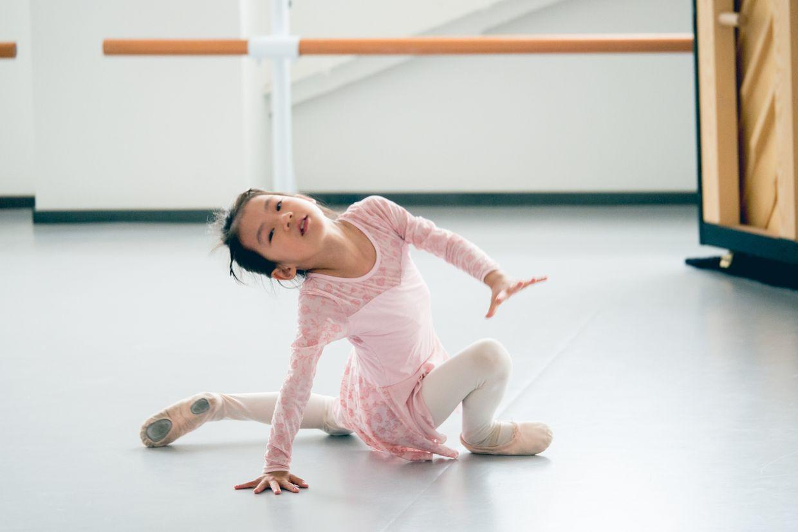

看着我还挺开心。

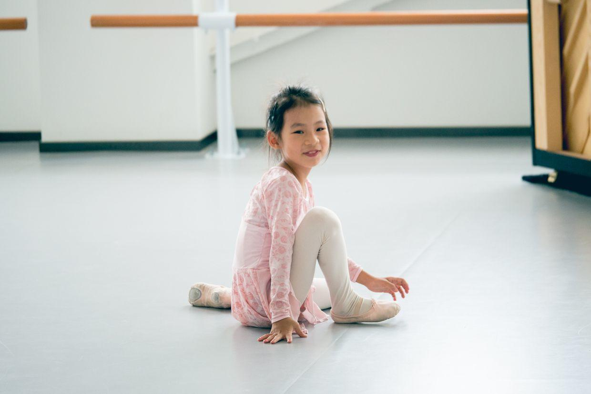

摔倒啦。

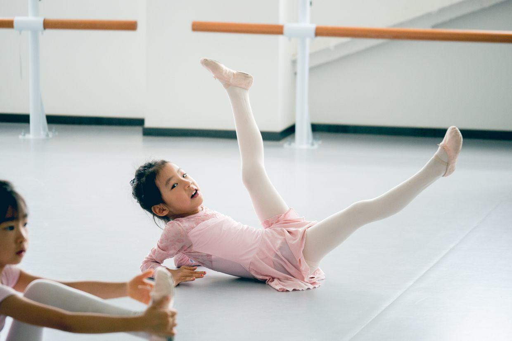

往后倾倒的瞬间。

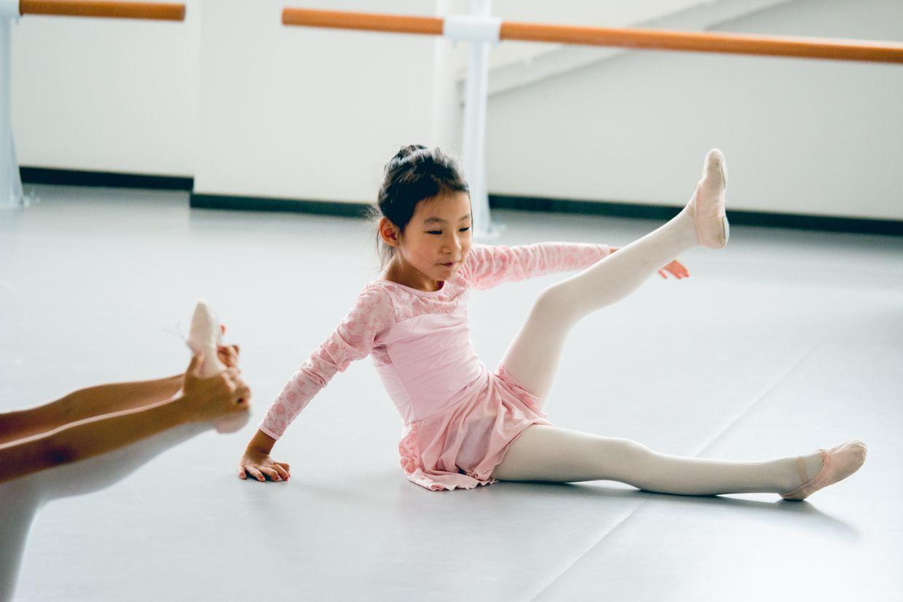

这张很漂亮。

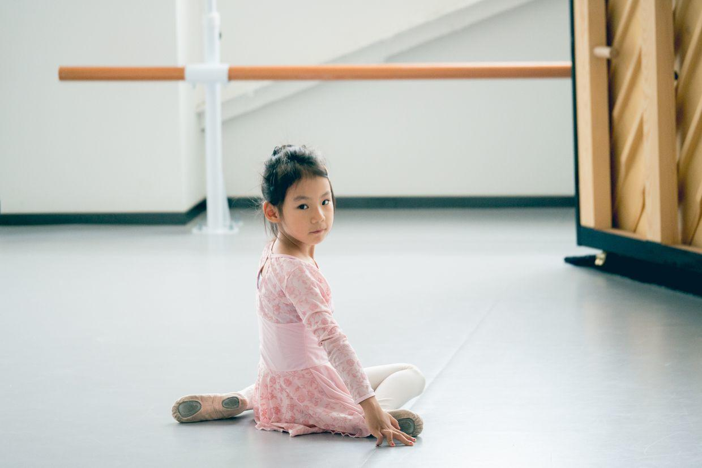

很认真的表情。

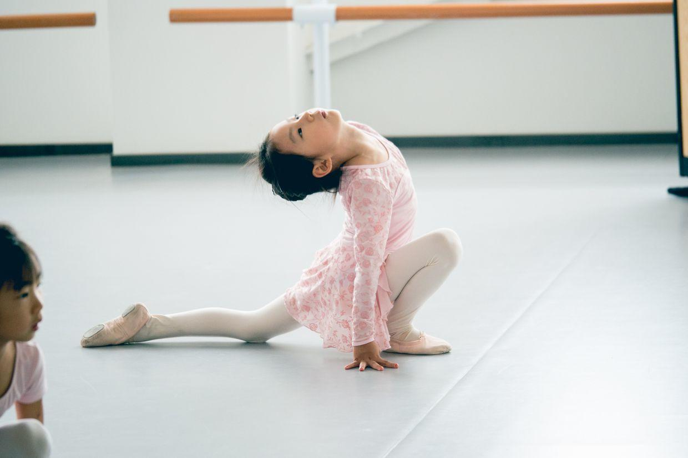

冲我挥手指头。

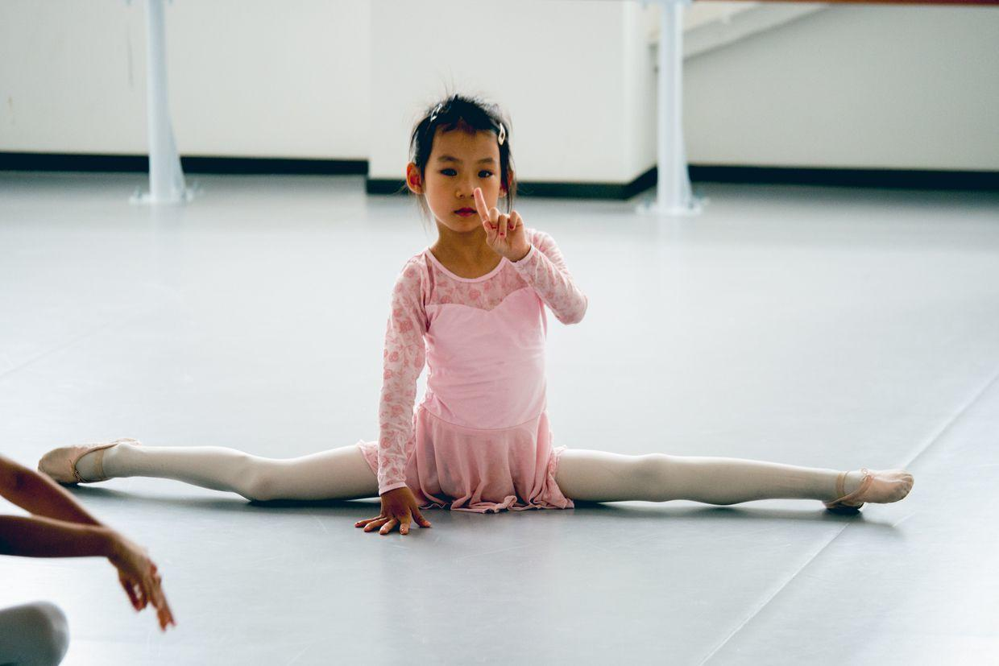

非常厉害，完全难以想象。

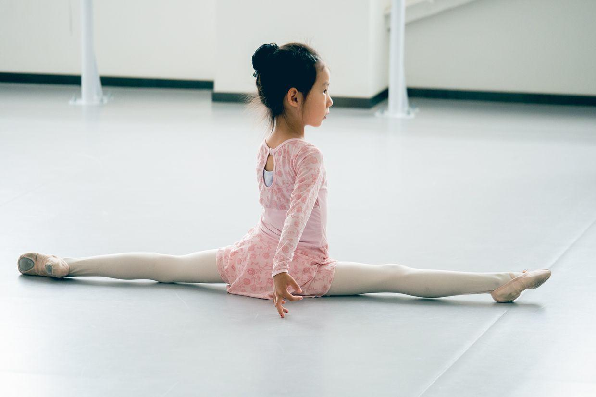

封面

上午妈妈去学校参加家长会，介绍了新学期的安排。

8月底就要开始准备去适应学校了，马上就要步入小学生的作息时间表了。

一个新的时代就要开始。

中午在楼下竟然很巧地碰到一起了。

回到家跟姥姥姥爷视频。

然后看会电视，吃午饭啦。

中午睡一大觉，下午起床吃点东西，然后去上钢琴课。

今天晚上还会有钢琴沙龙，又可以听小朋友们的精彩表演啦。

**个人微信公众号，请搜索：摹喵居士（momiaojushi）**

          
        