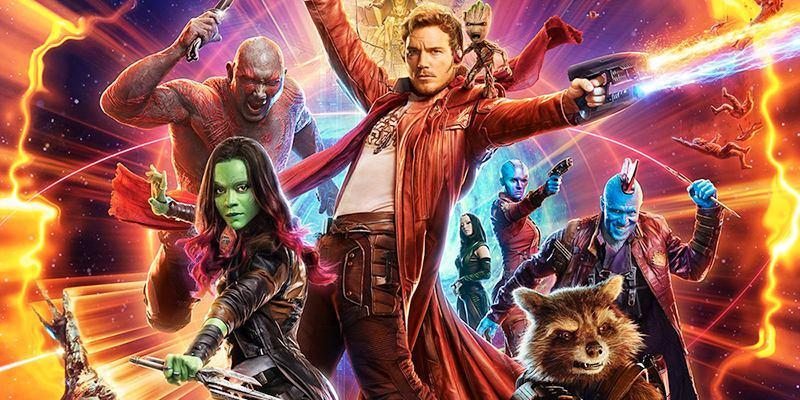

          
            
**2018.07.17**

最近，喵对超级英雄的兴趣，从DC转移到了Marvel。

在Marvel所有电影里，她最喜欢的就是《银河护卫队》1和2。

在她的带动下，我跟着看了好几遍，也突然爱上了这2部电影。

喵喜欢的最初原因是小树在《银河护卫队2》里面开头的配乐舞蹈。

还有小树各种可爱的搞笑情节。

后来，喵开始喜欢卡魔拉，觉得她非常厉害，对她的喜爱俨然和神奇女侠一样。

我们在家经常会角色扮演一下。

我是罗南的手下，冲进来大喊：
>Star Lord.

喵是星爵，开心地大喊：
>Finally.

后来，喵还扮演星云，吃一口萝卜，然后喊到：
>It's not ripe.

除此之外，《银河护卫队》系列电影和其他电影的区别是，很多情节都会配上精选的欧美老歌，非常烘托气氛。

平时在车上，我们一起听着《银河护卫队》的专辑，然后一起回忆电影里的情节。

最后，看电影之后，喵会提出各种问题，她会想各种办法去自己解释电影里面角色的行为。
>为什么卡魔拉要把星云锁起来？

>是因为她怕非常颠簸，星云掉出去。

真是善良啊。

**个人微信公众号，请搜索：摹喵居士（momiaojushi）**

          
        