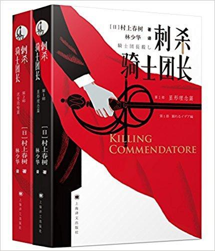

          
            
**2018.07.18**

非常有悬念的小说，结尾也很平淡，让你觉得看明白了，却更糊涂。 村上的各种爱好歌剧、黑胶、威士忌都在书里出场。 这些几十年前的新潮物件，如今都成了格格不入。 文中不时还来一些独白，比如用纸杯喝星巴克的IT精英。
<h2>2018.03.22（周四）</h2>
<h3>《刺杀骑士团长》 - 05</h3>
>这一星期没发生什么事。骑士团长没有现身，年长的人妻女友也没联系。风平浪静的一星期。唯独秋意在我四周缓缓加深。天空眼看着变高，空气澄澈如洗，一条条云絮那般优美洁白，如用毛刷勾勒出的一样。

这段氛围描写很棒
>刺杀骑士团长•第二部

“那个车型是不省油，电气系统也可能故障不少。捷豹在传统上电气系统就不够强。但在没有故障行驶的时候，只要不介意汽油费，那么一贯出类拔萃。无论乘坐感觉还是驾驶体验，都充满独一无二的魅力。当然世间绝大多数人都把故障和油耗牢牢放在心上。正因如此，丰田普锐斯才卖得飞一样快。”

捷豹的魅力在浪费？
>秋川笙子默默接过钥匙，往方向盘旁边插了进去，按顺时针方向旋转，那只猫科巨兽顿时醒了。她入迷地倾听了一会儿深沉的引擎声。“这引擎声有听过的记忆。”她说。“4.2升的V8发动机。令尊开的XJ6是六缸，阀门数量和压缩比都不一样，但声音或许相似。在毫不反省地大量燃烧化石燃料这点上，古往今来一成未变，实属罪孽深重的机械。”

捷豹好不反省地大量燃烧化石燃料
>秋川笙子抬起换挡杆，亮起右转向灯。独特的宏亮的砰砰声随之响了起来。“这声音实在让人怀念！”免色微微笑道：“这是只有捷豹才能发出的声音，和其他任何车的转向灯声都不一样。”

转向灯的声音都不一样
>秋川笙子从捷豹下来关合车门，把车钥匙还给免色。免色接过钥匙，揣回裤袋。她和真理惠随后钻进蓝色普锐斯。免色为真理惠关上车门。我再次深感捷豹和普锐斯关车门的声音截然有别。即使一种声音，世界上都有如此之多的差异。一如“砰”一声拉响低音大提琴同一根空弦，查尔斯·明格斯(1)的声音和雷·布朗(2)的声音听起来也分明有所不同。

捷豹的关门声都不一样
>有人说中国人死亡数字是四十万，有人说是十万。可是，四十万人与十万人的区别到底在哪里呢？”

写得好
>雨田具彦的弟弟继彦作为一名士兵参加了南京攻城战。是被征兵而参加实战部队的。他当时二十岁，是东京音乐学校、即现在的东京艺大音乐学部的在校学生，学钢琴。”

“但是，退伍复学后不久，雨田继彦中止了自己的生命。家人发现他在自家房顶阁楼里用剃刀割腕死了。那是夏天快过去时候的事。”

“弟弟的自杀——几乎与此同时，雨田具彦在维也纳发动暗杀未遂事件。你认为这二者之间可能有某种关联性？”

雨田具彦的弟弟被征兵去南京大屠杀，回来就自杀了，具彦在维也纳发动暗杀
<h2>2018.03.23（周五）</h2>
<h3>《刺杀骑士团长》 - 06</h3>
>“我也当过一阵子模特，当绘画模特总好像有些奇妙，时不时觉得魂儿像被掠走了似的。”说着，免色笑了。

真理惠以没有起伏的语声说道：“并没有被掠走，而是我递出什么，我接受什么。”

肖像画的感觉，被掠走还是递出
>她没有心思跟对方说话的时候，同她的交谈好比站在热浪灼人的空旷的沙漠正中用小勺子向周围洒水。

尬聊描述的很贴切
>雨田轻叹一声。“老样子。脑袋彻底短路，几乎连鸡蛋和睾丸都分不清了。”“掉在地板上碎了，那就是鸡蛋。”

鸡蛋和睾丸的区别
>雨田称为“瑞典饭盒”的老式沃尔沃。拉死掉的驯鹿估计足够方便。

瑞典饭盒
<h2>2018.03.26（周一）</h2>
<h3>《刺杀骑士团长》 - 07</h3>
>“我不喜欢CD那样的东西，光闪闪太新潮了，挂在房檐驱赶乌鸦或许正合适，但不是用来听音乐的。声音尖厉刺耳，混音不够自然，不分A面B面也没意思。想听磁带音乐还得坐这辆车。新车没有盒式磁带机。因此弄得大家目瞪口呆。但奈何不得。从广播中选录的音乐磁带家里多得不得了，不想作废。”

CD这么不堪啊
>人们从停车场前面的观光台用小数码相机或手机拍摄正面赫然入目的富士山。也许出于愚蠢的偏见，对于人们用手机拍照这一行为，我无论如何也看不惯。而用照相机打电话这一行为，就更让我看不顺眼。

看不惯用手机拍照和用相机打电话
>随后我蓦然感觉到什么，朝背后看去。于是得知，在这房间里的，不止雨田具彦和我两人。“是的，不是仅仅诸君两人在这里。”骑士团长说。

看望雨田具彦的时候，骑士团长来了
>雨田具彦眼睛瞪得更大了，直视那里的场景——我刺杀骑士团长的场景。

为了找回秋川真理惠，主角刺杀其实团长
>有什么在这房间里。有什么在那里动。我依然手握沾满血迹的锋利刃器，身姿未动，只是悄然转动眼珠朝那声音响起的那边看去。看清了，房间尽头角落有什么出现在眼角。长面人在那里。我通过刺杀骑士团长而把长面人拽到了这个世界。

长面人打开了地板出来
>“你究竟算是什么？同是理念的一种？”“不，我等不是什么理念，仅仅是隐喻。”

长面人是隐喻，很脆弱
>“如果有纸，可以画你的肖像画。说起此外我随身带的，不外乎画画技能。”无面人笑了——我想应该是笑——空白里面隐约传来类似欢快回响的声音。“我根本无脸。无脸的人的肖像画怎么能画出来呢？无也能画成画？怎么画？”“我是专家。”我说，“没有脸也能画肖像画。”

开船的无面人要报酬，主角许诺了画无面人肖像画
>无面人点头：“可能总有一天我会找你画我的肖像画。果真那样，届时就把这企鹅玩偶还给你。”

无面人拿走了秋川真理惠的企鹅护身符
>矿灯光照下的她的黑影被鲜明放大照在身后的岩壁上，摇曳不定。“等着您呢！”小个头唐娜·安娜对我说。

画中的安娜出场
>少时，直觉击中了我：这里是杂木林中小庙后面的那个洞。我是钻过唐娜·安娜所在洞窟的横洞跌落在石室底部的，置身于现实世界中的现实洞中。

在洞中爬出来，回到了家里小庙的洞，被免色救出，据说秋川真理惠也到家了
<h2>2018.03.27（周二）</h2>
<h3>《刺杀骑士团长》 - 08</h3>
>接着用大锅烧开水，焯芦笋和西兰花做沙拉用。煮蛋也准备了几个。总之如此这般还算顺利地把时间打发掉了。时间还多少有剩，也考虑学免色洗车，但想到洗了反正也马上就满是灰尘，兴趣顿时消失。还是继续站在厨房煮青菜有益。

做些无聊的事打发时间
>“这幅画的名字叫‘刺杀骑士团长’，

“你见过骑士团长？”真理惠点头。“什么时候？在哪儿？”“在免色的家。”她说。

真理惠见过骑士团长
>“我在免色家来着，这四天一直。”秋川真理惠说。流过一阵子泪，她终于能开口了。

真理惠去免色家，但是被困住
>“我不是什么幻觉。”骑士团长重复道。“至于我是不是实有其人自是众说纷纭，但反正不是幻觉。而且我是来这里帮助诸君的。难道诸君不是在寻求帮助吗？”

“诸君在这衣帽间里躲些时候。”骑士团长说，“屏住呼吸，一动不动。此外别无良策。合适时机到了由我告知。告知前不得离开这里。哪怕再有什么也不得出声。明白？”

骑士团长帮助真理惠藏好
>莫扎特的奏鸣曲，一般说来大多绝不难弹。但若想弹得得心应手，就往往带有深邃迷宫般的情趣。

莫扎特奏鸣曲
>真理惠定定注视了我十秒钟，用很小的声音说：“骑士团长真有。”“不错，骑士团长真有。”我说。而且我亲手刺杀了骑士团长，真真正正。但当然不能说出口。

真理惠和主角都相信骑士团长存在
>她久久、久久地看着我，就像在看久违的令人怀念的风景。然后伸出手，轻轻放在桌面上我的手上。“如果可能，我是想和你重归于好的。”柚说，“其实我一直这么考虑。”

主角和妻子复合
>我回到妻的身边重新共同生活。几年过后的三月十一日，东日本一带发生大地震。我坐在电视机前，目睹从岩手县到宫城县沿海城镇接二连三毁掉的实况。

311大地震
>东北地震两个月后，我曾经住的小田原房子失火烧掉了。

秋川真理惠在火灾发生后马上给我打来电话，我们就烧毁的房子交谈了半个小时。她打心眼里珍惜那座古旧的小房子。

雨田具彦的老宅失火
>我一个人在东北从一座城镇往另一座城镇移动之间，循着梦境而同熟睡中的柚交合了。我潜入她的梦中，结果使得她受孕而在九个月多一点点之后生出了孩子——我宁愿这样设想（虽然终究不过是我自己一个人悄悄地）。这孩子的父亲是作为理念的我、或作为隐喻的我。一如骑士团长来找我，唐娜·安娜在黑暗中引导我，我在另一世界让柚受孕。

真是情深所致啊

**个人微信公众号，请搜索：摹喵居士（momiaojushi）**

          
        