          
            
**2018.07.22**

周日啦，睡了个大懒觉，起床都快九点了。

吃过早饭，出门去锻炼。

到了仰山公园，人真是非常少啊。

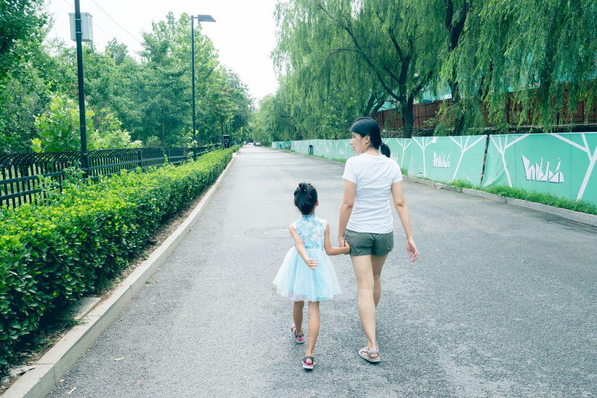

穿着裙子，转起了圈。

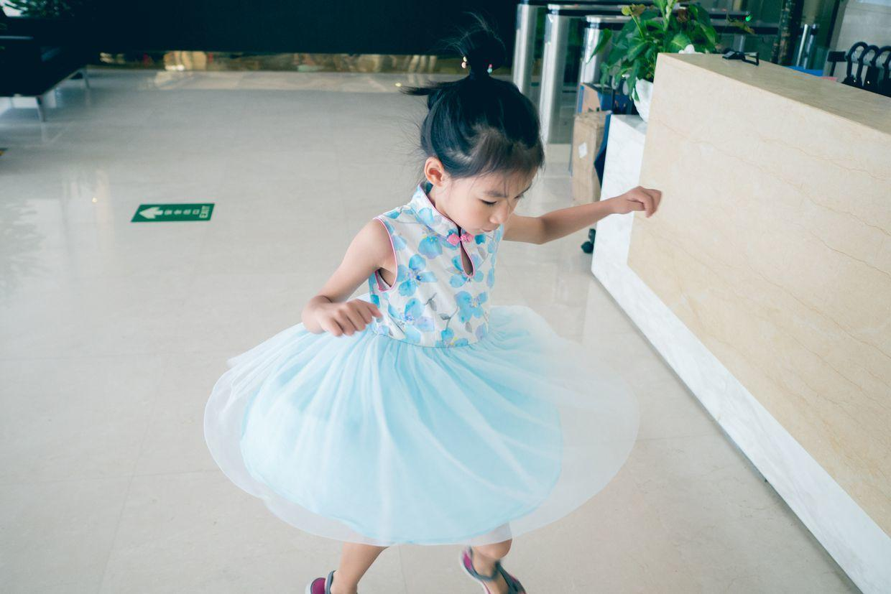

穿过了一条林间小路。

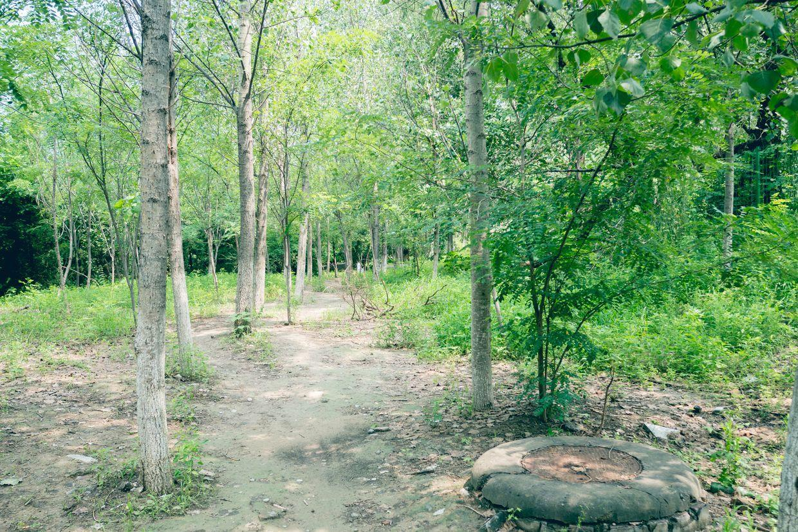

看着满地的毛毛虫，吓得吱哇乱叫。

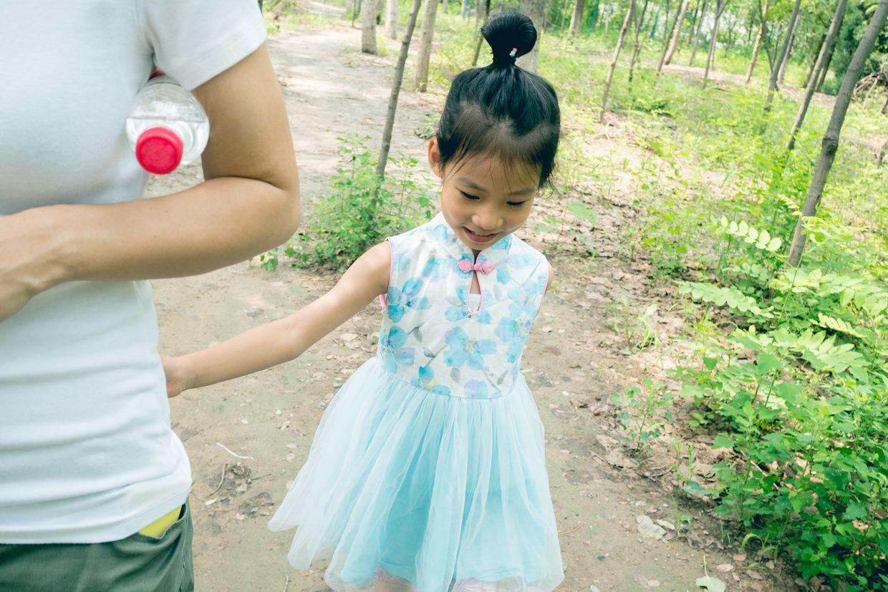

进到公园里啦，基本没有人，两边有断断续续的树荫。

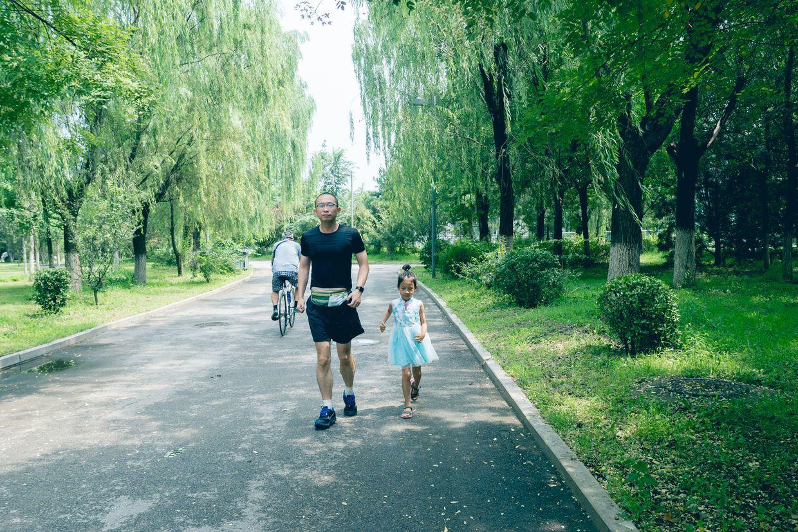

按照老师的要求，开始跑步锻炼。

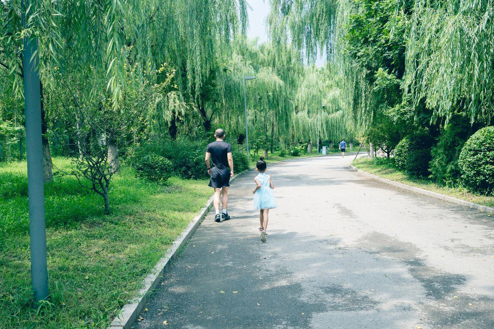

环境非常好，虽然没有塑胶跑道，但也不像奥森人那么多。

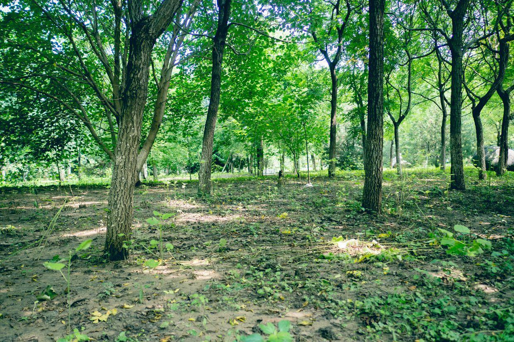

1公里很快就跑完了，最后来了一个冲刺。

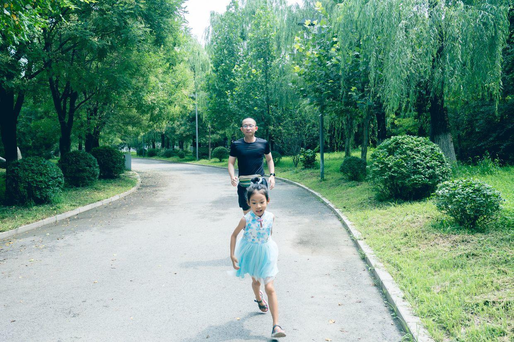

封面

还发现了一个小湖，有不少人在乘凉。

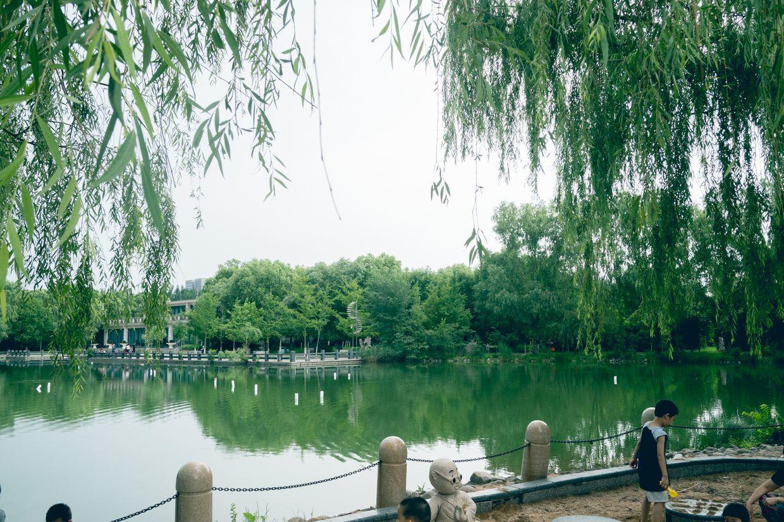

湖边还有个小沙滩。

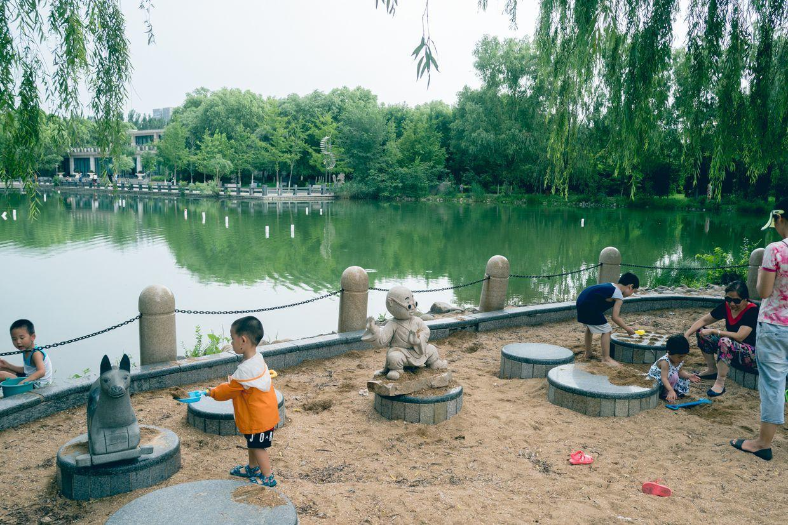

湖边的景色也是非常的别致。

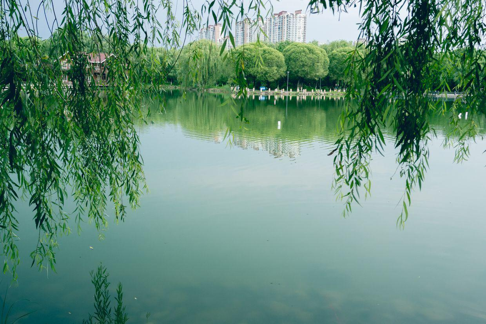

原以为会很热，没想到跑了一会儿就来了一大片乌云，刮着小风还挺凉快。

马上要上小学了，老师也要求了每天要有规律的体育运动时间。

跑步、跳绳等等，看来也要好好计划一下了。

**个人微信公众号，请搜索：摹喵居士（momiaojushi）**

          
        